## Changelog

A high level change history for GitPitch projects. Unless otherwise indicated fixes and features shown below are integrated across the entire [GitPitch Product Family](https://docs.gitpitch.com/#/meet-the-family).

 

## [Oct 11, 2020]
### Added
- Support for Slide Deck export to HTML
- See the [Desktop Offline Publishing Guide](https://docs.gitpitch.com/#/desktop/publishing)

 

## [Oct 1, 2020]
### Released
- Brand new product GitPitch 4.0
- See the [What's New in 4.0 Guide](https://docs.gitpitch.com/#/whats-new-in-40)
- [YouTube: Introducing GitPitch 4.0](https://www.youtube.com/watch?v=MT88pCE291I)

 

## [Jun 25, 2020]
### Added
- New product [GitPitch CI](https://docs.gitpitch.com/#/cicd/)
- For seamless integration with your existing CI/CD pipelines
- Initial support for [CircleCI](https://circleci.com/)
- For any GitPitch slide deck in any repo you can...
- Auto-generate PDF, PowerPoint PPTX, and/or Slide Screenshots (JPG)

## [Jun 08, 2020]
### Added
- Brand new [Mermaid Diagram Markdown Widget](https://docs.gitpitch.com/#/diagrams/mermaid) for rendering diagrams and flowcharts on any slide
- See the [Mermaid Diagrams + Flowcharts Official Docs](https://mermaid-js.github.io/mermaid)
- The [Cloud Diagram Markdown Widget](https://docs.gitpitch.com/#/diagrams/cloud-architecture) updated to support [Diagrams As Code v0.13.1](https://diagrams.mingrammer.com/)

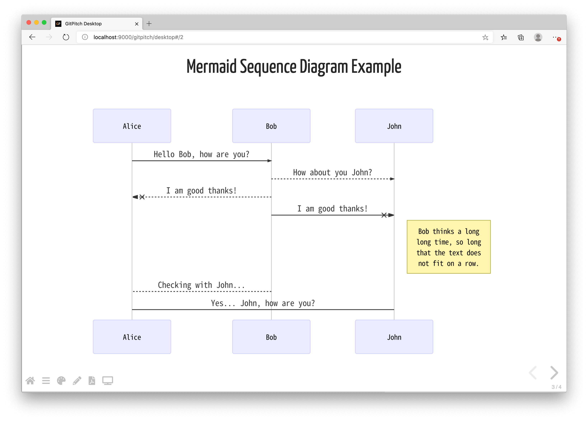

## [May 27, 2020]
### Added
- GitPitch [Desktop Whiteboard](https://docs.gitpitch.com/#/desktop/tools) powered by the amazing [Excalidraw](https://github.com/excalidraw/excalidraw)
- Create beautiful mockups, wireframes, system diagrams, UI flows, brainstorming, etc for any slide

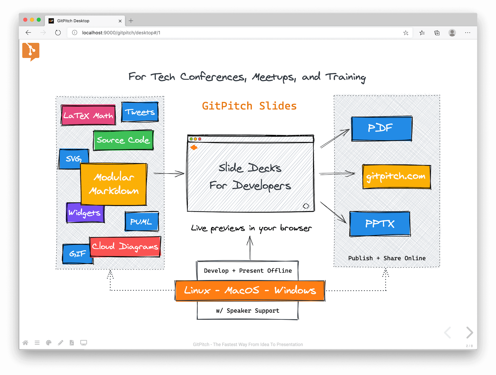

## [May 23, 2020]
### Added
- Brand new [Citations + Bibliography Support](https://docs.gitpitch.com/#/citations/bibliographies) using BibTEX, EndNote, or RIS databases.

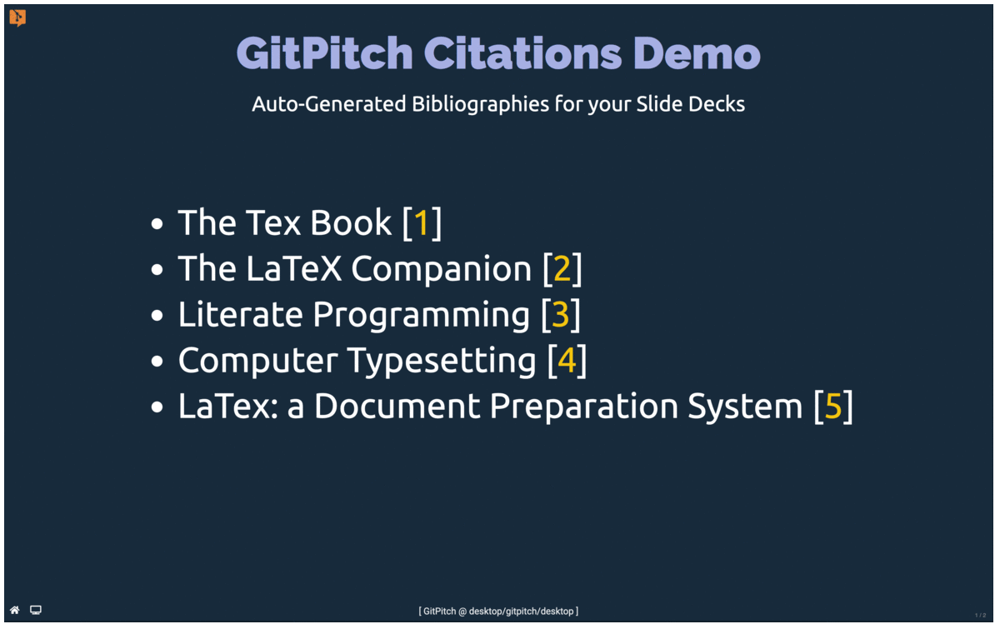

## [May 12, 2020]
### Added
- Brand new [Custom Fonts Support](https://docs.gitpitch.com/#/theme/custom-fonts) unlocks unlimited typography options for GitPitch slide decks

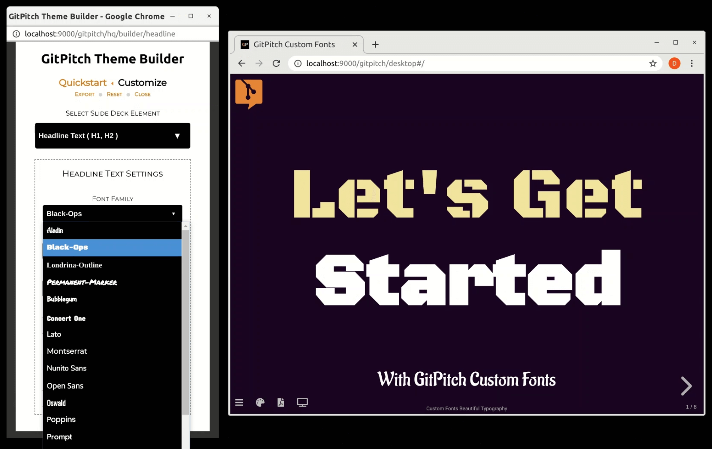

## [May 06, 2020]
### Added
- New PITCHME.yaml [Confidential Mode Challenge Form Settings](https://docs.gitpitch.com/#/cloud/password-protected-slide-decks) for secure publishing on [gitpitch.com](https://gitpitch.com)

## [May 02, 2020]
### Fixed
- Audio Slide Deck [List Fragment Support](https://docs.gitpitch.com/#/cloud/audio-slide-decks)

## [Apr 28, 2020]
### Changed
- The [Cloud Diagram Markdown Widget](https://docs.gitpitch.com/#/diagrams/cloud-architecture) updated to support [Diagrams As Code v0.9.0](https://diagrams.mingrammer.com/)

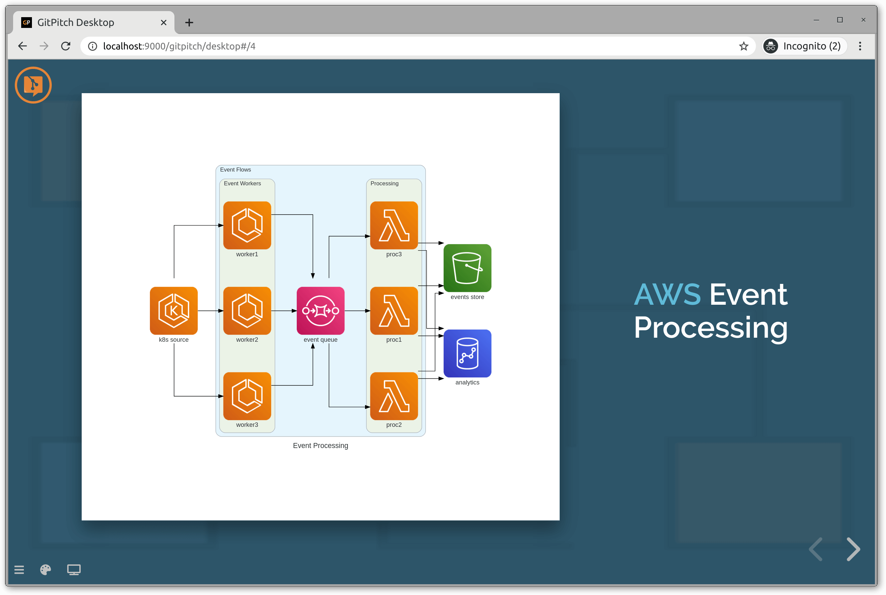

## [Apr 24, 2020]
### Added
- New PITCHME.yaml [theme-builder setting](https://docs.gitpitch.com/#/theme/builder) to control visibility of the builder
- New PITCHME.yaml [favicon setting](https://docs.gitpitch.com/#/settings/favicon) to activate a custom favicon for deck
- New PITCHME.yaml [lang setting](https://docs.gitpitch.com/#/settings/lang) to activate a custom HTML lang for deck

## [Apr 18, 2020]
### Changed
- Simplified slide deck home menu logo + layout
- Updated [Fira Code Monospaced Font v3.1](https://github.com/tonsky/FiraCode) built-in support within [Theme Template](https://docs.gitpitch.com/#/theme/template)

## [Apr 09, 2020]
### Added
- New [Cloud Diagram Markdown Widget](https://docs.gitpitch.com/#/diagrams/cloud-architecture) for Cloud System Architecture Diagrams

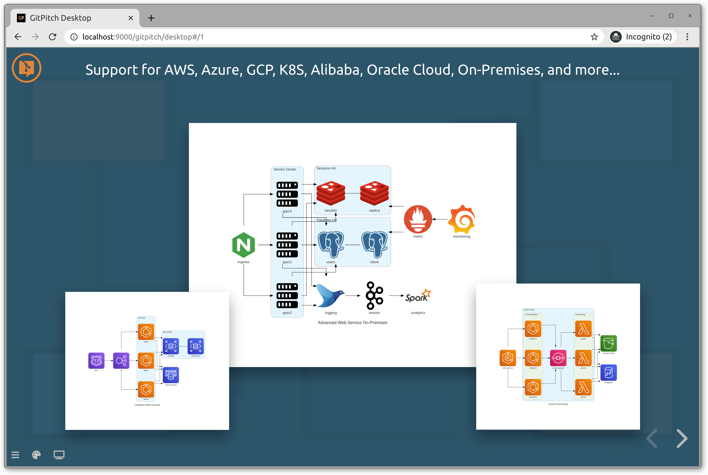

## [Mar 15, 2020]
### Changed
- Improved [User Dashboard](https://gitpitch.com/login) subscription reporting and management

## [Feb 08, 2020]
### Added
- Support on [User Dashboard](https://gitpitch.com/login) for quickstart one-click download of [GitPitch Desktop](https://docs.gitpitch.com/#/desktop/)

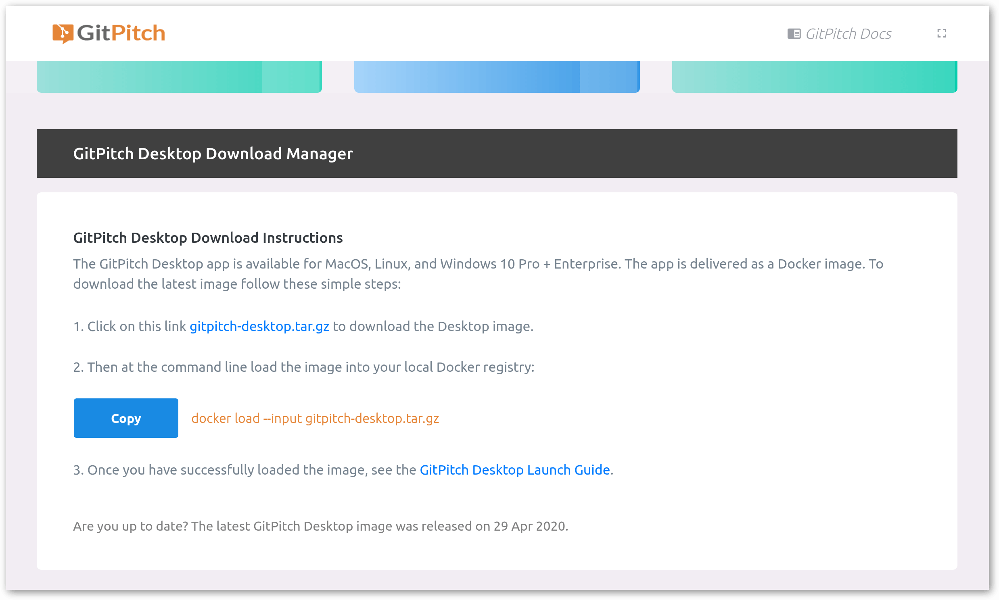

## [Jan 28, 2020]
### Added
- New [Inline Image Filters, Transformations, Behaviors](https://docs.gitpitch.com/#/images/widget)
- [YouTube: GitPitch Image Manipulation Video Tutorial](https://youtu.be/vdMDj9YNbYw)

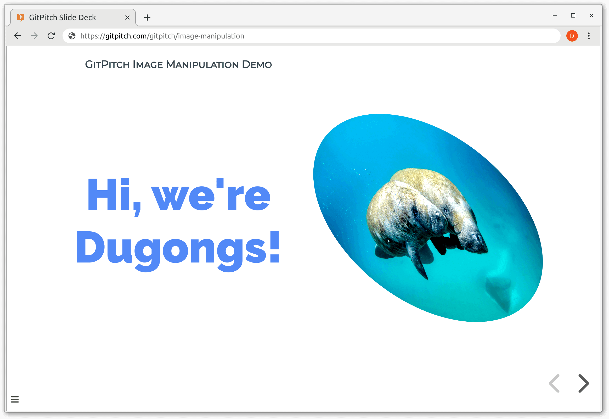

## [Jan 22, 2020]
### Changed
- Added support for search directly within the [GitPitch Docs](https://docs.gitpitch.com/#/)

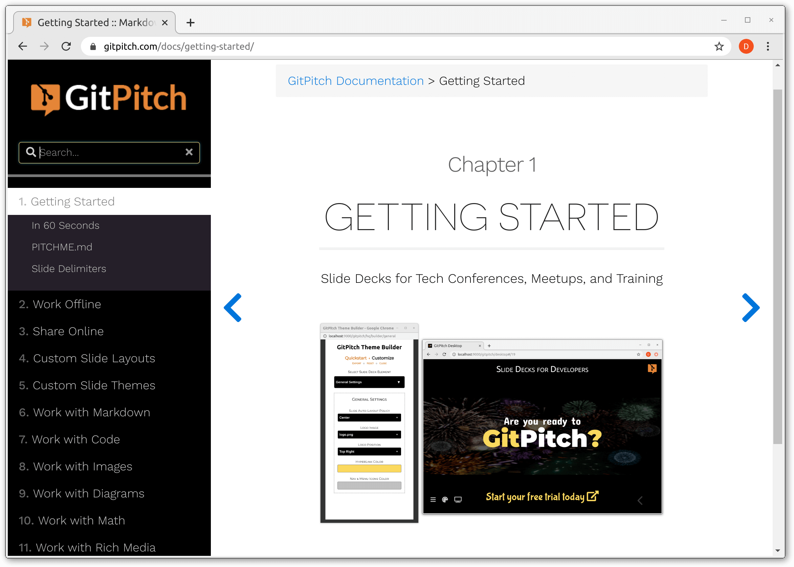

## [Jan 9, 2020]
### Added
- Brand new visual [Theme Builder](https://docs.gitpitch.com/#/theme/builder) for [GitPitch Desktop](https://docs.gitpitch.com/#/desktop/)
- [YouTube: GitPitch Theme Builder Video Tutorial](https://youtu.be/pfMsOZRvfXw)

## [Dec 16, 2019]
### Added
- [User Dashboard](https://gitpitch.com/login) default login now public-access-only with new private-access upgrade option

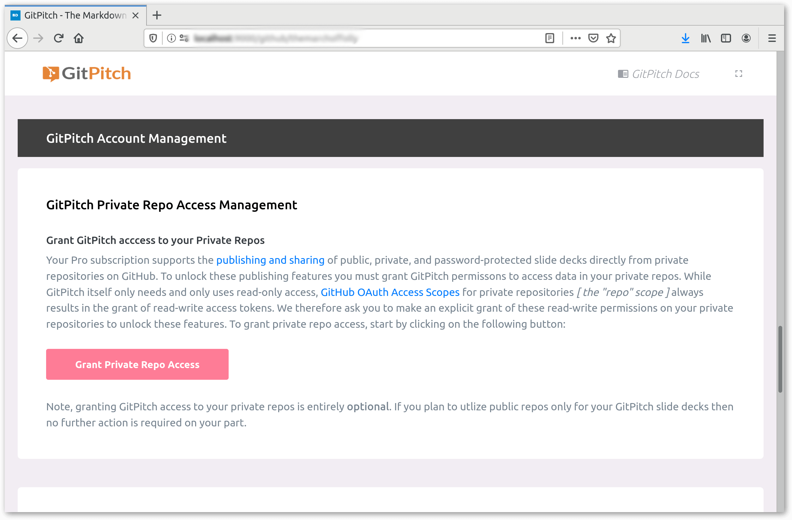

## [Dec 06, 2019]
### Added
- New PITCHME.yaml [speaker-mode setting](https://docs.gitpitch.com/#/speaker/window) to disable access to speaker window and notes

## [Dec 02, 2019]
### Added
- One-click compression for PNG, JPG, and GIF images within [GitPitch Desktop Image Manager](https://docs.gitpitch.com/#/desktop/tools)

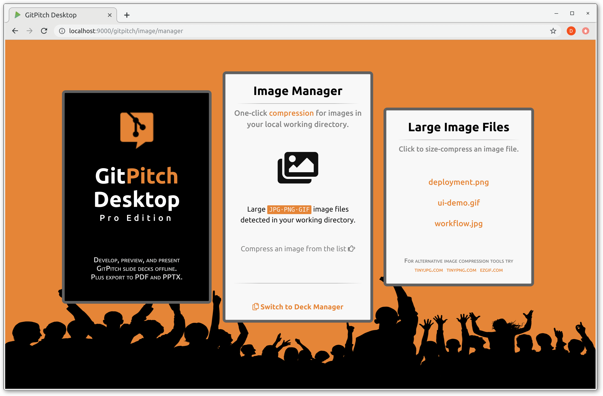

## [Dec 02, 2019]
### Added
- [YouTube: Custom Slide Layouts for Markdown Presentation Video Tutorial](https://youtu.be/rt4J1jUbSJU)

## [Nov 09, 2019]
### Added
- New [List Markdown Widget](https://docs.gitpitch.com/#/lists/widget) speaker mode hide and fade behaviors
- New [Table Data Markdown Widget](https://docs.gitpitch.com/#/media/table-data) speaker mode hide and fade behaviors

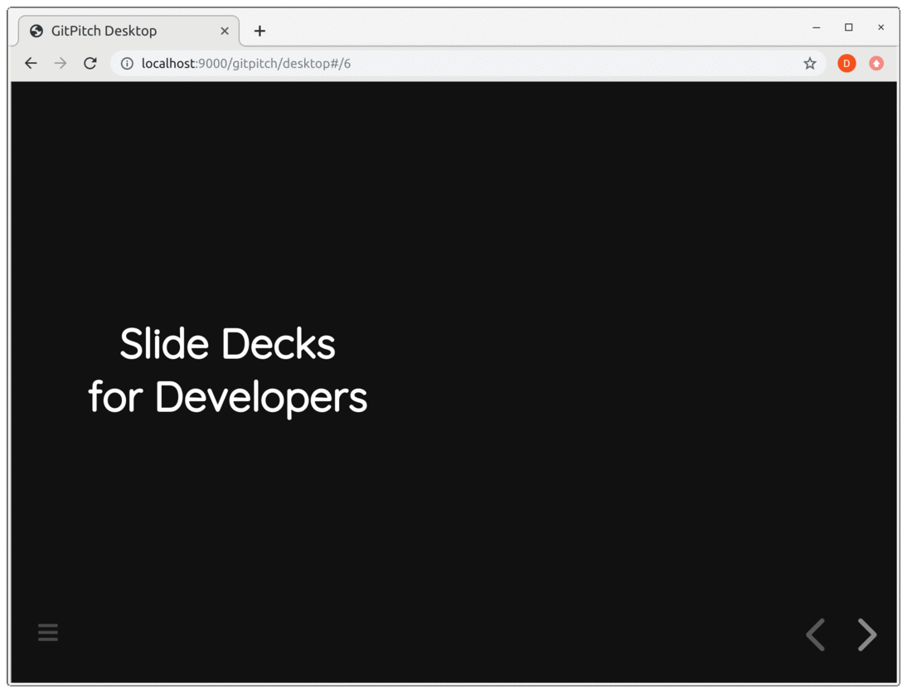

## [Oct 25, 2019]
### Added
- New [Iosevka Code Monospaced Font](https://github.com/be5invis/Iosevka) built-in support within [Theme Template](https://docs.gitpitch.com/#/theme/template)

## [Sept 13, 2019]
### Changed
- Updated [Fira Code Monospaced Font v2.x](https://github.com/tonsky/FiraCode) built-in support within [Theme Template](https://docs.gitpitch.com/#/theme/template)

## [Sept 11, 2019]
### Changed
- Updated [Font Awesome 5 Markdown Widget](https://docs.gitpitch.com/#/media/fontawesome) support for [FA Regular Icon Set](https://fontawesome.com/icons?s=regular)

## [Sept 09, 2019]
### Added
- New [Code Line Number + Code Tag Filters](https://docs.gitpitch.com/#/code/filters) support for source code files and GIST
- [YouTube: GitPitch Code Filters Video Tutorial](https://youtu.be/X8stj8p4JM4)

## [Sept 03, 2019]
### Added
- New Table Data Renderer for standard markdown table syntax within [Snap Layouts](https://docs.gitpitch.com/#/auxiliary/snap-layouts)

## [Aug 30, 2019]
### Added
- New [Markdown Text Manipulation Guide](https://docs.gitpitch.com/#/text/basics) added to the [GitPitch Docs](https://docs.gitpitch.com/#/)

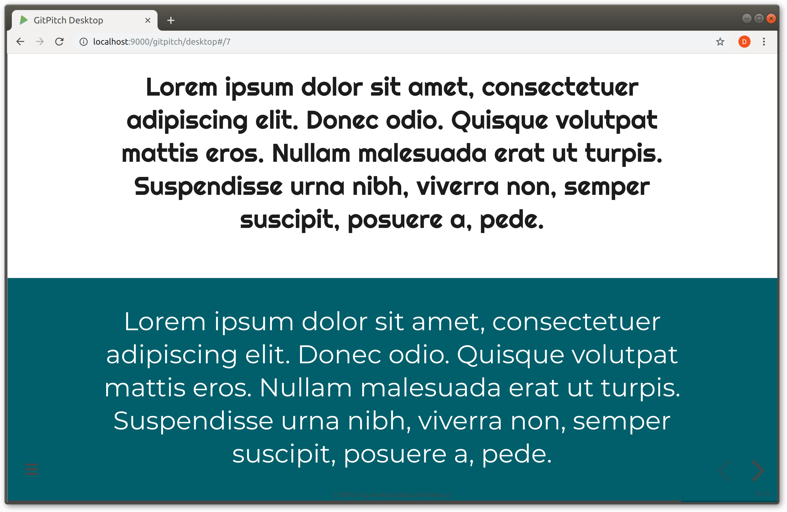

## [Aug 29, 2019]
### Added
- New [Font Family Utility Styles](https://docs.gitpitch.com/#/theme/utility-styles?id=text-fonts) built-in support within [Theme Template](https://docs.gitpitch.com/#/theme/template)

## [Aug 29, 2019]
### Added
- [Code Power Properties](https://docs.gitpitch.com/#/code/widgets)

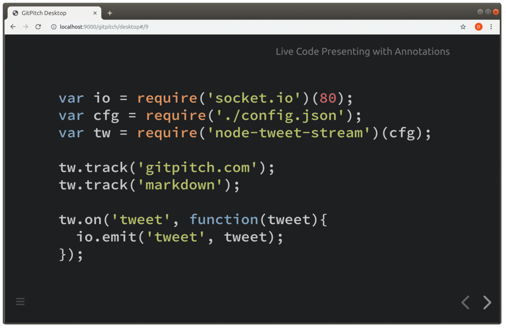

## [July 06, 2019]
### Added
- New [Victor Mono Cursive + Code Ligatures Font](https://github.com/rubjo/victor-mono) built-in support within [Theme Template](https://docs.gitpitch.com/#/theme/template)

## [June 26, 2019]
### Added
- New `code-noblend` control property added to list of supported [Code Power Properties](https://docs.gitpitch.com/#/code/widgets)

## [June 20, 2019]
### Changed
- Updated [GitPitch Pro Surveys](https://docs.gitpitch.com/#/cloud/survey-slide-decks) support for JotForm

## [June 26, 2019]
### Added
- Brand new [Theme Template](https://docs.gitpitch.com/#/theme/template) becomes the default theme for all decks
- [YouTube: Custom Themes for Markdown Presentations](https://youtu.be/OQOma4Xj-GY)

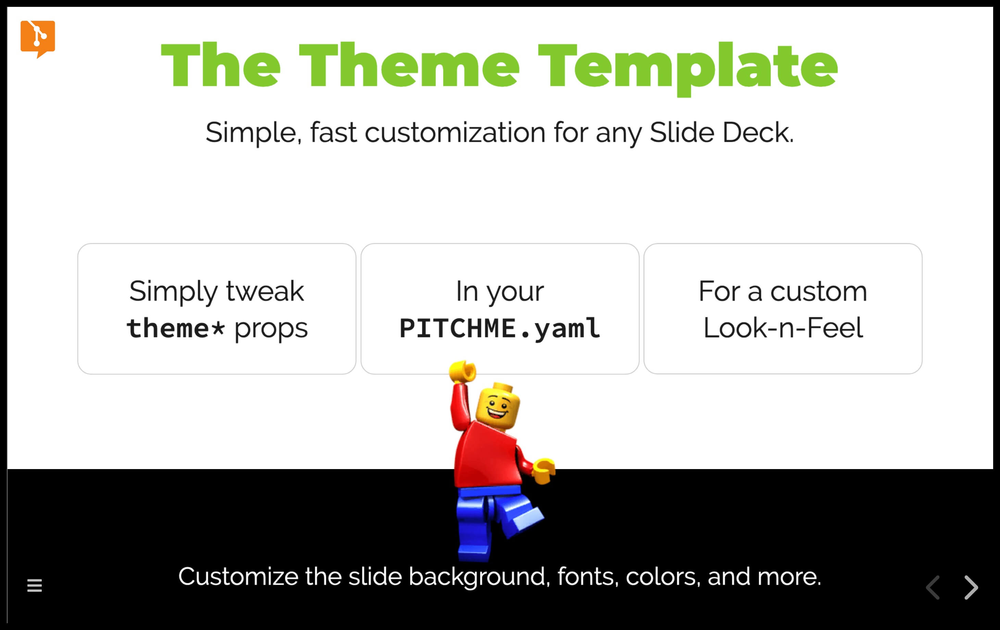

## [May 13, 2019]
### Added
- Brand new voiceover-for-slides support powered by [GitPitch Audio Slide Decks](https://docs.gitpitch.com/#/cloud/audio-slide-decks)
- [Blog Post: Presenting GitPitch Audio Slide Decks](https://medium.com/@gitpitch/presenting-gitpitch-audio-slide-decks-4fa4989533c6)

## [Mar 25, 2019]
### Added
- New [Table Data Markdown Widget](https://docs.gitpitch.com/#/media/table-data) support for table rendering, styling, sizing and behaviors

## [Mar 18, 2019]
### Added
- New [Code Revealing Modes](https://docs.gitpitch.com/#/code/behaviors) support for fenced code, source files, and GIST

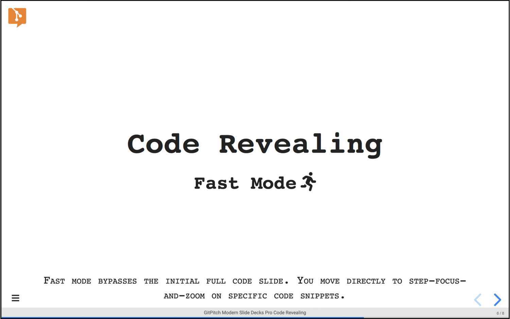

## [Mar 13, 2019]
### Added
- New [Font Awesome 5 Markdown Widget](https://docs.gitpitch.com/#/media/fontawesome) support for [FA Solid + Brand Icon Sets](https://fontawesome.com/icons?d=gallery&s=brands,solid)

## [Feb 28, 2019]
### Added
- New [GitHub Diff Markdown Widget](https://docs.gitpitch.com/#/code/widgets) to generate and render an interactive diff for any commit

## [Feb 16, 2019]
### Added
- New [Tweet Markdown Widget](https://docs.gitpitch.com/#/media/tweets) to render Twitter tweets on any slide

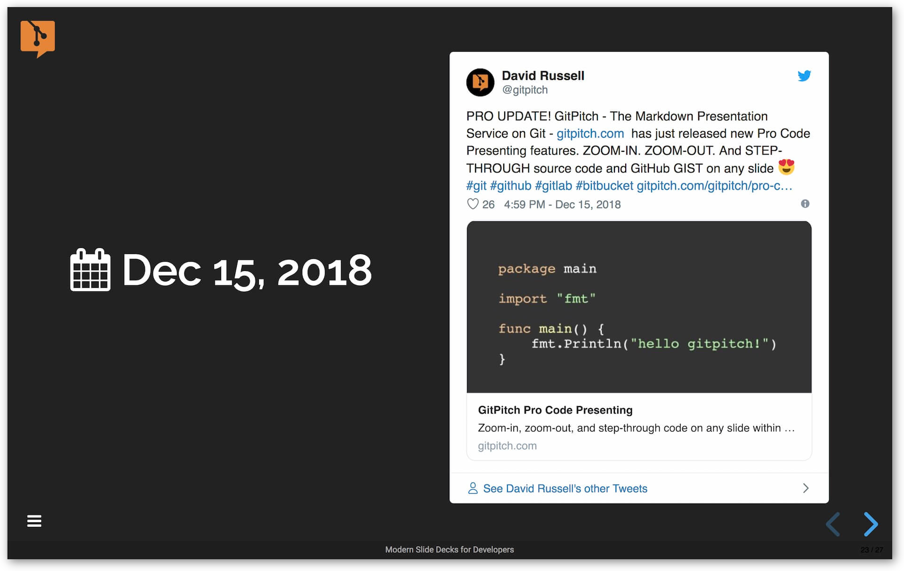

## [Feb 11, 2019]
### Added
- New [UML Markdown Widget](https://docs.gitpitch.com/#/diagrams/plantuml) to render [PlantUML Diagrams](https://plantuml.com/) on any slide

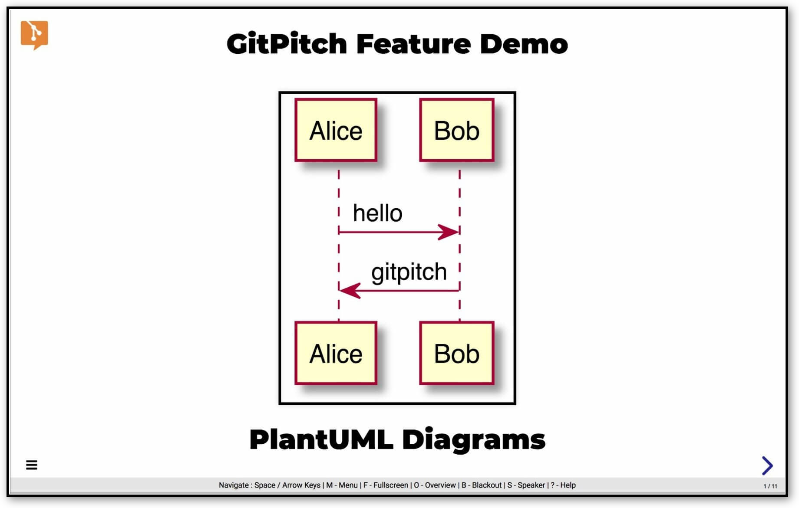

## [Jan 27, 2019]
### Added
- [GitPitch Desktop](https://docs.gitpitch.com/#/desktop/) adds slide deck export to **PDF** and **PowerPoint PPTX**
- [Blog Post: GitPitch embraces Microsoft PowerPoint, Keynote, and Google Slides](https://medium.com/@gitpitch/gitpitch-embraces-microsoft-powerpoint-keynote-google-slides-7095017dd57c)

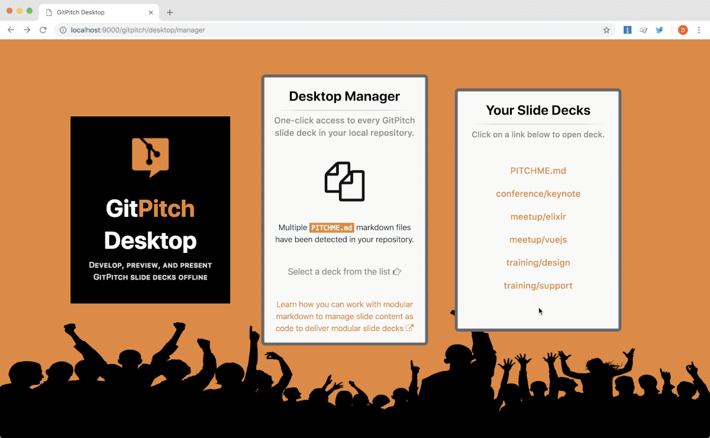

## [Jan 03, 2019]
### Added
- New [Ascinema Recorded Terminal Sessions](https://docs.gitpitch.com/#/code/terminal-sessions) playback support on any slide

## [Dec 15, 2018]
### Added
- New [Code ZOOM](https://docs.gitpitch.com/#/grid-layouts/fit-code) support for fenced code, source files, and GIST
- [Blog Post: GitPitch adds Code ZOOM for Slide Decks](https://medium.com/hackernoon/gitpitch-adds-code-zoom-for-slide-decks-49c9cf2cd3df)

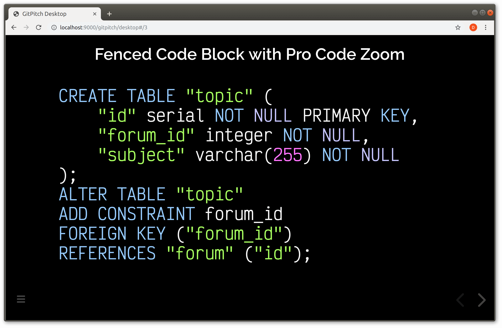

## [Dec 12, 2018]
### Added
- New [Code Markdown Widget + GIST Markdown Widget](https://docs.gitpitch.com/#/code/widgets) support for source files and GIST

## [Dec 04, 2018]
### Added
- New [GitPitch In 60 Seconds](https://docs.gitpitch.com/#/quickstart) quickstart tutorial on GitHub, GitLab, and Bitbucket

## [Aug 01, 2018]
### Added
- New [GitPitch Snap Layouts](https://docs.gitpitch.com/#/auxiliary/snap-layouts) markdown syntax for flexible slide designs
- [Blog Post: Snap Layouts for GitPitch Markdown Presentations](https://medium.com/@gitpitch/snap-layouts-for-gitpitch-markdown-presentations-29800f642586)
- [YouTube: An Introduction to Snap Layouts for Markdown Presentations Video Tutorial](https://youtu.be/MVd-SxhEPFs)

## [Jun 26, 2018]
### Added
- Brand new [GitPitch Documentation](https://docs.gitpitch.com/#/) full of sample slide markdown snippets and live demos
- [Blog Post: GitPitch releases brand new documentation for everyone](https://medium.com/@gitpitch/gitpitch-releases-brand-new-documentation-for-everyone-5a9417f352a6)

## [May 21, 2018]
### Added
- Announced general availability of [GitPitch Enterprise](https://docs.gitpitch.com/#/enterprise/) for on-premises deployment
- [Blog Post: GitPitch adds support for GitHub Enterprise On-Premises](https://medium.com/hackernoon/gitpitch-adds-support-for-github-enterprise-on-premise-servers-f15a5b91de5a)
- [Blog Post: GitPitch adds support for GitLab + Bitbucket On-Premises](https://medium.com/hackernoon/gitpitch-adds-support-for-gitlab-and-bitbucket-on-premise-servers-dfb78b104a3a)

## [Apr 17, 2018]
### Added
- New SurveyMonkey, JotForm, and Google Forms embedded support using [GitPitch Surveys](https://docs.gitpitch.com/#/cloud/survey-slide-decks)
- [Blog Post: Start a Two-Way Conversation with your Audience](https://medium.com/@gitpitch/start-a-two-way-conversation-with-your-slideshow-audience-8ad56bd96ff3)

## [Apr 05, 2018]
### Added
- Announced general availability of [GitPitch Desktop](https://docs.gitpitch.com/#/desktop/) for Linux, MacOS, and Windows 10

## [Feb 19, 2018]
### Added
- New [GitPitch Slide Deck Publishing](https://docs.gitpitch.com/#/cloud/private-slide-decks) using private repositories on GitHub, GitLab, and Bitbucket
- [Blog Post: Public Publishing using Private Repos](https://medium.com/hackernoon/gitpitch-private-git-repo-support-part-1-aa85ebc70f7e)
- [Blog Post: Private Publishing using Private Repos](https://medium.com/hackernoon/gitpitch-private-git-repo-support-part-2-e6aea33565d7)
- [Blog Post: Password Protected Publishing using Private Repos](https://medium.com/hackernoon/gitpitch-private-git-repo-support-part-3-c19aad572c14)

## [Nov 08, 2017]
### Added
- Manage decks as you manage code using [Slide Deck Modular Markdown](https://docs.gitpitch.com/#/modular-markdown/)
- [Blog Post: Develop Course and Training Materials](https://medium.com/hackernoon/develop-course-and-training-materials-using-fruit-punnets-cf9cfa88040f)

## [Aug 29, 2017]
### Added
- [GitPitch Speaker Support](https://docs.gitpitch.com/#/speaker/) including speaker notes, live preview, and remote control

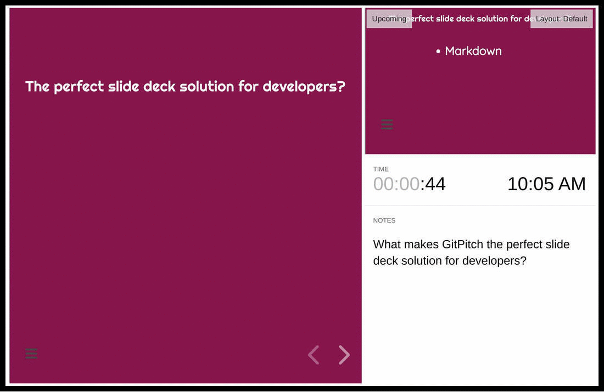

## [May 31, 2017]
### Added
- New [Live Code Presenting](https://docs.gitpitch.com/#/code/presenting) to *focus-on* and *step-through* code on any slide
- [Blog Post: Let Your Code Do The Talking](https://medium.com/hackernoon/let-your-code-do-the-talking-983906a3a587)

## [Sep 07, 2016]
### Added
- [GitPitch.com Markdown Presentations](https://gitpitch.com) SAAS added support for everyone on GitHub, GitLab, and Bitbucket

## [Aug 28, 2016]
### Added
- Released [GitPitch](https://gitpitch.com) as open source on [GitHub](https://github.com/gitpitch/gitpitch)

## [Aug 01, 2016]
### Added
- Launched [GitPitch.com Markdown Presentations](https://gitpitch.com) SAAS for everyone on GitHub
- [Blog Post: Use Git to deliver Modern Slideshow Presentations](https://medium.com/@gitpitch/use-git-to-deliver-stunning-slideshow-presentations-5dbdf644d4cc)

