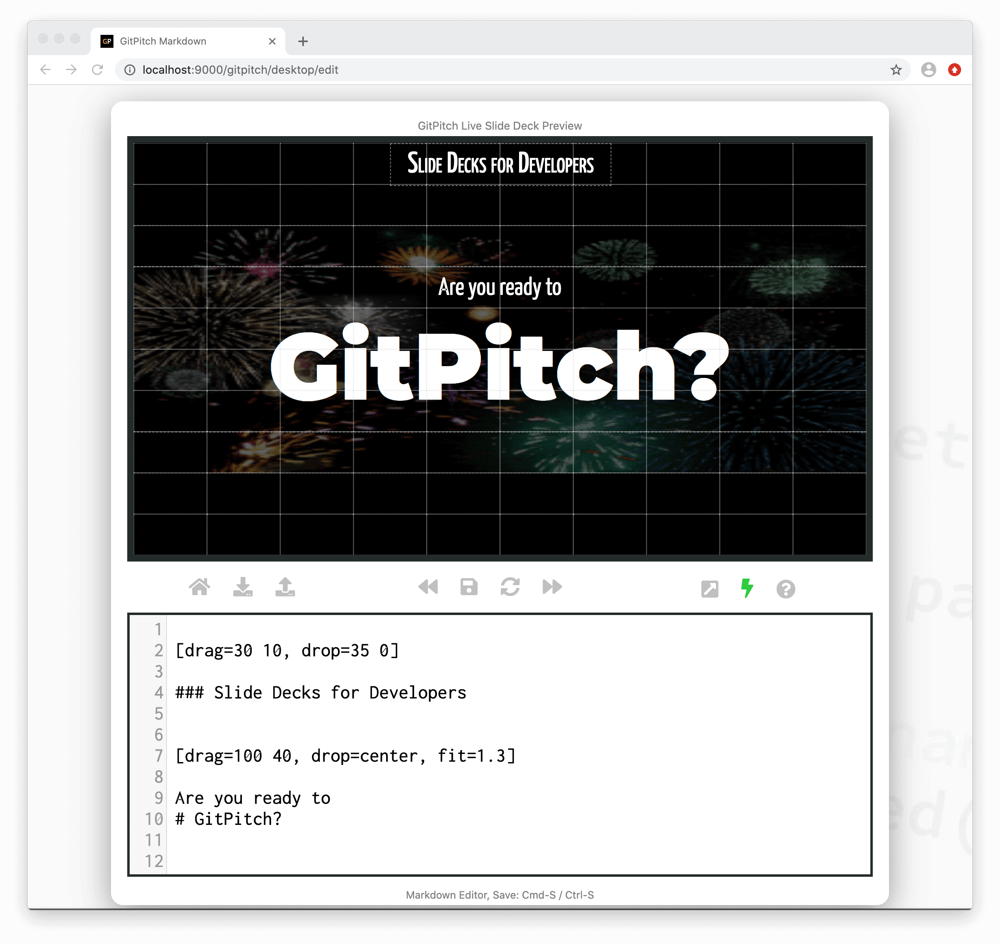
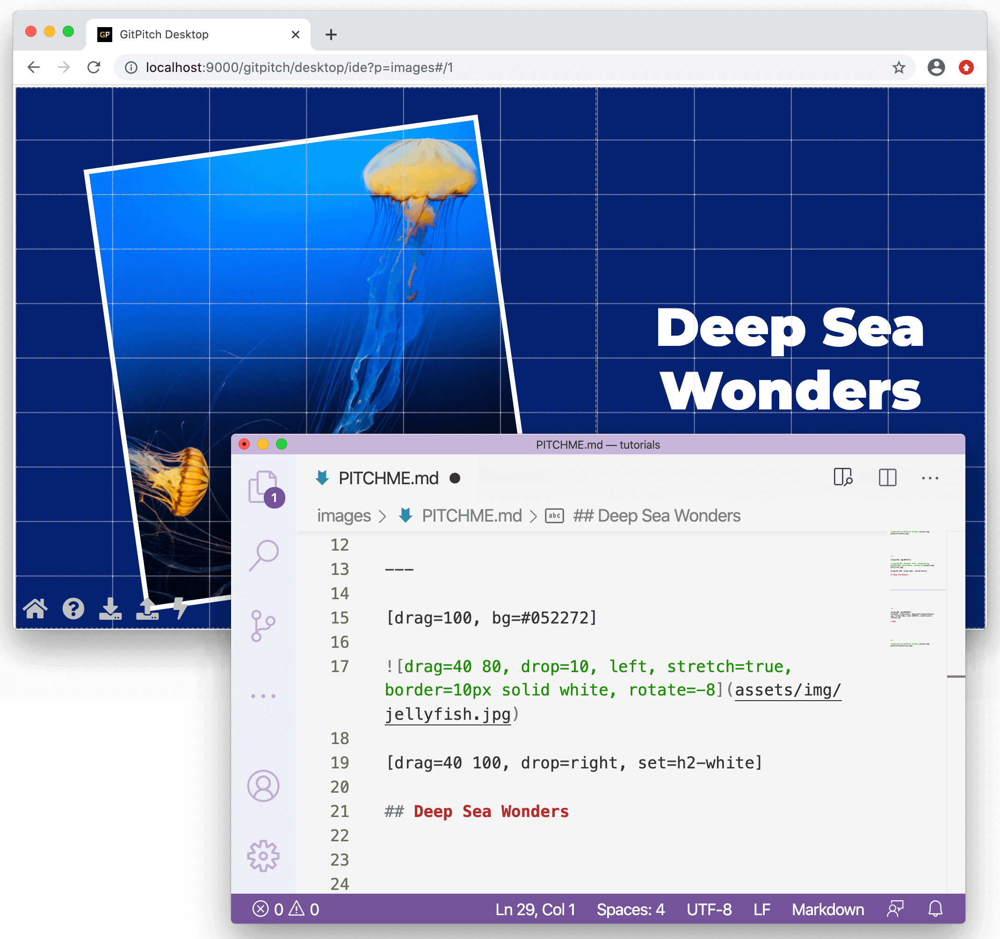
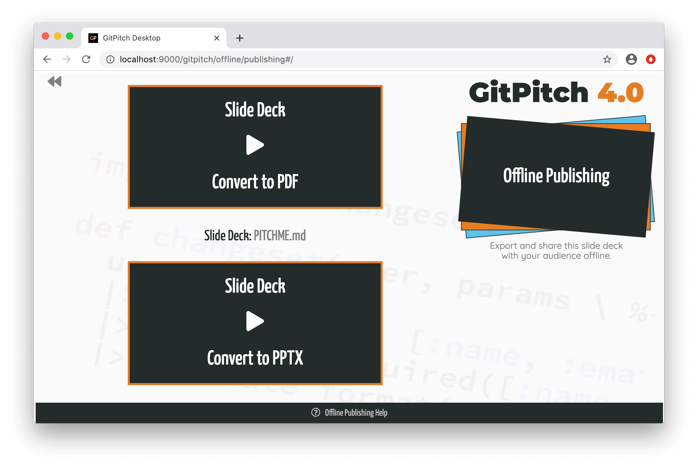
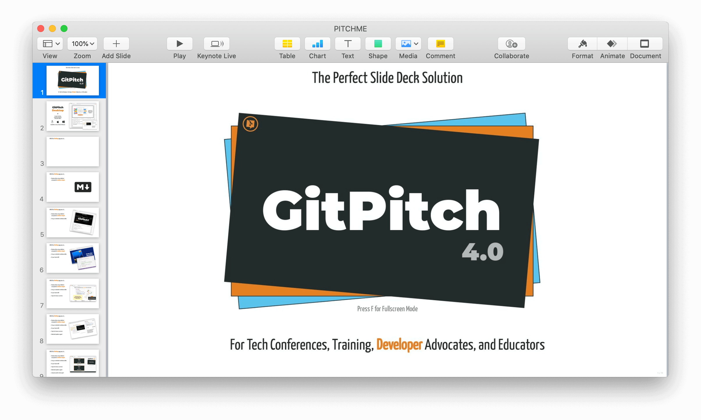
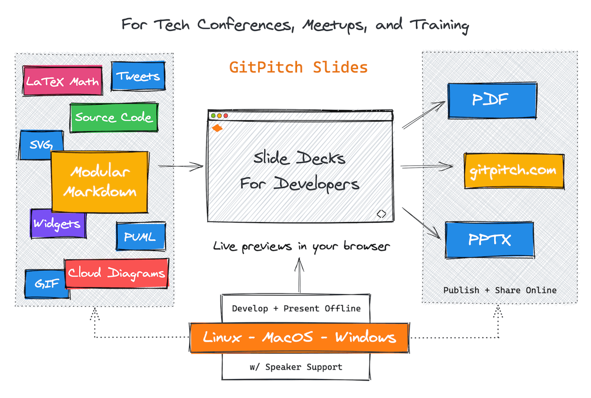
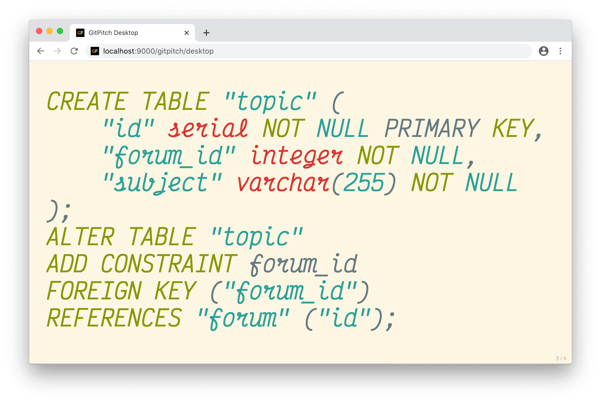
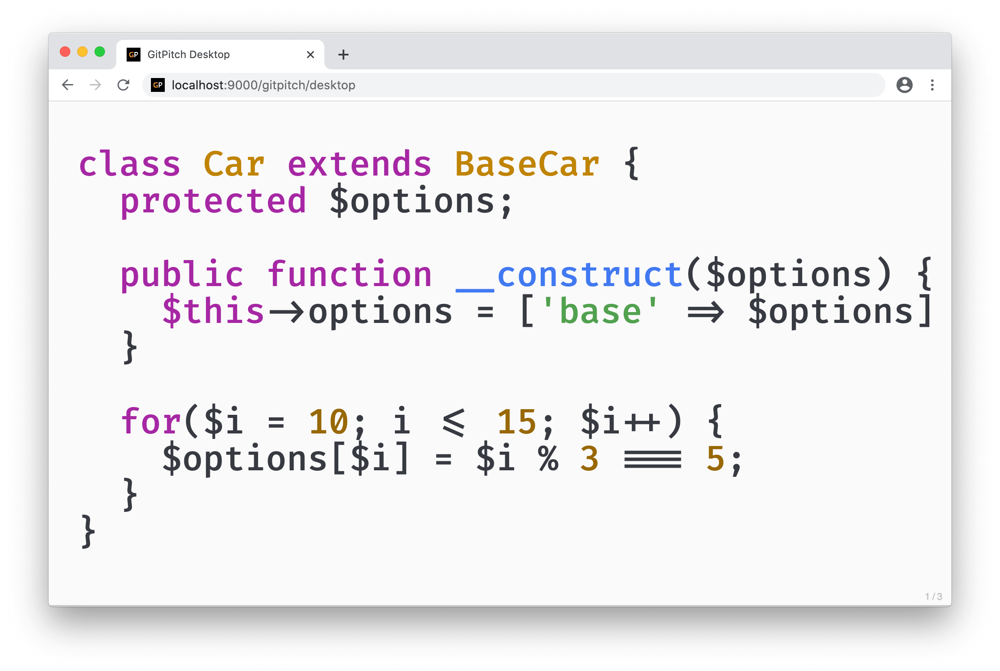
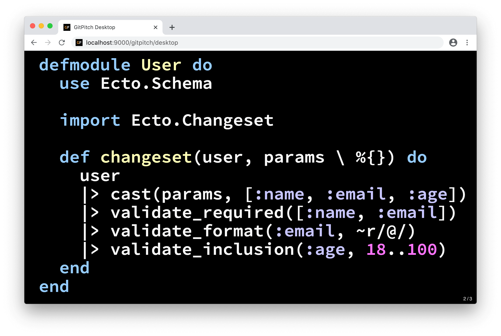
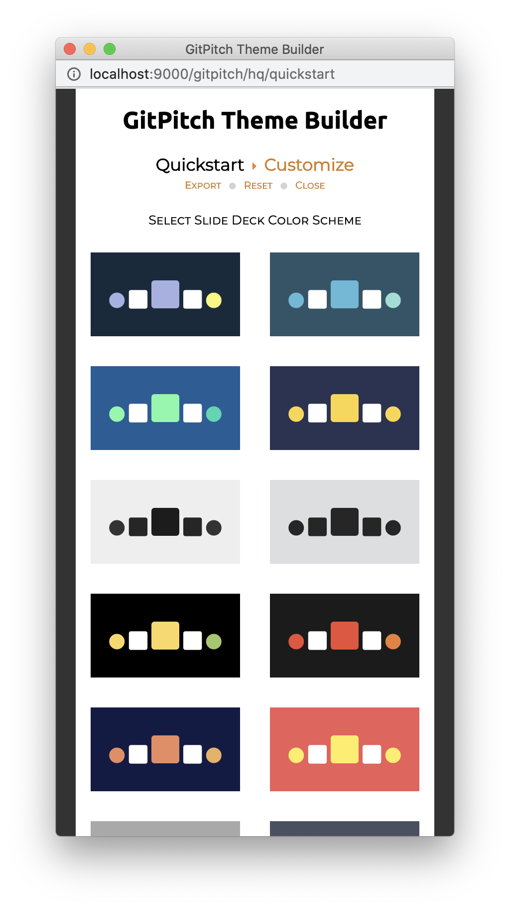

[drag=35 10, drop=top, pad=10, fit=1.1]

The Perfect Slide Deck Solution

@md[title=GitPitch](assets/md/splash.md)

[drag=30 3, drop=50 77 true false, set=text-gray, fit=0.5]
Press F for Fullscreen Mode

[drag=100 20, drop=bottom, fit=1.05]

For Tech Conferences, Training, **Developer** Advocates, and Educators

[drag=8 10, drop=-29 55, opacity=0.7, set=h2-silver, fit=0.8, animate=bouncedown, filter=contrast]

## 4.0

---

[drag=40 55, drop=1 10, fit=0.9]

## GitPitch **Desktop**

@fab[docker fa-xs]

An app to develop, preview, and present slide decks offline.

[drag=40 10, drop=1 -25, flow=row]

@fa[linux fa-2x]
@fa[apple fa-2x]
@fa[windows fa-2x ]

[drag=40 10, drop=1 -15, set=fragmentx]

Available on Linux, MacOS, Windows

---

[drag=40 10, drop=topleft, pad=10, fit=1.2]

With the **Desktop** app you can...

@ul[drag=40 80, drop=2 15, sync=true, list-spaced-bullets]
- Develop slides using markdown and powerful **markdown widgets**
- Using an embedded markdown editor
- Or your favorite IDE
- Enjoy live browser previews
- Dedicated speaker support
- And pixel-perfect slide export
- To **PDF @fa[file-pdf]**, **PPTX @fa[file-powerpoint]**, and **HTML @fa[html5]**
@ul

[drag=60 100, drop=right, flow=stack, pad=0 40, sync=true]

@fab[markdown fa-10x]

---

[drag=100 10, drop=top, fit=1.2]

And with a simple **git-push** to GitHub, GitLab, and Bitbucket you can share...

[drag=100 40, drop=center, flow=row, bg=#232B2B, set=text-white]

@fa[users fa-4x]
@fa[user-shield fa-4x]
@fa[lock fa-4x]

[drag=100 20, drop=0 -5, set=fragment, fit=1.5]

...public, private, and **password-protected** slide decks on gitpitch.com.

---

[drag=85 10, drop=top, fit=1.2]

GitPitch 4.0 introduces brand new **grid layouts** for your slide content...

@code[drag=37 41, drop=21 13, fit=0.66, border=2px dashed gray, elixir](src/demo.ex)

[drag=35, drop=12 56, pad=40px, bg=#FFFFBF, border=2px dashed gray]

Lorem ipsum dolor sit amet, consectetur adipiscing elit, sed do eiusmod tempor incididunt ut labore et dolore magna aliqua.

[drag=25 70, drop=-18 16, rotate=35, border=2px dashed gray]

@mermaid[width=250, theme=forest, border=2px dashed gray](src/demo.mmd)

[drag=100 7, drop=bottom, flow=row, border=2px dashed gray, fit=0.8]

@fa[github] gitpitch
david@gitpitch.com
@fa[twitter] gitpitch

[drag=30 20, drop=-0 -11, bg=#232B2B, set=text-white fragment, fit=0.9, animate=bounceright]

The new grid layouts system brings **drag-and-drop** layout precision to GitPitch markdown presentations.

---
[drag=100 10, drop=top, fit=1.1]

With Markdown **widgets** you can render rich slide content including...

@ul[drag=40 70, drop=0 20, sync=true, list-spaced-sm-bullets list-fade-fragments]
- Images with filters + transformations
- Mermaid + PlantUML diagrams
- Cloud architecture diagrams
- LaTeX Math formulas
- YouTube, Vimeo, Mp4 Videos
- Excalidraw whiteboard sketches
- Plus slide content synchronization **@fa[arrow-right]**
@ul

[drag=60 80, drop=-2 15, flow=stack, pad=0 30, fit=0.75, sync=true]

@mermaid[theme=forest](src/demo.mmd)
@cloud
@math[pad=30px, rotate=-25, fit=1.4]
`\[
\left( \sum_{k=22}^n a_k b_k \right)^{\!\!2} \leq
 \left( \sum_{k=1}^n a_k^2 \right) \left( \sum_{k=1}^n b_k^2 \right)
\]`
@math

### This slide is an example of **slide content synchronization**.  The display of the list-content on the left has been  synchronized with the display of this stack-content on the right.

---

[drag=60 10, drop=top, pad=20, fit=1.2]

Enjoy  **stunning** code slides with live **step-and-zoom**...

[drag=30 5, drop=-5 -24, fit=0.5]

* GitPitch 4.0 supports the use of the full slide area when rendering code.

Note:

- Selection of Monospaced Code Fonts
- 100+ Syntax Highlighting Styles
- Step-and-ZOOM into Code 
- Including Fenced Code Blocks
- Repository Source Code Files
- And any public GitHub GIST

---

@code[drag=98, drop=1, fit=1.6, elixir](src/demo.ex)

[drag=50 6, drop=-2 1, flow=false, set=font-concert-one pull-right]

@[1-4](Live code presenting with optional annotations.)
@[6,12](Filtering, casting, and validation of constraints.)
@[7-8, zoom-11](Taking advantage of Elixir's pipe operator.)
@[7-9, zoom-11]
@[7-10, zoom-11]
@[7-11, zoom-11]

---

[drag=100 10, drop=top, fit=1.2]

All powered using **modular** Markdown under Git **version control**...

[drag=30 90, drop=5 15, rotate=-4, bg=#232B2B]
@fab[markdown fa-4x text-white]

@fab[git fa-4x text-white]

@code[drag=17 80, drop=50 16 true false, fit=0.5, text](src/demo.txt)

[drag=30 90, drop=-5 15, rotate=4, bg=#B70057]
[drag=30 90, drop=-5 15, pad=0 40, rotate=4, fit=1.4, set=text-white]

... so you can manage your presentation + training content the same way you manage `code`.

---

[drag=60 90, drop=-5 5, fit=1.2]

And before you publish, stamp your **brand** on any slide deck...

Using the GitPitch Presentation Theme Builder

Note:

You can activate custom fonts, color schemes, logos and more for any slide deck.

---?color=black
@title[Now It's Your Turn]

[drag=30 10, drop=35 0, set=text-smallcaps]

### Slide Decks for Developers

[drag=100 40, drop=center, fit=1.3]

Are you ready to
# GitPitch?

[drag=100 15, drop=0 -0, set=bubblegum]

[No sign-up or credit card needed. Start your free trial now @fa[external-link]](https://docs.gitpitch.com/#/whats-new-in-40)
