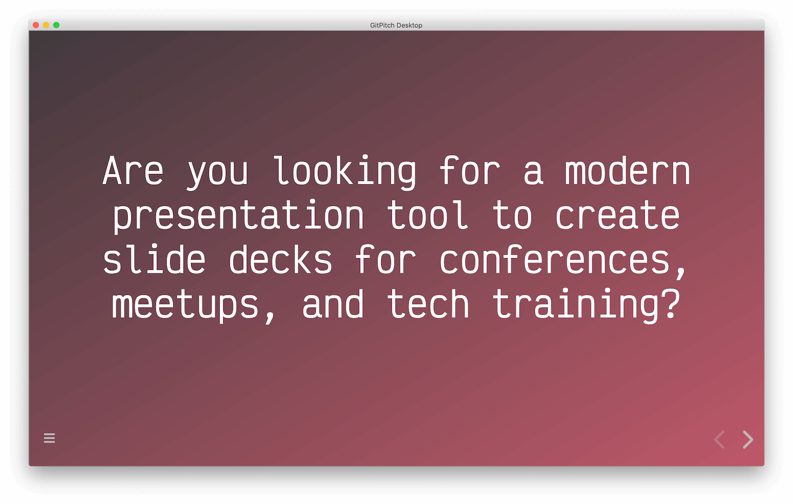

# Welcome to **GitPitch**

---?image=assets/img/code.jpg&opacity=60&position=left&size=45% 100%
@title[Slide Decks for Developers]

@snap[east span-50 text-center]
## GitPitch
#### Slide Decks
#### for
### Developers
@snapend

---
@title[Create, Preview, Present]

@snap[north span-50 text-center]
@fab[docker text-pink]
@snapend

@snap[midpoint span-100 text-center]
The GitPitch Desktop app lets you
**Create**, **Preview**, and **Present** Offline
@snapend

@snap[south span-50 text-center]
@fa[linux fa-2x] @fa[apple fa-2x] @fa[windows fa-2x]
@snapend

---
@title[Export to PDF + PPTX]

@snap[north span-50 text-center]
@fab[docker text-pink]
@snapend

@snap[midpoint span-100 text-center]
Plus **export** any deck to **PDF** @fa[file-pdf] and **PPTX** @fa[file-powerpoint]
@snapend

@snap[south span-50 text-center]
@fa[linux fa-2x] @fa[apple fa-2x] @fa[windows fa-2x]
@snapend

---
@title[Custom Visual Themes]

@snap[north span-50 text-center]
@fa[palette text-pink]
@snapend

@snap[midpoint span-100 text-center]
The GitPitch Theme Builder lets you 
create new **Visual Themes** for any Deck
@snapend

@snap[south span-50 text-center]

@snapend

---
@title[Custom Slide Layouts]

@snap[north-west span-50 text-center]

@snapend

@snap[north span-50 text-center]
@fa[drafting-compass text-pink]
@snapend

@snap[north-east span-50 text-center]

@snapend

@snap[midpoint span-100 text-center]
GitPitch Markdown Snap Layouts let you
create **Custom Layouts** for any Slide
@snapend

@snap[south-west span-50 text-left]

@snapend

@snap[south span-50 text-center]

@snapend

@snap[south-east span-50 text-right]

@snapend

---
@title[Flexible Layout Grid]


@snap[west span-50 text-center]

@snapend

@snap[east span-50 text-center]

@snapend

@snap[north span-100 text-center]
Using a **Flexible Grid** System
@snapend

@snap[north-east span-50 text-right]

@snapend

@snap[south span-50 text-center]

@snapend

@snap[south-west span-50 text-left]

@snapend

---
@title[Live Code Presenting]

@snap[north span-50 text-center]
@fa[search-plus text-pink]
@snapend

@snap[midpoint span-100 text-center]
GitPitch Live Code Presenting lets you
**Step-and-ZOOM** into Source Code on any Slide
@snapend

@snap[south span-50 text-center]
@fa[code fa-5x]
@snapend

---
@title[Live Code Presenting Demo]

@snap[north span-100 text-center text-smallcaps text-08]
Live Code Presenting
@snapend

```sql zoom-19
CREATE TABLE "topic" (
    "id" serial NOT NULL PRIMARY KEY,
    "forum_id" integer NOT NULL,
    "subject" varchar(255) NOT NULL
);

ALTER TABLE "topic"
ADD CONSTRAINT forum_id

FOREIGN KEY ("forum_id")
REFERENCES "forum" ("id");
```

@snap[south span-100 text-08]
@[1-5](Step-into and focus on specific lines of code on any slide.)
@[2-4, zoom-09](Zoom in-or-out to help guide your audience.)
@[6-9, zoom-14](Using optional annotations &#40; like this one &#41; for extra context.)
@snapend

---
@title[Markdown Widgets]

@snap[north span-50 text-center]
@fab[markdown text-pink]
@snapend

@snap[midpoint span-100 text-center]
GitPitch Markdown Widgets add
**Interactivity** and **Rich-Content** to any Slide
@snapend

@snap[south span-50 text-center]
@fab[medapps fa-5x]
@snapend

---
@title[Markdown Widgets Demo]

@snap[west span-48 text-center bg-black]
@fab[markdown fa-3x text-white]
@snapend

@snap[west span-50 text-center fragment]

@snapend

@snap[east span-48 text-center]
@ul[text-11 list-spaced-bullets list-fade-fragments]
- **Markdown**
- Modular
- **Git** Native
- Speaker Ready
- **Cross Platform**
@ulend
@snapend

---
@title[Markdown Widgets Demo]

@snap[west span-48 text-center]
## GitPitch
#### Slide Decks
#### for
### Developers
@snapend


@snap[east span-48 text-center text-11 list-spaced-bullets]
- **Markdown**
- Modular
- **Git** Native
- Speaker Ready
- **Cross Platform**
@snapend

---?color=#EE5D58
@title[Embed Tweets]

@snap[north-west span-50 text-center text-smallcaps text-08]
Rich Media Support
@snapend

@snap[west span-50 text-center]
@fa[twitter fa-4x]
#### Tweets
@snapend

@snap[east span-45]
@tweet[https://twitter.com/gitpitch/status/1214471194642022401]
@snapend

---?color=black
@title[Embed Charts]

@snap[north-west span-50 text-center text-smallcaps text-08]
Rich Media Support
@snapend

@snap[west span-50 text-center]
@fa[chart-pie fa-4x]
#### Charts
@snapend

@snap[east span-45 text-left]
<canvas data-chart="line">
<!--
{
 "data": {
  "labels": ["January"," February"," March"," April"," May"," June"," July"],
  "datasets": [
   {
    "data":[65,59,80,81,56,55,40],
    "label":"Sample Data X",
    "backgroundColor":"rgba(20,220,220,.8)"
   },
   {
    "data":[28,48,40,19,86,27,90],
    "label":"Sample Data Y",
    "backgroundColor":"rgba(120,220,0,.8)"
   }
  ]
 },
 "options": { "responsive": "true" }
}
-->
</canvas>
@snapend

---?color=white
@title[Embed UML Diagrams]

@snap[north-west span-50 text-center text-smallcaps text-08 text-black]
Rich Media Support
@snapend

@snap[west span-50 text-center h4-black]
@fa[chart-pie fa-4x text-black]
#### UML Diagrams
@snapend

@snap[east span-45 text-left]
@uml[span-100](assets/demo/graph.puml)
@snapend


---?color=#16A085
@title[Embed Video]

@snap[north-west span-50 text-center text-smallcaps text-08]
Rich Media Support
@snapend

@snap[west span-50 text-center]
@fa[youtube fa-4x text-white]
#### Video
@snapend

@snap[east span-45 text-left]

@snapend

---?color=white
@title[Embed LaTeX Math]

@snap[north-west span-50 text-center text-smallcaps text-08 text-black]
Rich Media Support
@snapend

@snap[west span-50 text-center h4-black]
@fa[square-root-alt fa-4x text-black]
#### LaTeX Math
@snapend

@snap[east span-45 text-left]
@uml[span-100](assets/demo/math.puml)
@snapend

---?color=black
@title[Embed Font Awesome]

@snap[north-west span-50 text-center text-smallcaps text-08]
Rich Media Support
@snapend

@snap[west span-50 text-center]
@fa[font-awesome fa-4x text-white]
#### Font Awesome
@snapend

@snap[east span-45 text-left]
@fa[smile fa-8x text-gold]
@snapend

---?image=assets/img/robot.jpg&opacity=20
@title[Available Everywhere]

#### Available Everywhere You Work
<br>
## MacOS, Linux,<br>and Windows 10<sup>*</sup>

@snap[south span-100 text-smallcaps text-06 text-gray]
<sup>*</sup>MacOS, Linux, Windows 10 Pro + Enterprise
@snapend

---?image=assets/img/fireworks.gif&opacity=40&size=100% 50%&position=center
@title[Now It's Your Turn]

@snap[north span-100 text-smallcaps text-08]
Slide Decks for Developers
@snapend

@snap[midpoint span-100 text-center text-13]
##### Are you ready to
## Git**Pitch**?
@snapend

@snap[south span-100 font-bubblegum text-center text-10 fragment]
[Start your free trial today @fa[external-link]](https://gitpitch.com/pricing)
@snapend

