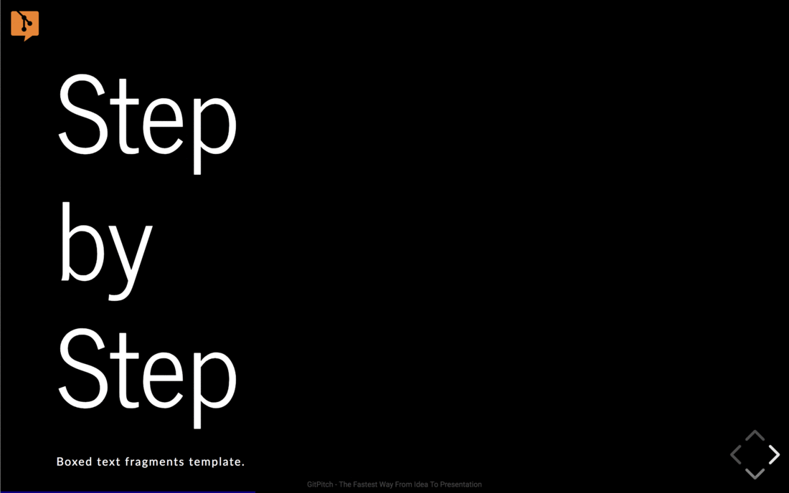
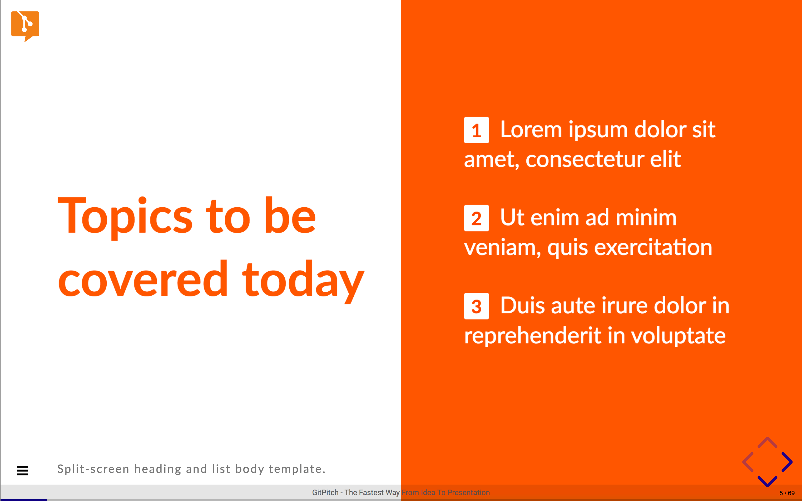
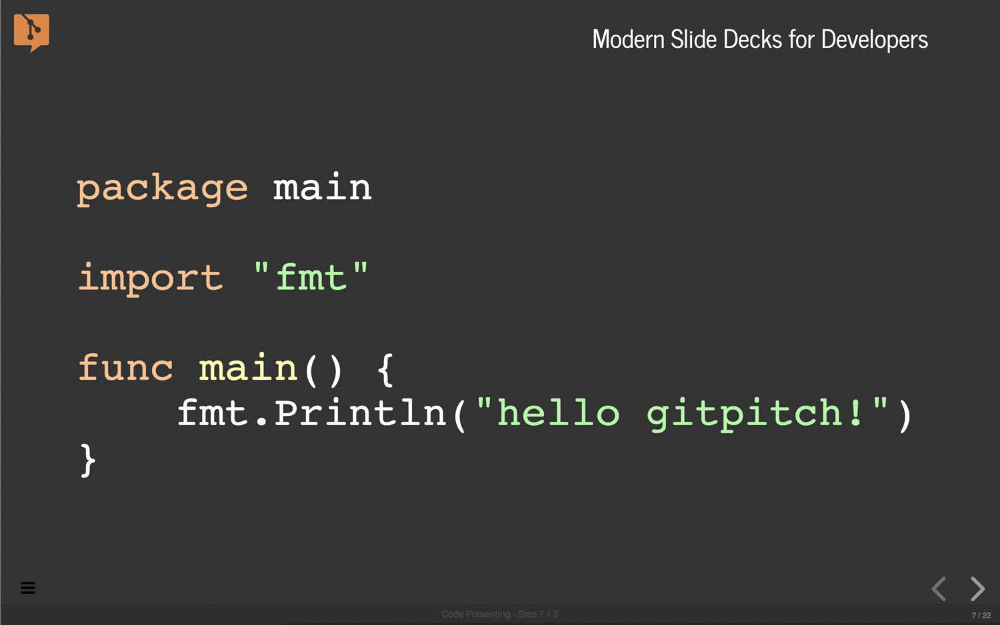
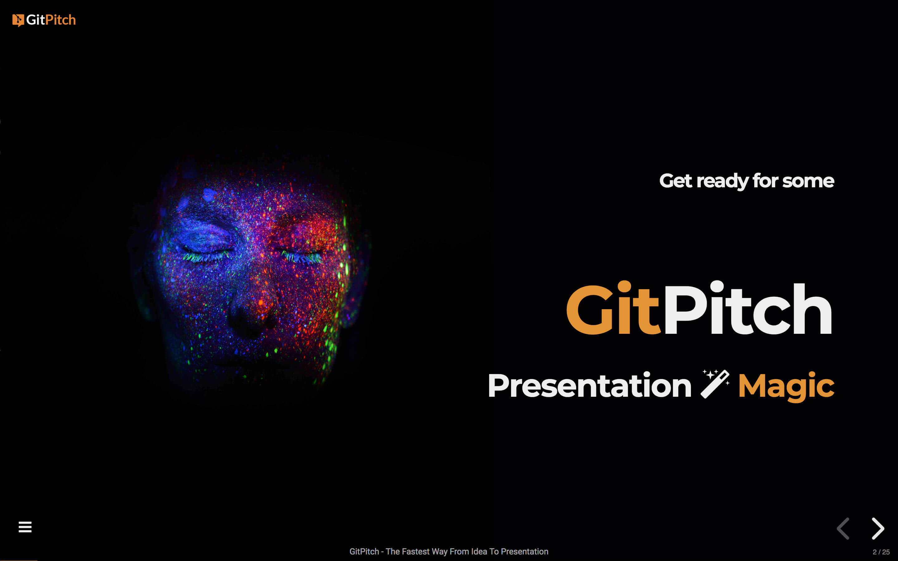
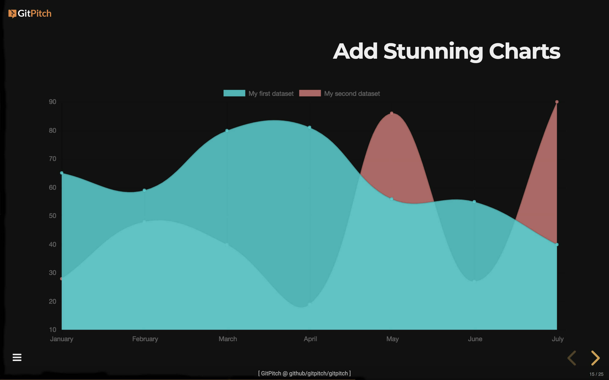
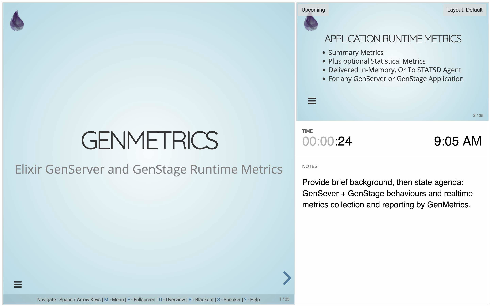
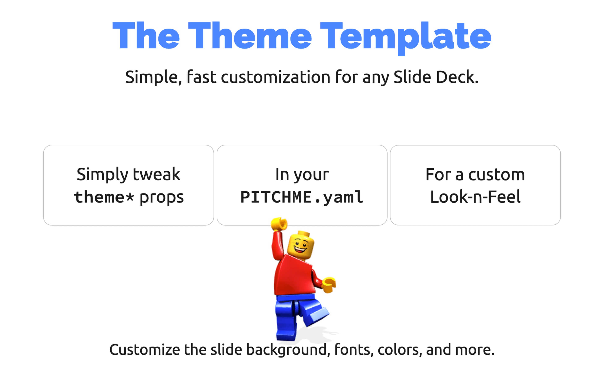
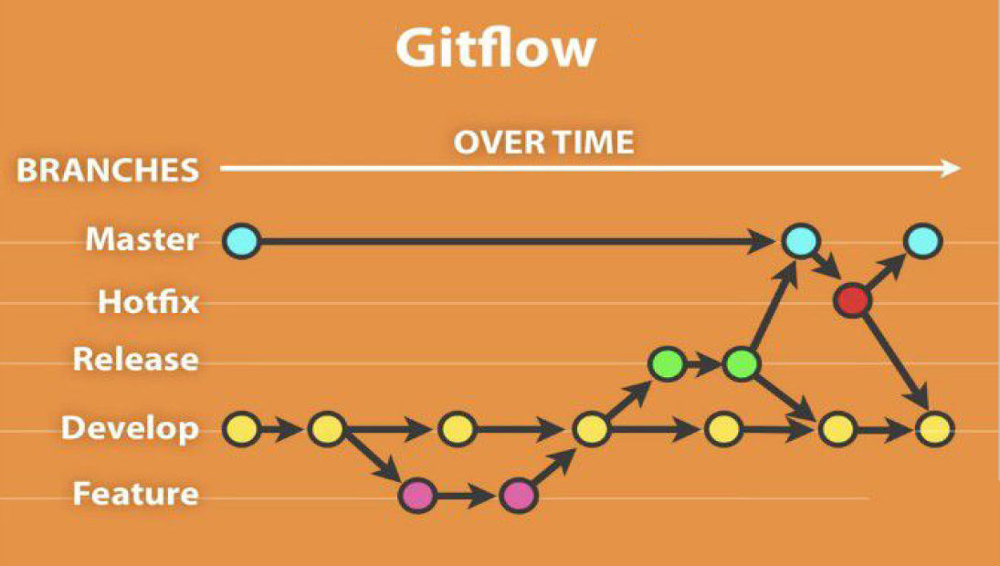

---?image=assets/img/audience.png&opacity=100&color=#E58537&size=100% 40%
@title[Introduction]

@snap[north-west raleway-medium]
#### The Markdown Presentation Service on Git
@snapend

@snap[west montserrat-heavy heading-white]
# GitPitch@css[faded text-05](.com)
@snapend

---?image=assets/img/audience.png&size=100% 40%

### What can GitPitch do for you?

@snap[north text-gray text-05 span-100]
*Conference Speakers. Consultants. Educators. Training Instructors. Pssst...*
@snapend

---?image=assets/img/audience.png&size=100% 40%

@snap[north-east raleway-medium span-55]
#### GitPitch Desktop
[Pro Desktop Docs @fa[external-link fa-font]](https://gitpitch.com/docs/pro-features/desktop)
@snapend

@snap[east span-50]

@snapend

@snap[west span-40 pro-feature-details]
@fa[quote-left] Enjoy a dedicated desktop tool on Linux, OSX, and Windows1 for developing and presenting offline. See local changes to your presentation instantly reflected in a live preview in your browser.
@snapend

@snap[south-west text-03]
1. Windows 10 Pro + Enterprise Editions
@snapend

---?image=assets/img/audience.png&size=100% 40%

@snap[north-east raleway-medium span-55]
#### GitPitch Security
[Pro Security Docs @fa[external-link fa-font]](https://gitpitch.com/docs/pro-features/security)
@snapend

@snap[east span-50]

@snapend

@snap[west span-40 pro-feature-details]
@fa[quote-left] Activate public, private, and password-protected slideshow presentations powered by private Git repositories. Use GitPitch to secure your content and manage your slideshow audience in the cloud.
@snapend

---?image=assets/img/audience.png&size=100% 40%

@snap[north-east raleway-medium span-55]
#### GitPitch Surveys
[Pro Surveys Docs @fa[external-link fa-font]](https://gitpitch.com/docs/pro-features/surveys)
@snapend

@snap[east span-50]

@snapend

@snap[west span-40 pro-feature-details]
@fa[quote-left] Turn any slideshow into a two-way conversation. Deliver your message using a GitPitch slide deck. Then gather feedback from your audience long after you leave the stage using rich, professional surveys.
@snapend

---?image=assets/img/audience.png&size=100% 40%

@snap[north-east raleway-medium span-55]
#### GitPitch Pro Bonus
[Pro Bonus Docs @fa[external-link fa-font]](https://gitpitch.com/docs/pro-features/bonus)
@snapend

@snap[east span-50]

@snapend

@snap[west span-40 pro-feature-details]
@fa[quote-left] Beyond GitPitch Desktop, Security, and Surveys...Pro users enjoy powerful slideshow features including image opacity controls, offline video streaming, Google Web Fonts, and Emojis @emoji[heart_eyes]
@snapend     

---

@snap[north raleway-medium span-80]
### Markdown Shortcuts
[Markdown Shortcuts Docs @fa[external-link fa-font]](https://gitpitch.com/docs/markdown-features)
@snapend

@snap[midpoint span-50]

@snapend

@snap[south span-100 feature-details]
Use GitPitch markdown syntax shortcuts to control the appearance of slide content, and effortlessly generate rich visual slide components aka. GitPitch Markdown Widgets @fa[quote-right]
@snapend

---

@snap[north raleway-medium span-80]
### Snap Layouts
[Snap Layouts Docs @fa[external-link fa-font]](https://gitpitch.com/docs/layout-features)
@snapend

@snap[midpoint span-50]

@snapend

@snap[south span-100 feature-details]
Use GitPitch snap-layouts syntax to control the placement of content on any slide. Override automatic layout controls and enjoy the power to create unique layouts for your slide decks @fa[quote-right]
@snapend     

---

@snap[north raleway-medium span-80]
### Live Code Presenting
[Code Presenting Docs @fa[external-link fa-font]](https://gitpitch.com/docs/code-features)
@snapend

@snap[midpoint span-50]

@snapend

@snap[south span-100 feature-details]
Present any fenced code-block, repository source file, or GitHub GIST. Focus-on and step-through specific code snippets, loops, functions, output, etc. from directly within your slide deck @fa[quote-right]
@snapend     

---

@snap[north raleway-medium span-80]
### Image Magic
[Image Magic Docs @fa[external-link fa-font]](https://gitpitch.com/docs/image-features)
@snapend

@snap[midpoint span-50]

@snapend

@snap[south span-100 feature-details]
Enjoy extensive support for inline and background images on any slide. Images can be automatically sized, scaled, positioned, repeated, and even styled using custom CSS @fa[quote-right]
@snapend     

---

@snap[north raleway-medium span-80]
### Rich Media
[Rich Media Docs @fa[external-link fa-font]](https://gitpitch.com/docs/rich-media-features)
@snapend

@snap[midpoint span-50]

@snapend

@snap[south span-100 feature-details]
Enhance your slide decks by adding rich visual content, including charts, MathJax formulas, inline and background videos, FontAwesome icons, solid color and gradient backgrounds @fa[quote-right]
@snapend     

---

@snap[north raleway-medium span-80]
### Speaker Support
[Speaker Support Docs @fa[external-link fa-font]](https://gitpitch.com/docs/speaker-features)
@snapend

@snap[midpoint span-50]

@snapend

@snap[south span-100 feature-details]
Enjoy great features tailored specifically for conference speakers and training instructors. Including speaker notes, a dedicated speaker window, and support for remote control devices @fa[quote-right]
@snapend     

---

@snap[north raleway-medium span-80]
### Theme Customization
[Theme Customization Docs @fa[external-link fa-font]](https://gitpitch.com/docs/themes)
@snapend

@snap[midpoint span-50]

@snapend

@snap[south span-100 feature-details]
Embrace or extend one of the built-in slideshow themes to create a look-n-feel to fit your business or brand. You have unlimited control over the appearance of your slide decks using CSS @fa[quote-right]
@snapend     

---

@snap[north raleway-medium span-80]
### Do More With Git
[Do More With Git Docs @fa[external-link fa-font]](https://gitpitch.com/docs/git)
@snapend

@snap[midpoint span-50]

@snapend

@snap[south span-100 feature-details]
Use your preferred Git flow to develop your slideshow presentation content. Collaborate with your existing Git organizations and teams. Use one or more branches. Publish unlimited decks @fa[quote-right]
@snapend     

---

@snap[north raleway-medium span-80]
### Modular Slideshows
[Modular Slideshows Docs @fa[external-link fa-font]](https://gitpitch.com/docs/git/branch-modular-slideshows)
@snapend

@snap[midpoint span-45]

@snapend

@snap[south span-100 feature-details]
Thanks to first-class support for modular markdown you can develop and publish modular slideshows. Share the complete slide deck. Or share select mini-decks with your audience @fa[quote-right]
@snapend     

---

@snap[north raleway-medium span-80]
### The Quickstart Template
[Quickstart Template Docs @fa[external-link fa-font]](https://gitpitch.com/docs/the-template)
@snapend

@snap[midpoint span-50]

@snapend

@snap[south span-100 feature-details]
The Template is a collection of high-utility slide designs available out-of-the-box to GitPitch presentation authors. Developed using markdown. Customizable using CSS @fa[quote-right]
@snapend     

---?image=assets/img/audience.png&opacity=100&color=#E58537&size=100% 55%
@title[Now It's Your Turn]

@snap[north-west montserrat-heavy heading-white]
## GitPitch@css[faded text-05](.com)
@snapend

@snap[west raleway-medium pad-bottom-5]
#### Modern @css[text-white text-smallcaps text-14](Slide Decks) for @css[text-white text-smallcaps text-16](Developers)
@snapend

@snap[south-west raleway-medium text-white text-08]
On GitHub @fa[github fa-font], GitLab @fa[gitlab fa-font], and Bitbucket @fa[bitbucket fa-font]
@snapend
