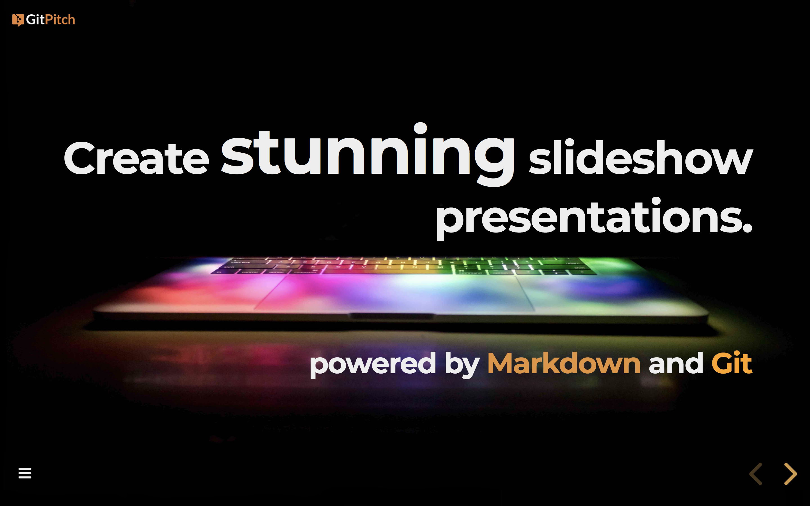
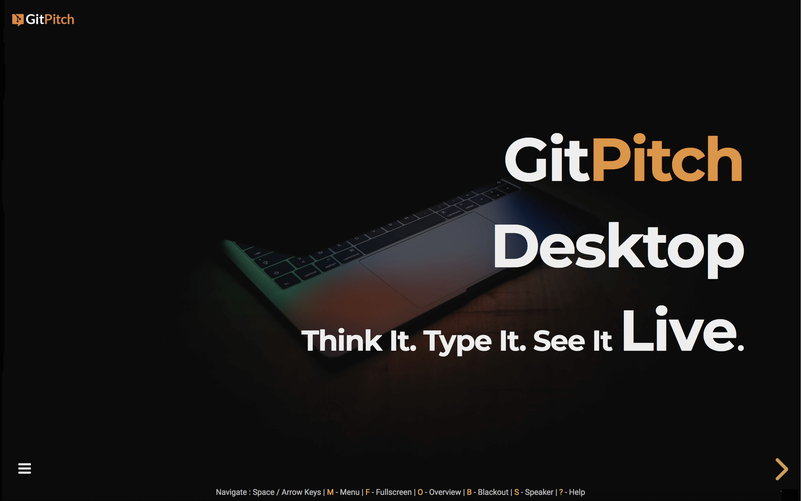
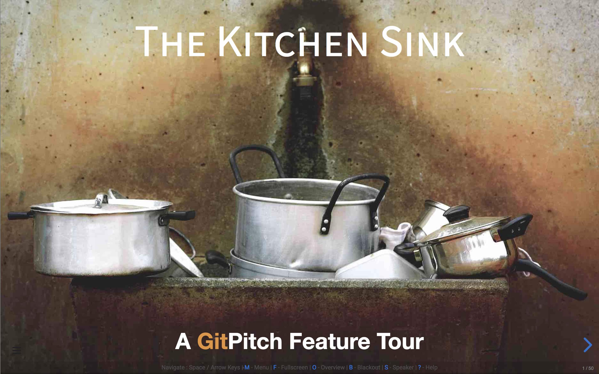
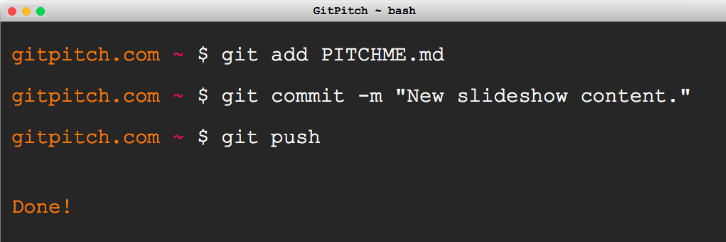
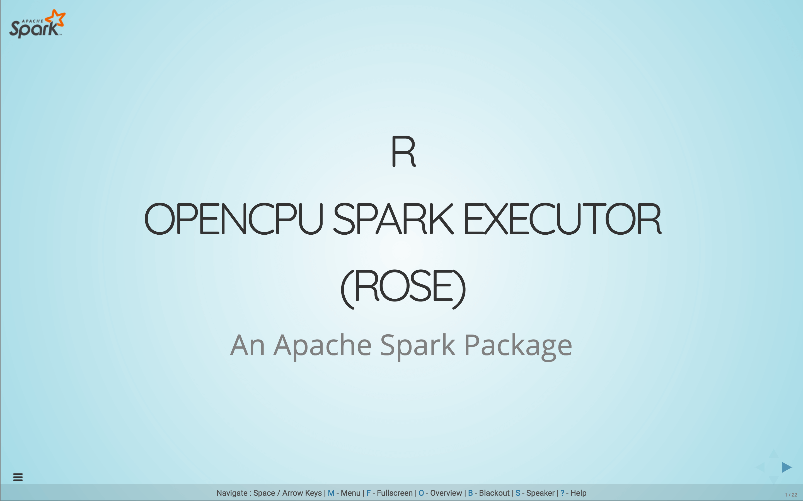
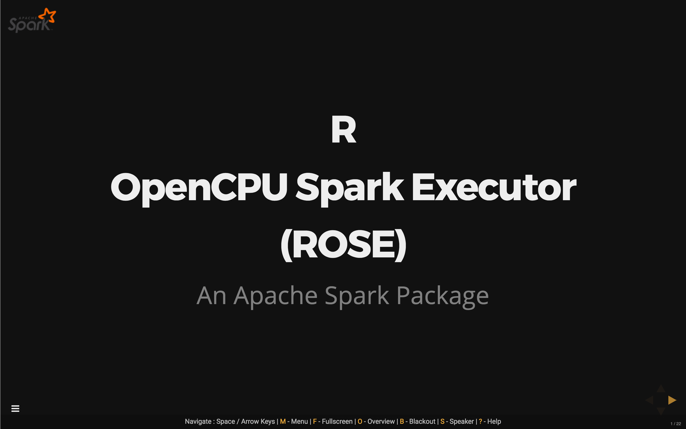
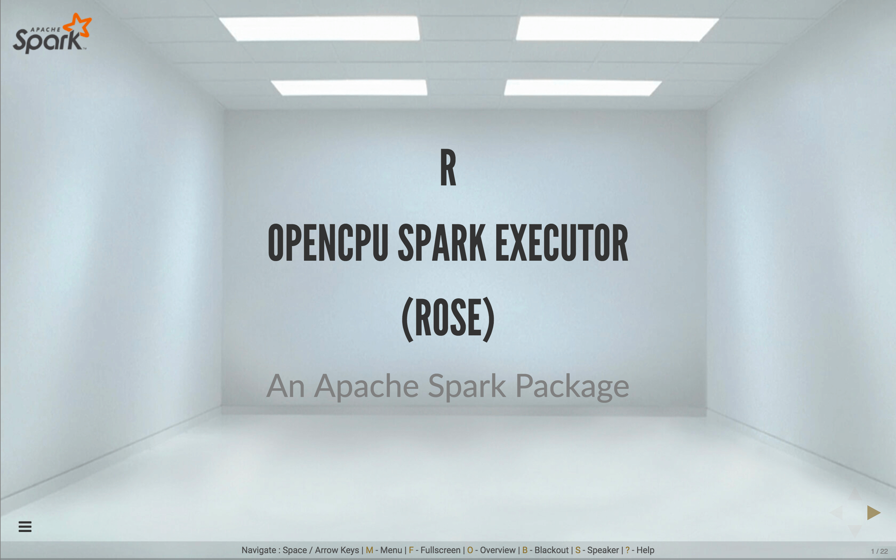
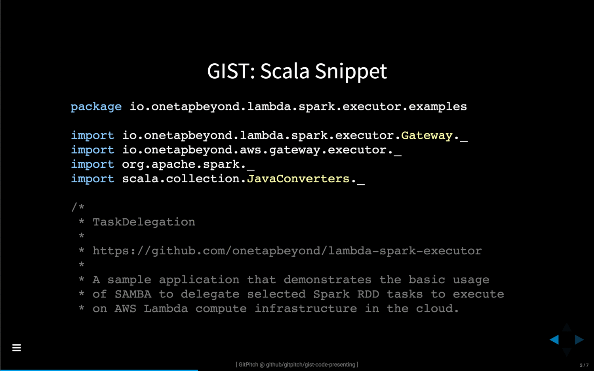
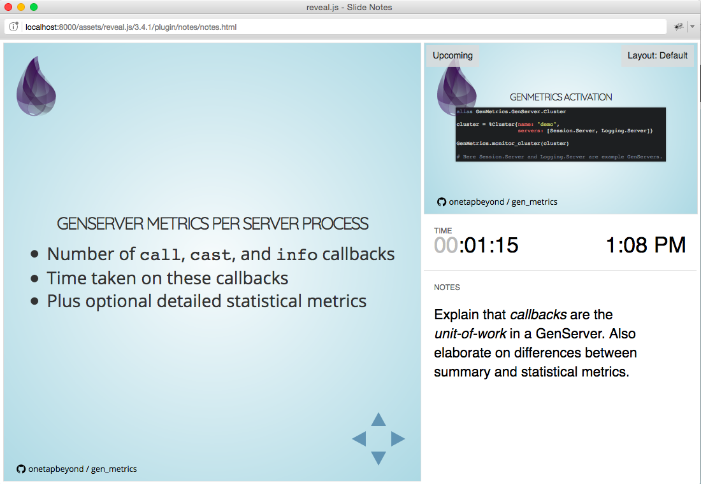

 

# Markdown Presentations For Everyone on GitHub, GitLab, Bitbucket, GitBucket, Gitea, and Gogs.

#### WEBSITE: [www.gitpitch.com](https://gitpitch.com) | HOW-TO : [GitPitch Docs](https://gitpitch.com/docs) | TWITTER: [@gitpitch](https://twitter.com/gitpitch)

- [What is GitPitch?](#what-is-gitpitch)
- [What is GitPitch Pro?](#what-is-gitpitch-pro)
- [Is GitPitch for you?](#is-gitpitch-for-you)
- [Live Feature Tour](#gitpitch-kitchen-sink---a-live-feature-tour)
- [How does GitPitch work?](#how-does-gitpitch-work)
- [Compelling Presentations](#gitpitch-slideshow-presentations-are-compelling)
- [Customizable Presentations](#gitpitch-slideshow-presentations-are-customizable)
- [Code-Ready Presentations](#gitpitch-slideshow-presentations-speak-code-fluently)
- [Speaker-Ready Presentations](#gitpitch-slideshow-presentations-are-speaker-ready)
- [Modular Presentations](#gitpitch-slideshow-presentations-are-modular)
- [Social Presentations](#gitpitch-slideshow-presentations-are-social)
- [Presentations That Just Work](#gitpitch-slideshow-presentations-just-work)
- [An Open Source Project](#gitpitch---an-open-source-project)

## What is GitPitch?

https://gitpitch.com/docs

GitPitch is a markdown presentation service for everyone on Git. You can use it
to promote, pitch or present absolutely anything using the tools you already
know and love - Markdown + Git.

The service introduces a new convention for Git users, called **PITCHME.md**.
The GitPitch server turns **PITCHME.md** markdown files found within any public
or private repo into online and offline, interactive slideshows.

GitPitch is an open source project so you can fork, clone, and modify the source.
You can find detailed build instructions [here](https://github.com/gitpitch/gitpitch/wiki/Server-Build-Instructions).
You can also submit bug, feature and pull-requests on this repo. If you like
this project please show your support with a [GitHub star](https://github.com/gitpitch/gitpitch/stargazers).

Your support is much appreciated. Cheers, David :heart:.

## What is GitPitch Pro?

GitPitch Pro is the GitPitch service hosted on [gitpitch.com](https://gitpitch.com).

GitPitch Pro offers a wide range of [free](https://gitpitch.com/features) and
enhanced [subscription](https://gitpitch.com/pro-features) features, including
[GitPitch Desktop](https://gitpitch.com/desktop) for local development, live
previews, and presenting directly on your Linux, Windows, or OSX desktop.

GitPitch Pro is also available as [GitPitch Enterprise](https://gitpitch.com/docs/about/enterprise)
for on-premises deployment with seamless integration for GitHub Enterprise,
GitLab, Bitbucket, GitBucket, Gitea, and Gogs servers.

GitPitch Enterprise is delivered using Docker, the worlds leading software
containerization platform.

## Is GitPitch for you?

If you ever find yourself needing to present a concept, design, library, framework, product, service, training materials, or educational course work:

- To colleagues, clients or customers
- At meetups or conferences
- At training events or teaching sessions

Then GitPitch is for you. Simply capture your ideas in Markdown and let GitPitch automatically turn those ideas into compelling, responsive, online and offline slideshow presentations.

## GitPitch Kitchen Sink - A Live Feature Tour

See the [GitPitch Kitchen Sink](https://gitpitch.com/gitpitch/kitchen-sink) for a live demonstration of GitPitch slideshow features.

## How does GitPitch work?

GitPitch presentations are powered by the amazing [reveal.js](https://github.com/hakimel/reveal.js) presentation framework. But with GitPitch there is nothing to download. Nothing to install. All you need is your favorite text editor. And an account on GitHub, GitLab, or Bitbucket. Or a self-hosted instance of GitHub Enterprise, GitLab CE, GitBucket, Gitea, or Gogs.

No more Keynote. No more PowerPoint. Just Markdown. Then git-commit and push on
any branch within a public GitHub, GitLab, Bitbucket, GitBucket, Gitea, or Gogs repo.

If you want to avoid the `git-push-preview` cycle during development, consider activating a GitPitch Pro subscription that will give you access to [GitPitch Desktop](https://gitpitch.com/desktop). GitPitch Desktop supports local development, live previews, and presenting directly on your Linux, Windows, or OSX desktop. Desktop works offline so you can too. Which is prefect for long-haul flights, or when you take the stage for live presentations.

## GitPitch slideshow presentations are compelling

Each slideshow presentation is beautifully rendered, fully responsive, and highly interactive with a rich set of features including:

- [Markdown Magic](https://gitpitch.com/docs/markdown-features) Slides
- [Code + GIST](https://gitpitch.com/docs/code-features) Slides
- [Image](https://gitpitch.com/docs/image-features) Slides
- [Video + Math Formulas + Charts + Icons](https://gitpitch.com/docs/rich-media-features)

## GitPitch slideshow presentations are customizable

Choose between six distinct [visual themes](https://gitpitch.com/docs/themes):

Or further [customize the look and feel](https://gitpitch.com/docs/settings) of your slideshow presentations using background images, your own logo and even [custom css](https://gitpitch.com/docs/themes/custom).

## GitPitch slideshow presentations speak code fluently

Step-through static-code blocks or the complete source-code from any file in the repo, line-by-line or section-by-section, from directly within any slideshow presentation using [code-presenting](https://gitpitch.com/docs/code-features/presenting).

## GitPitch slideshow presentations are speaker-ready

GitPitch supports a [speaker notes window](https://gitpitch.com/docs/speaker-features) that can be opened for any GitPitch online or [offline](https://gitpitch.com/docs/foundation-features/offline) presentation. The speaker notes window shows the current slide, provides a preview of the upcoming slide, and also includes a timer that helps keep track of time once you launch the presentation.

## GitPitch slideshow presentations are modular

Create and deliver content and course materials as a series of slideshow presentations using [modular markdown](https://gitpitch.com/docs/git/branch-shared-markdown) and [shared assets](https://gitpitch.com/docs/git/branch-shared-assets) (css, images, etc.) in a single git repo.

## GitPitch slideshow presentations are social

GitPitch slideshow presentations are designed for instant [sharing online](https://gitpitch.com/docs/foundation-features/online).

## GitPitch slideshow presentations just work

GitPitch requires no sign-up. And no configuration. Just add **PITCHME.md** ;)

The [GitPitch Docs](https://gitpitch.com/docs) provide a detailed `How-To` that walks you through getting started, building, customizing, and sharing your GitPitch slideshow presentations.

## GitPitch - An Open Source Project

The GitPitch server is a [Play Framework 2.5.x](https://playframework.com/) Web application open-sourced under an MIT License. This means you can fork, clone, and modify the source and build and test the server on your local machine.

You can find detailed build instructions [here](https://github.com/gitpitch/gitpitch/wiki/Server-Build-Instructions). You can also submit bug, feature and pull-requests on this repo. If you like this project please show your support with a [GitHub star](https://github.com/gitpitch/gitpitch/stargazers). Much appreciated.

GitPitch has been designed to follow standard Play Framework conventions. In order to understand the layout of this project see the following article, [Anatomy of a Play Application](https://playframework.com/documentation/2.5.x/Anatomy).

## MIT License

Copyright (c) 2016 David Russell

Permission is hereby granted, free of charge, to any person obtaining a copy
of this software and associated documentation files (the "Software"), to deal
in the Software without restriction, including without limitation the rights
to use, copy, modify, merge, publish, distribute, sublicense, and/or sell
copies of the Software, and to permit persons to whom the Software is
furnished to do so, subject to the following conditions:

The above copyright notice and this permission notice shall be included in all
copies or substantial portions of the Software.

THE SOFTWARE IS PROVIDED "AS IS", WITHOUT WARRANTY OF ANY KIND, EXPRESS OR
IMPLIED, INCLUDING BUT NOT LIMITED TO THE WARRANTIES OF MERCHANTABILITY,
FITNESS FOR A PARTICULAR PURPOSE AND NONINFRINGEMENT. IN NO EVENT SHALL THE
AUTHORS OR COPYRIGHT HOLDERS BE LIABLE FOR ANY CLAIM, DAMAGES OR OTHER
LIABILITY, WHETHER IN AN ACTION OF CONTRACT, TORT OR OTHERWISE, ARISING FROM,
OUT OF OR IN CONNECTION WITH THE SOFTWARE OR THE USE OR OTHER DEALINGS IN THE
SOFTWARE.
