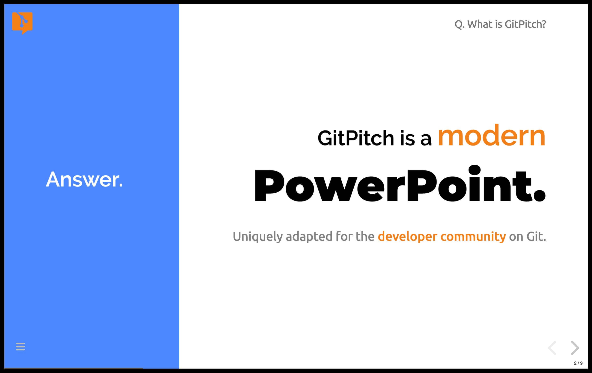
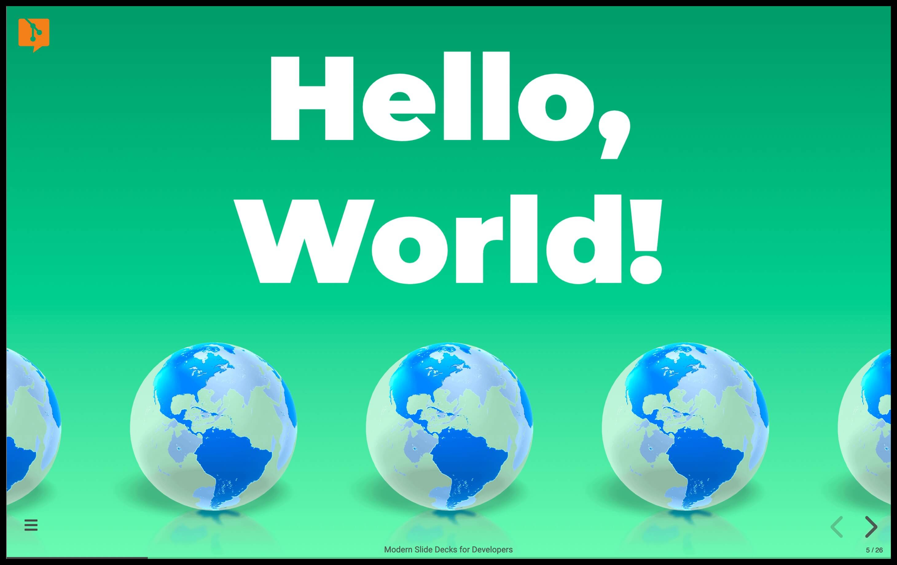
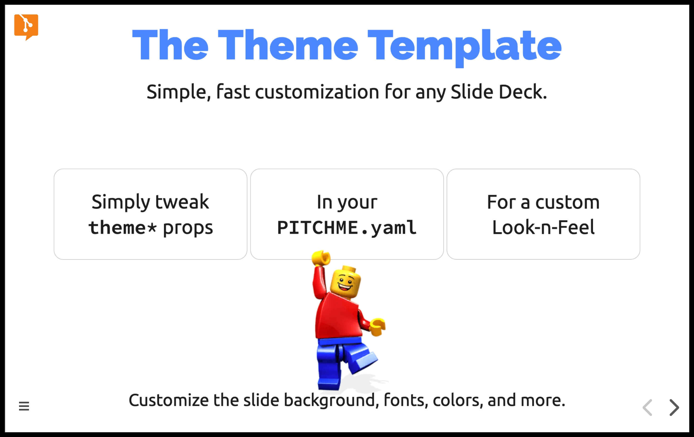
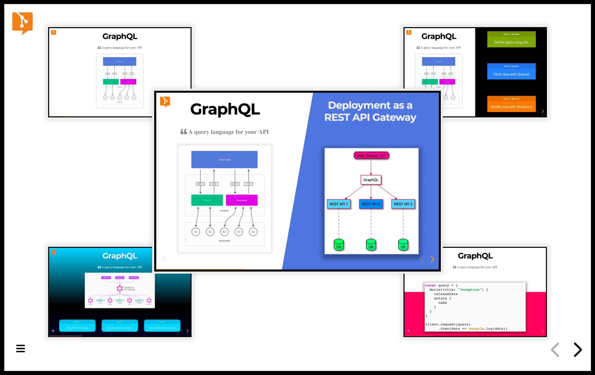
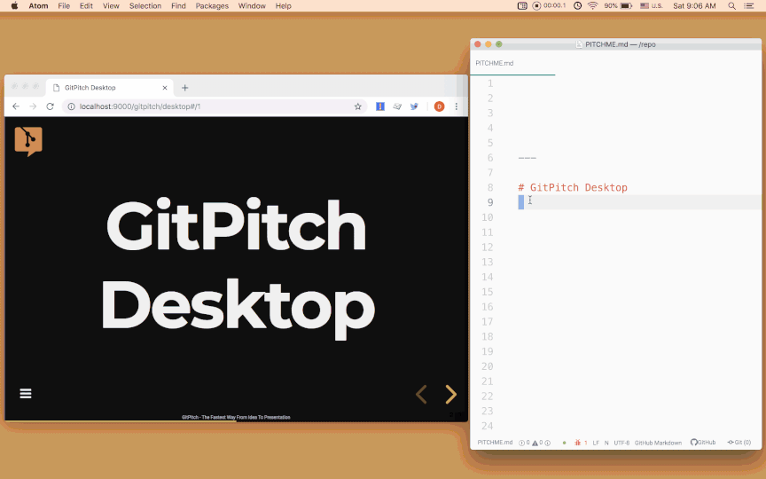
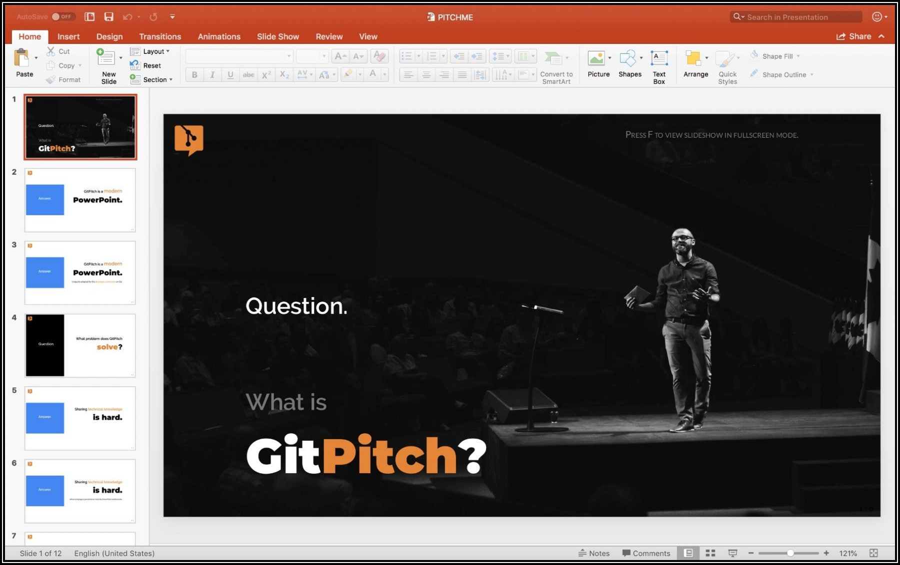

 

# Modern Slide Decks for Developers on Git

#### WEBSITE: [www.gitpitch.com](https://gitpitch.com) | HOW-TO : [GitPitch Docs](https://gitpitch.com/docs) | TWITTER: [@gitpitch](https://twitter.com/gitpitch)

### What is GitPitch?

> Consultants. Conference Speakers. Educators. Training Instructors. Pssst...

GitPitch is a modern PowerPoint uniquely adapted for developers on GitHub,
GitLab, and Bitbucket. Develop, preview, and present offline. Git-push to
publish and share online. Or one-click export to PowerPoint, Keynote, Google
Slides, and PDF.

> Click link to view the **What is GitPitch?** slide deck: https://gitpitch.com/gitpitch/what-is-gitpitch

 

### What is GitPitch.com?

GitPitch.com is a modern slide deck solution hosted on
[gitpitch.com](https://gitpitch.com). GitPitch is powered by the tools you
already know and love - Markdown and Git. You can learn more about each of
the available GitPitch services at the following links:

- [A Modern Slide Deck Service in the Cloud Free for Everyone](https://gitpitch.com/free-features)
- [A Modern Slide Deck Service in the Cloud and on the Desktop for Subscribers](https://gitpitch.com/features)
- [A Modern Slide Deck Service for Enterprise Deployment On-Premises](https://gitpitch.com/enterprise)

 

> Click link to view the **GitPitch Hello World** slide deck: https://gitpitch.com/gitpitch/demo-deck

 

### What makes GitPitch so perfect for Developers?

Click on the links below to view sample slide decks and feature guides to
learn what makes GitPitch a truly unique *developer-native* slide deck solution
for everyone on GitHub, GitLab, and Bitbucket.

  

> Click link to view the **Modular Slide Decks with Git Guide**: https://gitpitch.com/docs/git

  

> Click link to view the **The Theme Template** slide deck: https://gitpitch.com/gitpitch/theme-template-demos

  

> Click link to view the **Custom Layouts Guide**: https://gitpitch.com/gitpitch/snap-layouts

  

> Click link to view the **Live Code Presenting** slide deck: https://gitpitch.com/gitpitch/pro-code-presenting

  

> Click link to view the **Speaker Support Guide** : https://gitpitch.com/docs/speaker-features

  

> Click link to view the **The GitPitch Desktop Guide**: https://gitpitch.com/docs/pro-features/desktop

  

> Click link to view the **The GitPitch Desktop Export Guide**: https://gitpitch.com/docs/pro-features/desktop

  

> Click link to view the **The Complete GitPitch Docs**: https://gitpitch.com/docs

  

### Introducing the PITCHME.md Convention

#### The README.md Convention

If you have ever worked with Git - on GitHub, GitLab, or Bitbucket - you are
probably already familiar with this convention. It automatically turns any
README.md file found within a Git repository into nicely rendered documentation.
This convention gives developers a simple and convenient way to document any
project.

#### The PITCHME.md Convention

GitPitch introduces a brand new convention for all Git users, the PITCHME.md
convention. This convention automatically turns any PITCHME.md file found
within a Git repository into a modern slideshow presentation on
[gitpitch.com](https://gitpitch.com). This convention gives developers a simple
and convenient way to promote, pitch or present absolutely anything. Using the
tools we already know and love - Markdown and Git.

  

### The GitPitch Backstory

GitPitch began as a personal project back in 2016. The early versions of the
service were maintained as an open source project in this repository. I now
work on this project full-time and develop a wide range of
[free, subscriber, and enterprise](https://gitpitch.com/pricing) slide deck
solutions. You can still fork, clone, or modify the original source and open
new issues and feature requests on this repo. For project news and updates,
follow me on [Twitter](https://twitter.com/gitpitch).

If you like this project please show your support with a
[GitHub Star](https://github.com/gitpitch/gitpitch/stargazers). Your support is
much appreciated. Cheers, David :heart:.

  
