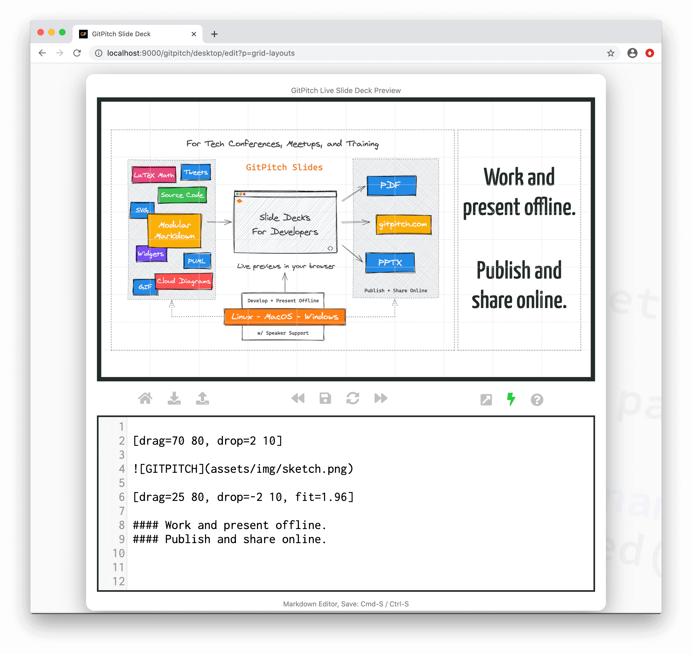

 

> Service on [gitpitch.com](https://gitpitch.com) is shutting down on March 1, 2021.

## GitPitch 4.0

- [Docs](https://docs.gitpitch.com)
- [Twitter](https://twitter.com/gitpitch)

### About

- Watch the [Introducing GitPitch 4.0 Video](https://www.youtube.com/watch?v=MT88pCE291I)
- Visit the [What's New in GitPitch 4.0 Guide](https://docs.gitpitch.com/#/whats-new-in-40)
- Go directly to the [GitPitch 4.0 Quickstart Guide](https://docs.gitpitch.com/#/quickstart)

GitPitch 4.0 is the perfect slide deck solution for tech conferences, training, developer advocates, and educators. Available on MacOS, Linux, and Windows 10. Work and present offline. Export to PDF, PPTX, and HTML. Or git-push to share public, private and password-protected slide decks online.

 

- GitPitch is a markdown presentation tool for MacOS, Linux, and Windows 10.
- GitPitch Desktop lets you develop, preview, and present markdown presentations offline.
- Using modular markdown to deliver modular decks...perfect for training and course content.
- Export your markdown presentations to PDF, PPTX, and HTML.
- And publish and share your markdown presentations online at [gitpitch.com](https://gitpitch.com).
- To publish any deck just *git-push* to any repo on GitHub, GitLab, or Bitbucket.
- And share it as a public, private, or password-protected slide deck on [gitpitch.com](https://gitpitch.com).

 

## GitPitch Documentation

The official GitPitch docs are maintained in this repository under the [docs](/docs) directory. Pull-requests on this repo to fix or improve the documentation in any way are very welcome. You can view the documentation live at [https://docs.gitpitch.com](https://docs.gitpitch.com/).

 

## GitPitch Product Repos

GitPitch began as an open-source project back in 2016.  Since early 2017 I have been working full time developing a number of [GitPitch products and services](https://docs.gitpitch.com/#/meet-the-family) most of which are maintained in private repositories.

This repository is now used to maintain the official GitPitch docs. You can also use this repository to report issues and request features for all GitPitch products using GitHub [issue tracking](https://github.com/gitpitch/gitpitch/issues).

