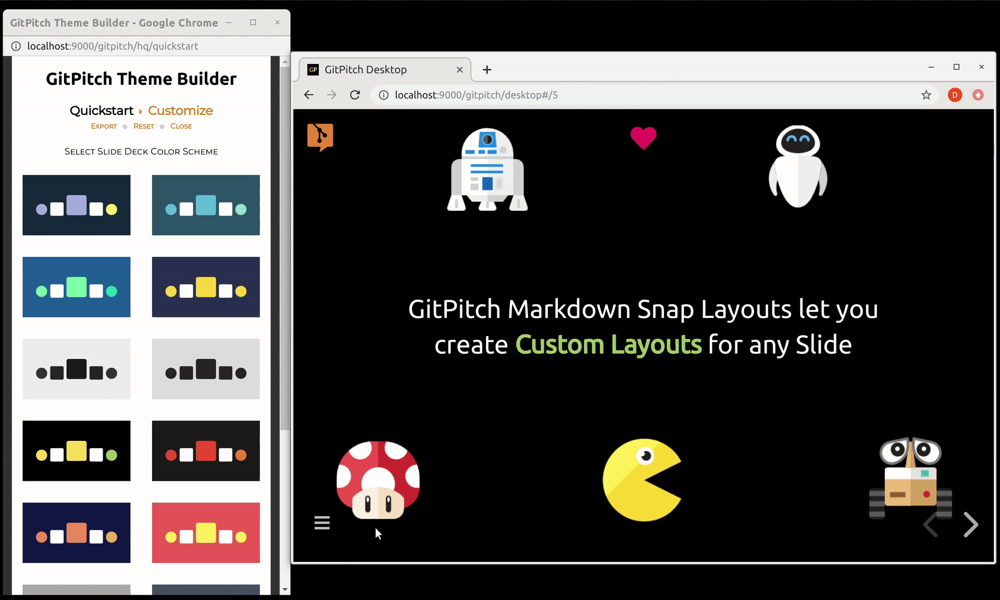
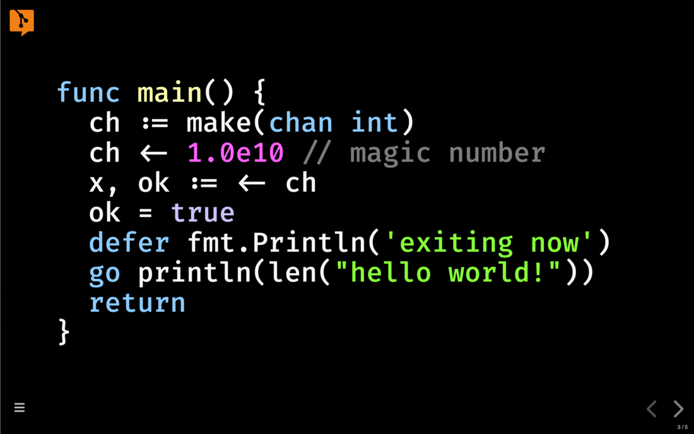
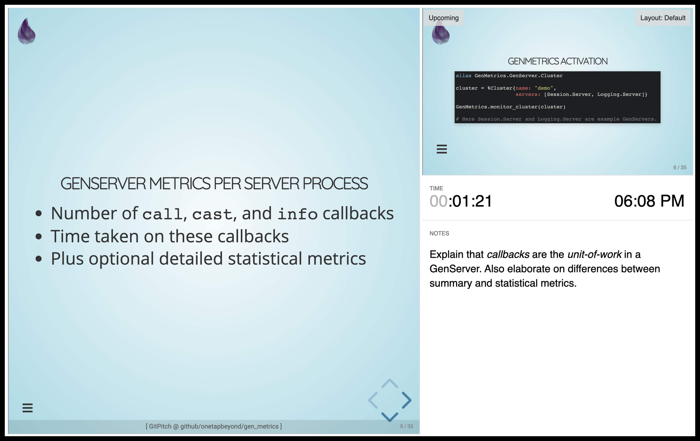
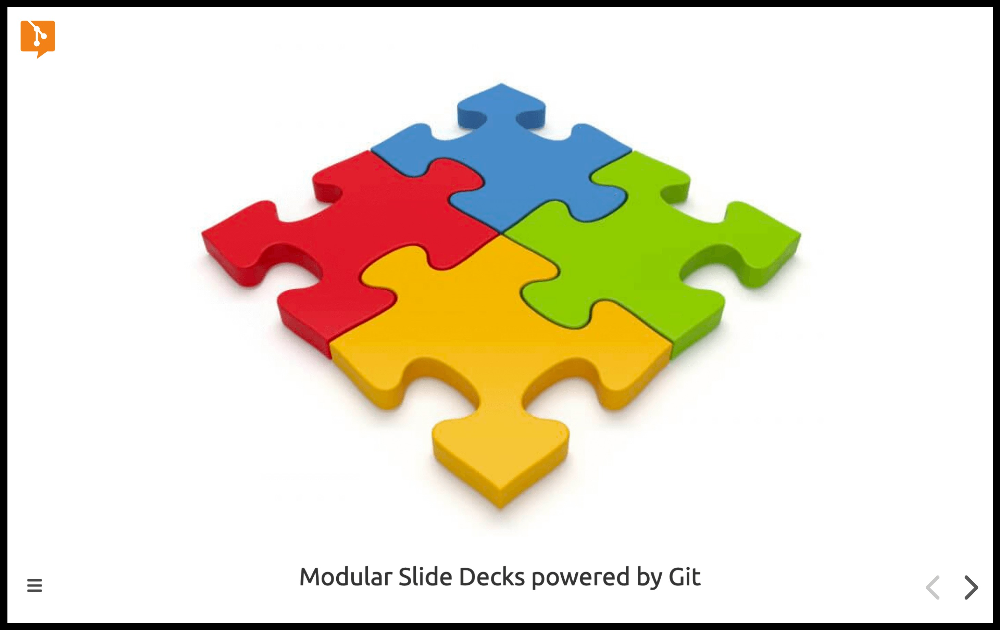
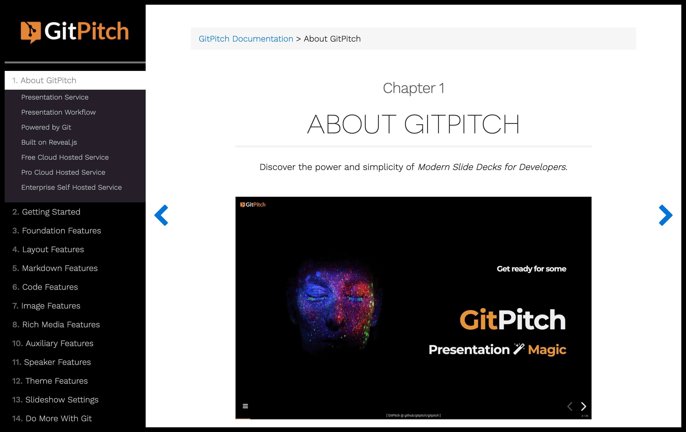
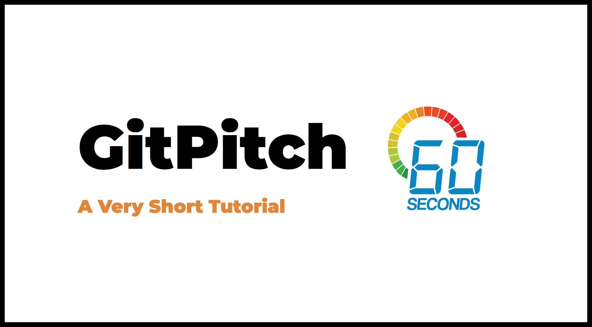

 

# Slide Decks for Tech Conferences, Meetups, and Training

#### WEBSITE: [www.gitpitch.com](https://gitpitch.com) | HOW-TO : [GitPitch Docs](https://gitpitch.com/docs) | TWITTER: [@gitpitch](https://twitter.com/gitpitch)

### What is GitPitch?

> Developers. Conference Speakers. Educators. Training Instructors. Pssst...
>
 

  

- GitPitch is a markdown presentation tool for MacOS, Linux, and Windows 10.
- GitPitch Desktop lets you develop, preview, and present markdown presentations offline.
- Export your markdown presentations to PDF and PowerPoint PTTX.
- And publish and share your markdown presentations online at [gitpitch.com](https://gitpitch.com).
- To publish any deck just *git-push* from your desktop to any repo on GitHub, GitLab, or Bitbucket.
- And share it as a public, private, or password-protected markdown presentation in the cloud.

 

### GitPitch Theme Builder

> Click link to view the **Theme Builder Guide** : https://gitpitch.com/docs/themes/default

  

### GitPitch Snap Layouts

> Click link to view the **Snap Layouts Guide** : https://gitpitch.com/docs/layout-features/snap-layouts

  

### GitPitch Live Code Presenting

> Click link to view the **Live Code Presenting Guide** : https://gitpitch.com/docs/code-features/presenting

  

> Click link to view the **Speaker Support Guide** : https://gitpitch.com/docs/speaker-features

  

> Click link to view the **Modular Presentations Guide** : https://gitpitch.com/docs/git/branch-shared-markdown

  

### The GitPitch Docs

> Click link to view the **The Complete GitPitch Docs**: https://gitpitch.com/docs

  

### GitPitch In-60-Seconds Tutorial

> Click link to launch the **GitPitch In-60-Seconds Tutorial**: https://github.com/gitpitch/in-60-seconds

  

### Introducing the PITCHME.md Convention

#### The README.md Convention

If you have ever worked with Git - on GitHub, GitLab, or Bitbucket - you are
probably already familiar with this convention. It automatically turns any
README.md file found within a Git repository into nicely rendered documentation.
This convention gives developers a simple and convenient way to document any
project.

#### The PITCHME.md Convention

GitPitch introduces a brand new convention for all Git users, the PITCHME.md
convention. This convention automatically turns any PITCHME.md file found
within a Git repository into a modern slideshow presentation on
[gitpitch.com](https://gitpitch.com). This convention gives developers a simple
and convenient way to promote, pitch or present absolutely anything. Using the
tools we already know and love - Markdown and Git.

  

### The GitPitch Backstory

GitPitch began as a personal project back in 2016. The early versions of the
service were maintained as an open source project in this repository. I now
work on this project full-time and develop a wide range of
[free, subscriber, and enterprise](https://gitpitch.com/pricing) presentation
tools and services. You can still fork, clone, or modify the original source and open
new issues and feature requests on this repo. For project news and updates,
follow me on [Twitter](https://twitter.com/gitpitch).

If you like this project please show your support with a
[GitHub Star](https://github.com/gitpitch/gitpitch/stargazers). Your support is
much appreciated. Cheers, David :heart:.

  
