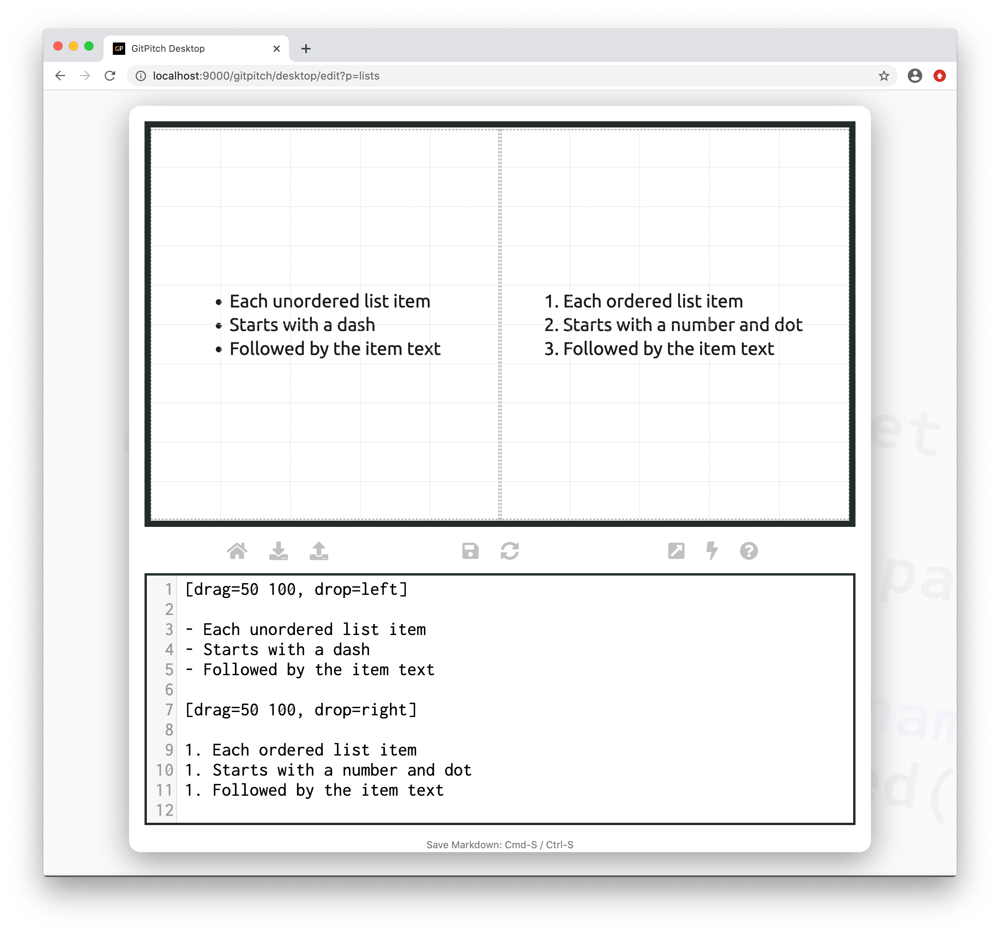
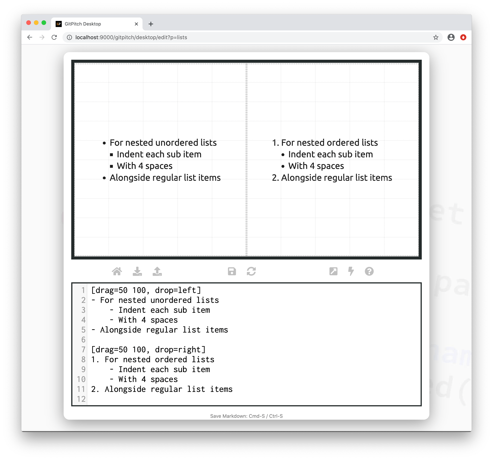

?> For advanced behaviors and styles unique to lists see the [List Widgets Guide](../lists/widgets.md).

### Basic Lists



Copy this markdown snippet to experiment with lists within your own slide deck:

```markdown
[drag=50 100, drop=left]

- Each unordered list item
- Starts with a dash
- Followed by the item text

[drag=50 100, drop=right]

1. Each ordered list item
1. Starts with a number and dot
1. Followed by the item text
```

### Nested Lists

?> For advanced behaviors and styles unique to lists see the [List Widgets Guide](../lists/widgets.md).



Copy this markdown snippet to experiment with nested lists within your own slide deck:

```markdown
[drag=50 100, drop=left]
- For nested unordered lists
    - Indent each sub item
    - With 4 spaces
- Alongside regular list items

[drag=50 100, drop=right]
1. For nested ordered lists
    - Indent each sub item
    - With 4 spaces
2. Alongside regular list items
```

