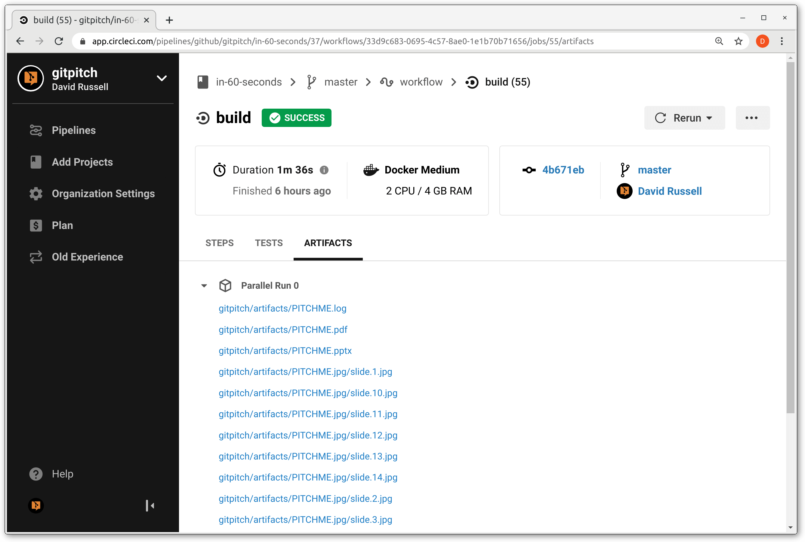

# GitPitch CICD on CircleCI

- [Environment Variables](#environment-variables)
- [Sample Generated Artifacts](#sample-generated-artifacts)
- [Persist To CircleCI Workspace](#circleci-workspace)
- [Persist As CircleCI Artifacts](#circleci-artifacts)

### Environment Variables

The behavior of GitPitch CICD at runtime depends on the values set for the following required environment variables:

- **$GITPITCHCI_TARGET** - identifies the target slide deck or decks within the target reposistory for processing
- **$GITPITCHCI_TYPE**   - identifies the type of file artifacts to be generated by GitPitch CICD for the target slide deck or decks
- **$DOCKERHUB_USER**   - identifies the name of the Docker Hub account that has beeen granted access to GitPitch CICD
- **$DOCKERHUB_PASS**   - identifies the password of the Docker Hub account that has beeen granted access to GitPitch CICD

The $GITPITCHCI_TARGET environment variable takes the following values:

- **ALL**
- **DEFAULT** (slide deck in root directory)
- **deck/specific/path** (eg. training/intro)

The $GITPITCHCI_TYPE environment variable takes the following values:

- **ALL**
- **PDF**
- **PPTX**
- **JPG**
- **Comma-separated types** (eg. PDF,JPG)

When GitPitch CICD executes it will generate file artifacts for the target deck or decks matching the artifact types indicated on the environment variables passed to your job.

For example, the following snippet show sample values for these required GitPitch CICD environment variables:

```bash
$GITPITCHCI_TARGET=DEFAULT
$GITPITCHCI_TYPE=PDF,PPTX
```

In this example PDF and PPTX artifacts would be generated for the DEFAULT slide deck found in the target repository.

#### Sample Generated Artifacts

The following screenshot demostrates the nature of GitPitch CICD artifacts generated within a CircleCI pipeline: 



This screenshot is provided simply to help you visualize the types of artifacts generated by GitPitch CICD. In this case you can see PDF, PowerPoint PPTX, and JPG screenshots for a single slide deck.

### CircleCI Workspace

The PDF, PPTX, and/or JPG artifacts generated by GitPitch CICD can be persisted to a CircleCI workspace. CircleCI workspaces are a convenient mechanism for sharing data across different jobs within your pipeline.

The following **config.yml** demonstrates how to define a GitPitch CICD job that persists artifacts to a workspace:

```yaml
version: 2.0
jobs:
  build:
    docker:
      - image: gitpitch/cicd:latest
        auth:
            username: $DOCKERHUB_USER
            password: $DOCKERHUB_PASS
    working_directory: /repo
    no_output_timeout: 1h
    steps:
      - checkout
      - run: /gitpitchci/start.sh
      - persist_to_workspace:
          root: /gitpitch
          paths:
              artifacts
```

Note, the **no_output_timeout** setting is activated for this job to ensure CircleCI does not cancel your job while GitPitch CICD is busy generating file artifacts for your deck or decks. By default, CircleCI cancels jobs that do not generate output within 10 minutes. For details about this setting, see the [CircleCI Configuration Guide](https://circleci.com/docs/2.0/configuration-reference/).

### CircleCI Artifacts

```yaml
version: 2.0
jobs:
  build:
    docker:
      - image: gitpitch/cicd:latest
        auth:
            username: $DOCKERHUB_USER
            password: $DOCKERHUB_PASS
    working_directory: /repo
    no_output_timeout: 1h
    steps:
      - checkout
      - run: /gitpitchci/start.sh
      - store_artifacts:
          path: /gitpitch/artifacts
```

Note, the **no_output_timeout** setting is activated for this job to ensure CircleCI does not cancel your job while GitPitch CICD is busy generating file artifacts for your deck or decks. By default, CircleCI cancels jobs that do not generate output within 10 minutes. For details about this setting, see the [CircleCI Configuration Guide](https://circleci.com/docs/2.0/configuration-reference/).


