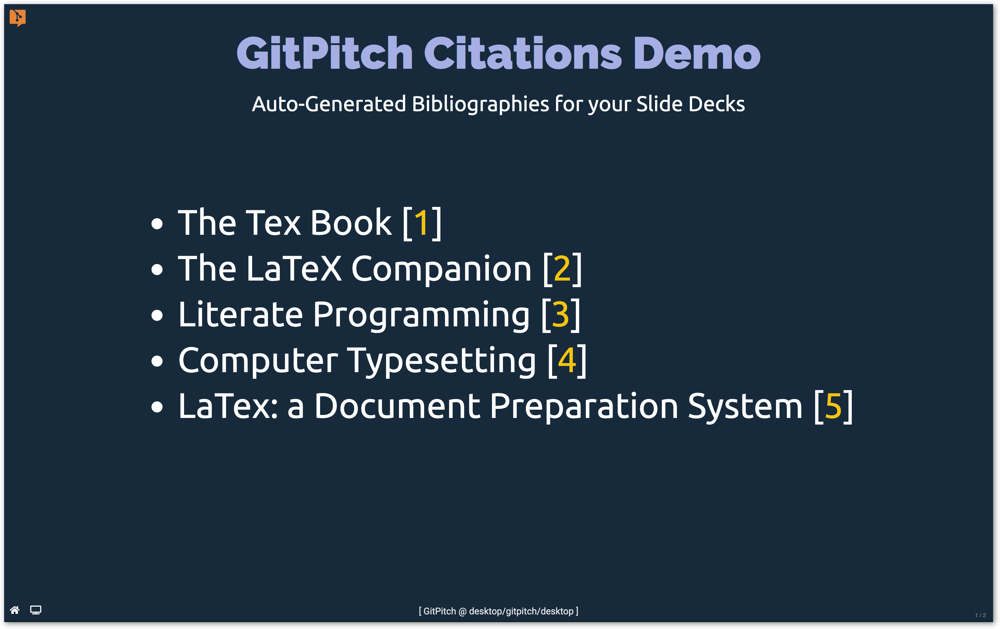
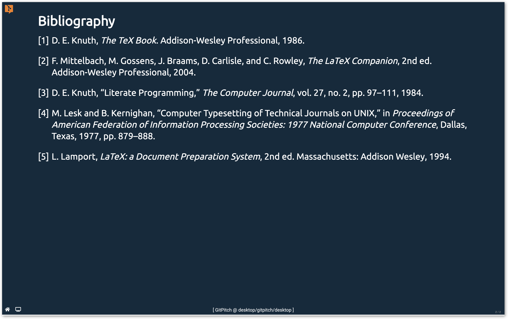

# Bibliographies

The [Cite Widget](#add-citations) can be used to add citations to any GitPitch slide deck. When citations are added a bibliography is automatically generated for the slide deck. Bibliographies are generated using existing BibTEX, EndNote, or RIS databases.

This guide describes how you can add citations to your slide decks:

- [BibTEX, EndNote, RIS Databases](#register-database)
- [Citations Markdown Widget](#add-citations)
- [Customize Bibliography Pages](#bibliography-pages)
- [Customize Bibliography Fonts](#bibliography-fonts)
- [Recommendations for Desktop](#desktop-tip)


### Register Database

Download your BibTEX, EndNote, or RIS database file and add it as an asset depedency for your slide deck. For example, the following directory structure shows a sample slide deck using a sample **books.bib** BibTEX database:


```text
.
├── assets
│   ├── css
│   │   └── PITCHME.css
│   │
│   ├── citations
│   │   └── books.bib
│   │
│   └── img
│       └── logo.png
│
├── PITCHME.md
└── PITCHME.yaml
```

The following [PITCHME.yaml](/conventions/pitchme-yaml.md) snippet shows how the `citations-db` setting can be used to register your custom database:

```yaml
citations-db : assets/citations/books.bib
```

The following database file name and file size conventions are enforced:

- BibTEX database files must use the `.bib` extension
- EndNote database files must use the `.enl` extension
- RIS database files must use the `.ris` extension
- Registered database files must not exceed 1Mb in size

### Add Citations

You can add a citation alongside text on any slide using `@cite[cid]` markdown widget syntax. The *cid* value is a citation identifier matching a record in your [BibTEX, EndNote, or RIS Database](#register-database).

The following markdown snippet shows citations added alongside sample markdown list items:

```markdown
- The Tex Book @cite[texbook]
- The LaTeX Companion @cite[latex:companion]
- Literate Programming @cite[knuth:1984]
- Computer Typesetting @cite[lesk:1977]
- LaTex: a Document Preparation System @cite[latex2e]
```

This sample markdown snippet renders as follows:



Each citation becomes a hyperlink to a bibliography slide that is automatically generated and appended to the end of your slide deck.

### Bibliography Pages

By default the generated bibliography slide renders using the following conventions:

1. The default title text appearing on the slide is **Bibliography**
1. The default number of bibliographic entries per slide is **10**



You can override these default conventions using the `citations-page-title` and `citations-page-size` settings respectively. For example:

```yaml
citations-db : assets/citations/books.bib
citations-page-title : "Further Reading"
citations-page-size : 14
```

### Bibliography Fonts

By default the generated bibliography renders using the following CSS styles:

```css
/* Bibliography Page Title Style */
h4.csl-references {
  font-size: 30px;
  font-weight: bold;
  font-family: "Ubuntu";
}

/* Bibliography Entry Style */
div.csl-entry {
  font-size: 20px;
  font-family: "Ubuntu";
  padding-bottom: 20px;
}

/* Bibliography Entry Index Style */
div.csl-left-margin {
  padding-right: 6px;
}
```

You can override these default style rules to customize the appearance of the bibliography in your slide decks. To overide these default styles simply add your own custom style rules per the [Custom CSS Guide](/theme/custom-css.md).

### Desktop Tip

Processing citations within your [PITCHME.md](/conventions/pitchme-md.md) and auto-generating a bibliography slide is a compute intensive task. The time spent on this task can impact the auto-refresh responsiveness of [GitPitch Desktop](desktop/) when developing slide content.

If the auto-refresh feature of the Desktop app is heavily impacted for a slide deck using citations then it is recommended that during slide content development you temporarily disable the `citations-db` setting in your [PITCHME.yaml](/conventions/pitchme-yaml.md).

The best way to tempoarily disable this setting is to comment it out as follows:

```yaml
# citations-db : assets/citations/book.bib
```

If you do temporarily disable this setting do remember to activate it again to verify your citations and bibliography are working as expected before [publishing the slide deck](/cloud/).
