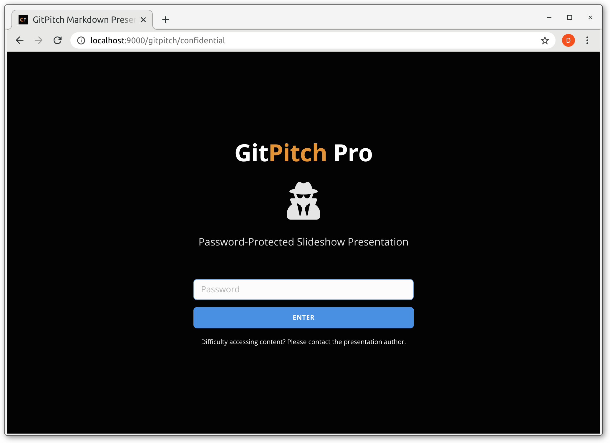
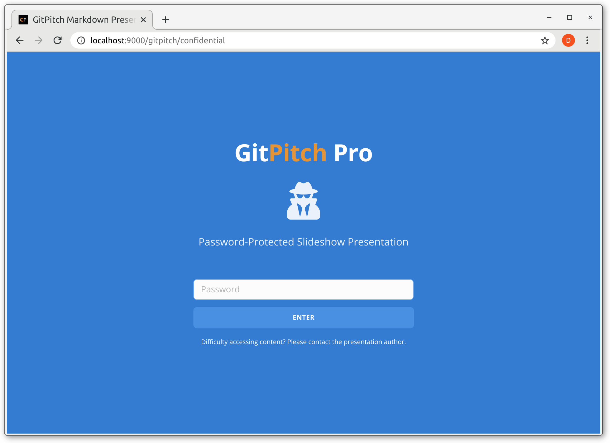
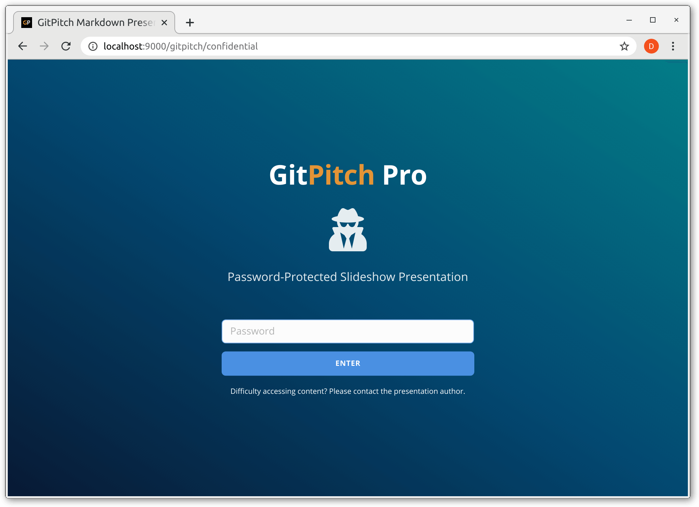

# Publish Password-protected Slide Decks

!> To unlock online publishing features for your slide decks [activate paid service](https://gitpitch.com/pricing).

Password-protected publishing is ideal for managing secure access to business confidential content, including paid training content. Password-protected publishing is also known as *confidential mode*.

### Publish 4.0

To publish a [4.0 slide deck](/whats-new-in-40.md) to the cloud you *must* activate the `gitpitch` setting in the [PITCHME.yaml](/conventions/pitchme-yaml.md) for your deck as shown here:

```yaml
gitpitch : 4.0
```

When activated as shown your slide deck can be published and shared in the cloud on **gitpitch.com**.

### Using Public Repos

Password-protected publishing is not supported within *public* repositories.

### Using Private Repos

To publish a password-protected slide deck using a *private* repository on GitHub, GitLab, or Bitbucket you must activate the `confidential` setting in the [PICHTME.yaml](/conventions/pitchme-yaml.md) for your deck. The confidential setting accepts a comma-separated list of one or more confidential-tokens. A token can be any arbitrary string value you define.

The following *PITCHME.yaml* snippet demonstrates a single value on the `confidential` setting:

```yaml
confidential: 82428
```

The following *PITCHME.yaml* snippet demonstrates multiple values on the `confidential` setting:

```yaml
confidential: 82428, G!tMag!c, Acce$$
```

Note, all confidential tokens are case-sensitive.

Once activated, `git-push` your presentation files on any branch. Any attempt to access your password-protected slide deck in the cloud is now automatically intercepted. The viewer is presented with a password challenge form. Only when the viewer inputs a valid confidential token as password into the form can they proceed to view the slide deck itself.

?> Any attempt to access a password-protected slide deck without a valid token is denied.

Password-protected token management is as simple as adding and removing tokens on the `confidential` setting in your PITCHME.yaml file. Managing tokens in this way gives you the ability to define and manage your audience over time.

### Password-Protected URLs

The following snippets demonstrate the basic structure of confidential slide deck URLs on **gitpitch.com**. Decks can be uniquely identified using PITCHME.md paths, branch names, tag names, and commit ids.

<!-- tabs:start -->

#### ** GitHub Deck**

```bash
# The default slide deck in the acmecorp/tech-talk repo, master branch.
https://gitpitch.com/acmecorp/tech-talk

# The default slide deck in the acmecorp/tech-talk repo, dev branch.
https://gitpitch.com/acmecorp/tech-talk/dev

# The coding/intro slide deck in the acmecorp/tech-talk repo, master branch.
https://gitpitch.com/acmecorp/tech-talk?p=coding/intro

# The coding/intro slide deck in the acmecorp/tech-talk repo, at tagX. 
https://gitpitch.com/acmecorp/tech-talk/tagX?p=coding/intro

# The coding/intro slide deck in the acmecorp/tech-talk repo, at commitX. 
https://gitpitch.com/acmecorp/tech-talk/commitX?p=coding/intro
```

#### ** GitLab Deck**

```bash
# The default slide deck in the acmecorp/tech-talk repo, master branch.
https://gitpitch.com/acmecorp/tech-talk?grs=gitlab

# The default slide deck in the acmecorp/tech-talk repo, dev branch.
https://gitpitch.com/acmecorp/tech-talk/dev?grs=gitlab

# The coding/intro slide deck in the acmecorp/tech-talk repo, master branch.
https://gitpitch.com/acmecorp/tech-talk?grs=gitlab&p=coding/intro

# The coding/intro slide deck in the acmecorp/tech-talk repo, at tagX. 
https://gitpitch.com/acmecorp/tech-talk/tagX?grs=gitlab&p=coding/intro

# The coding/intro slide deck in the acmecorp/tech-talk repo, at commitX. 
https://gitpitch.com/acmecorp/tech-talk/commitX?grs=gitlab&p=coding/intro
```

#### ** Bitbucket Deck**

```bash
# The default slide deck in the acmecorp/tech-talk repo, master branch.
https://gitpitch.com/acmecorp/tech-talk?grs=bitbucket&s=sneakpEEk

# The default slide deck in the acmecorp/tech-talk repo, dev branch.
https://gitpitch.com/acmecorp/tech-talk/dev?grs=bitbucket&s=sneakpEEk

# The coding/intro slide deck in the acmecorp/tech-talk repo, master branch.
https://gitpitch.com/acmecorp/tech-talk?grs=bitbucket&p=coding/intro

# The coding/intro slide deck in the acmecorp/tech-talk repo, at tagX. 
https://gitpitch.com/acmecorp/tech-talk/tagX?grs=bitbucket&p=coding/intro

# The coding/intro slide deck in the acmecorp/tech-talk repo, at commitX. 
https://gitpitch.com/acmecorp/tech-talk/commitX?grs=bitbucket&p=coding/intro
```

<!-- tabs:end -->

### Settings Policy

[YAML Policy](../_snippets/yaml-private-policy.md ':include')

### Form Customization

As noted, when confidential mode is activated any attempt to access the slide deck is intercepted. The viewer is automatically presented with a password challenge form. The default challenge form renders as follows:


The default form can be entirely re-branded to reflect your product, service,
or content using a set of `pro-*` settings in your [PITCHME.yaml](/conventions/pitchme-yaml.md). For example, you can specify `none` on the `pro-background` setting:

```yaml
pro-background : none
```

When `none` is set on this property the default background image is hidden as shown here:



As you can see the default background color is `black`. The
`pro-background-color` setting is provided for a quick and easy way to
activate a custom background color. For example:

```yaml
pro-background : none
pro-background-color : "#3686E4"
```

These sample settings render as follows:



The `pro-background-color` setting can also be used to activate a
background color gradient using any valid CSS
[linear-gradient](https://developer.mozilla.org/en-US/docs/Web/CSS/linear-gradient)
value, for example:

```yaml
pro-background : none
pro-background-color : "linear-gradient(to right top, #051937, #004d7a, #008793);"
```

These sample settings render as follows:




Here is an example of how you can customize the title, subtitle, logo, and
background image for this form using the set of <i>pro-*</i> settings in
your <b>PITCHME.yaml</b>:

```yaml
# Tokens
confidential : 54321, GitMagic, earlyacce$$

# Customizations
pro-title : "Tech Training 2020"
pro-subtitle : "Leverage the Power of Git"
pro-contact : "Please use the password token provided."
pro-logo : assets/img/logo.png
pro-background : assets/img/robot.jpg
```

These sample settings render as follows:


Further customization of the challenge form can be achieved using custom CSS in the [same way](theme/custom-css.md) you can activate custom CSS for your slide decks. The following CSS snippet identifies the set of customizable CSS ID selectors for the challenge form along with some sample values:

```css
#pro-background {
    opacity: 0.9 !important;
}

#pro-logo {
    max-height: 3em;
}

#pro-title {
    font-size: 1.1em;
}

#pro-subtitle {
    color: lightgray;
}

#pro-enter {
    background: #e49436;
    border-color: #e49436;
}

#pro-contact {
    display: none;
}
```

