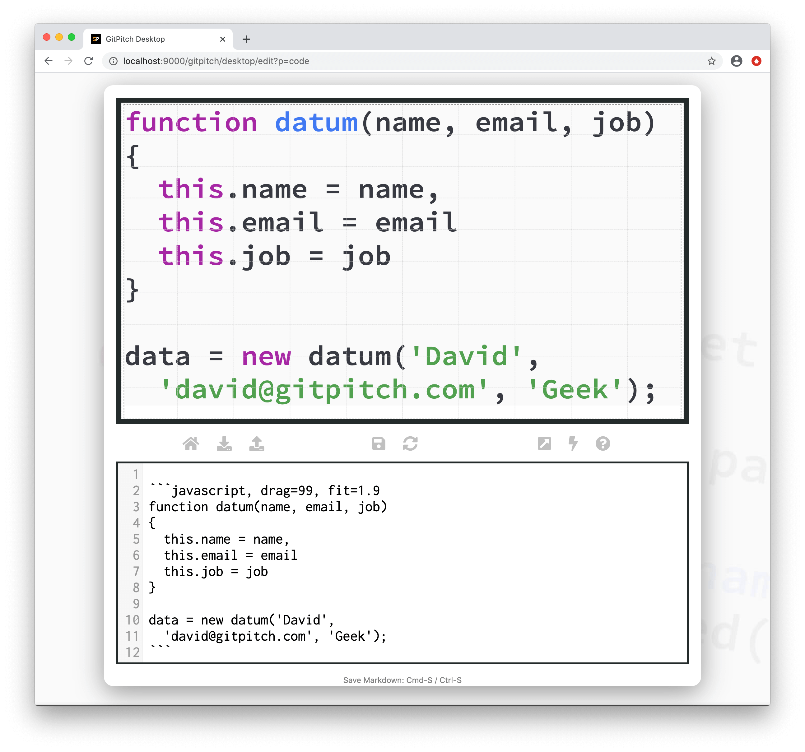

# Code Content

GitPitch strongly encourages the use of [Grid Native Code Widgets](/code/widgets.md) to render code on your slides.

?> Code widgets can render, filter, size, and position source code from files, GISTs, and Diffs.

### Code Widgets

Code widgets let you maintain modular code dependencies for your slide deck. So rather than inlining code blocks directly on your slides, code widgets let you simply reference external code dependencies. Including code maintained within source code files, as GitHub GIST, and as GitHub Diffs.

For a detailed description and demonstration of code widgets see the [Code Widgets Guide](/code/widgets.md).

### Inline Code

While [code widgets](/code/widgets.md) are the recommended approach when working with code on your slides, you can render inline code blocks using [standard code fencing](https://guides.github.com/features/mastering-markdown/) markdown syntax. Code fencing syntax is sometimes referred to as *triple-backtick* markdown syntax. For example:

!> As demonstrated above standard markdown code fencing syntax within PITCHME.md has been *supercharged* with built-in support for grid-native [code widget properties](/code/widgets.md).

### Language Hints

Did you noticed the use of `javascript` immediately after the opening triple-backticks on the example slide above? This is called a **language hint** for your code block.

All code rendered on your slides enjoys [code syntax highlighting](/code/highlighting.md). But automatic syntax highlighting is *best-effort* only. The use of an *explicit* language hint is **required** for the following reasons:

1. Language hints ensure the code is rendered using the most appropriate highlighting style.
1. Language hints also ensure any *markup* in your code is properly *escaped* before being rendered.

!> The proper escaping of code content is especially important when presenting snippets containing markup syntax, for example: HTML, XML, PHP, React snippets etc.

See the [Code Language Hints Quick Reference](#lang-hints-refs) to find an *alias* that can be used as a language hint when displaying code on your slides.

### Lang Hint Refs

The following table lists the supported languages and their corresponding aliases. You should use these *aliases* as the language hint anytime you are rendering code on your slides.

 

| Language                | Aliases                |
| :-----------------------| :--------------------- |
| 1C                      | 1c                     |
| ABNF                    | abnf                   |
| Access logs             | accesslog              |
| Ada                     | ada                    |
| ARM assembler           | armasm, arm            |
| AVR assembler           | avrasm                 |
| ActionScript            | actionscript, as       |
| Alan                    | alan, i                |
| AngelScript             | angelscript, asc       |
| Apache                  | apache, apacheconf     |
| AppleScript             | applescript, osascript |
| Arcade                  | arcade                 |
| AsciiDoc                | asciidoc, adoc         |
| AspectJ                 | aspectj                |
| AutoHotkey              | autohotkey             |
| AutoIt                  | autoit                 |
| Awk                     | awk, mawk, nawk, gawk  |
| Axapta                  | axapta                 |
| Bash                    | bash, sh, zsh          |
| Basic                   | basic                  |
| BNF                     | bnf                    |
| Brainfuck               | brainfuck, bf          |
| C#                      | cs, csharp             |
| C++                     | cpp, c, cc, h, c++, h++, hpp |
| C/AL                    | cal                    |
| Cache Object Script     | cos, cls               |
| CMake                   | cmake, cmake.in        |
| Coq                     | coq                    |
| CSP                     | csp                    |
| CSS                     | css                    |
| Cap’n Proto             | capnproto, capnp       |
| Clojure                 | clojure, clj           |
| CoffeeScript            | coffeescript, coffee, cson, iced |
| Crmsh                   | crmsh, crm, pcmk       |
| Crystal                 | crystal, cr            |
| Cypher (Neo4j)          | cypher                 |
| D                       | d                      |
| DNS Zone file           | dns, zone, bind        |
| DOS                     | dos, bat, cmd          |
| Dart                    | dart                   |
| Delphi                  | delphi, dpr, dfm, pas, pascal, freepascal, lazarus, lpr, lfm |
| Diff                    | diff, patch            |
| Django                  | django, jinja          |
| Dockerfile              | dockerfile, docker     |
| dsconfig                | dsconfig               |
| DTS (Device Tree)       | dts                    |
| Dust                    | dust, dst              |
| Dylan                   | dylan                  |
| EBNF                    | ebnf                   |
| Elixir                  | elixir                 |
| Elm                     | elm                    |
| Erlang                  | erlang, erl            |
| Excel                   | excel, xls, xlsx       |
| Extempore               | extempore, xtlang, xtm |
| F#                      | fsharp, fs             |
| FIX                     | fix                    |
| Fortran                 | fortran, f90, f95      |
| G-Code                  | gcode, nc              |
| Gams                    | gams, gms              |
| GAUSS                   | gauss, gss             |
| GDScript                | godot, gdscript        |
| Gherkin                 | gherkin                |
| GN for Ninja            | gn, gni                |
| Go                      | go, golang             |
| Golo                    | golo, gololang         |
| Gradle                  | gradle                 |
| Groovy                  | groovy                 |
| HTML, XML               | xml, html, xhtml, rss, atom, xjb, xsd, xsl, plist |
| HTTP                    | http, https            |
| Haml                    | haml                   |
| Handlebars              | handlebars, hbs, html.hbs, html.handlebars        |
| Haskell                 | haskell, hs            |
| Haxe                    | haxe, hx               |
| Hy                      | hy, hylang             |
| Ini, TOML               | ini, toml              |
| Inform7                 | inform7, i7            |
| IRPF90                  | irpf90                 |
| JSON                    | json                   |
| Java                    | java, jsp              |
| JavaScript              | javascript, js, jsx    |
| Kotlin                  | kotlin, kt             |
| Leaf                    | leaf                   |
| Lasso                   | lasso, ls, lassoscript |
| Less                    | less                   |
| LDIF                    | ldif                   |
| Lisp                    | lisp                   |
| LiveCode Server         | livecodeserver         |
| LiveScript              | livescript, ls         |
| Lua                     | lua                    |
| Makefile                | makefile, mk, mak      |
| Markdown                | markdown, md, mkdown, mkd |
| Mathematica             | mathematica, mma, wl   |
| Matlab                  | matlab                 |
| Maxima                  | maxima                 |
| Maya Embedded Language  | mel                    |
| Mercury                 | mercury                |
| mIRC Scripting Language | mirc, mrc              |
| Mizar                   | mizar                  |
| Mojolicious             | mojolicious            |
| Monkey                  | monkey                 |
| Moonscript              | moonscript, moon       |
| N1QL                    | n1ql                   |
| NSIS                    | nsis                   |
| Nginx                   | nginx, nginxconf       |
| Nimrod                  | nimrod, nim            |
| Nix                     | nix                    |
| OCaml                   | ocaml, ml              |
| Objective C             | objectivec, mm, objc, obj-c |
| OpenGL Shading Language | glsl                   |
| OpenSCAD                | openscad, scad         |
| Oracle Rules Language   | ruleslanguage          |
| Oxygene                 | oxygene                |
| PF                      | pf, pf.conf            |
| PHP                     | php, php3, php4, php5, php6 |
| Parser3                 | parser3                |
| Perl                    | perl, pl, pm           |
| Plaintext: no highlight | plaintext              |
| Pony                    | pony                   |
| PostgreSQL & PL/pgSQL   | pgsql, postgres, postgresql |
| PowerShell              | powershell, ps         |
| Processing              | processing             |
| Prolog                  | prolog                 |
| Properties              | properties             |
| Protocol Buffers        | protobuf               |
| Puppet                  | puppet, pp             |
| Python                  | python, py, gyp        |
| Python profiler results | profile                |
| Q                       | k, kdb                 |
| QML                     | qml                    |
| R                       | r                      |
| Razor CSHTML            | cshtml, razor, razor-cshtml |
| ReasonML                | reasonml, re           |
| RenderMan RIB           | rib                    |
| RenderMan RSL           | rsl                    |
| Roboconf                | graph, instances       |
| Robot Framework         | robot, rf              |
| RPM spec files          | rpm-specfile, rpm, spec, rpm-spec, specfile |
| Ruby                    | ruby, rb, gemspec, podspec, thor, irb |
| Rust                    | rust, rs               |
| SAS                     | SAS, sas               |
| SCSS                    | scss                   |
| SQL                     | sql                    |
| STEP Part 21            | p21, step, stp         |
| Scala                   | scala                  |
| Scheme                  | scheme                 |
| Scilab                  | scilab, sci            |
| Shape Expressions       | shexc                  |
| Shell                   | shell, console         |
| Smali                   | smali                  |
| Smalltalk               | smalltalk, st          |
| Solidity                | solidity, sol          |
| Stan                    | stan                   |
| Stata                   | stata                  |
| Structured Text         | iecst, scl, stl, structured-text |
| Stylus                  | stylus, styl           |
| SubUnit                 | subunit                |
| Supercollider           | supercollider, sc      |
| Swift                   | swift                  |
| Tcl                     | tcl, tk                |
| Terraform (HCL)         | terraform, tf, hcl     |
| Test Anything Protocol  | tap                    |
| TeX                     | tex                    |
| Thrift                  | thrift                 |
| TP                      | tp                     |
| Twig                    | twig, craftcms         |
| TypeScript              | typescript, ts         |
| VB.Net                  | vbnet, vb              |
| VBScript                | vbscript, vbs          |
| VHDL                    | vhdl                   |
| Vala                    | vala                   |
| Verilog                 | verilog, v             |
| Vim Script              | vim                    |
| x86 Assembly            | x86asm                 |
| XL                      | xl, tao                |
| XQuery                  | xquery, xpath, xq      |
| YAML                    | yml, yaml              |
| Zephir                  | zephir, zep            |

