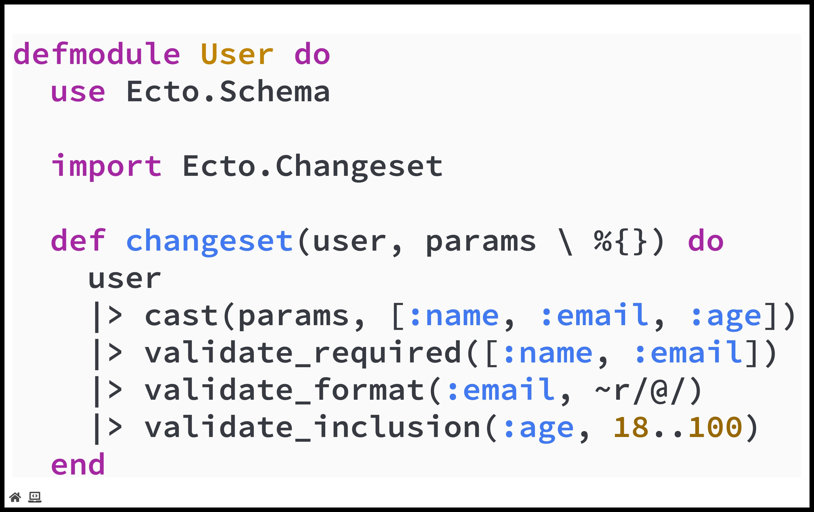
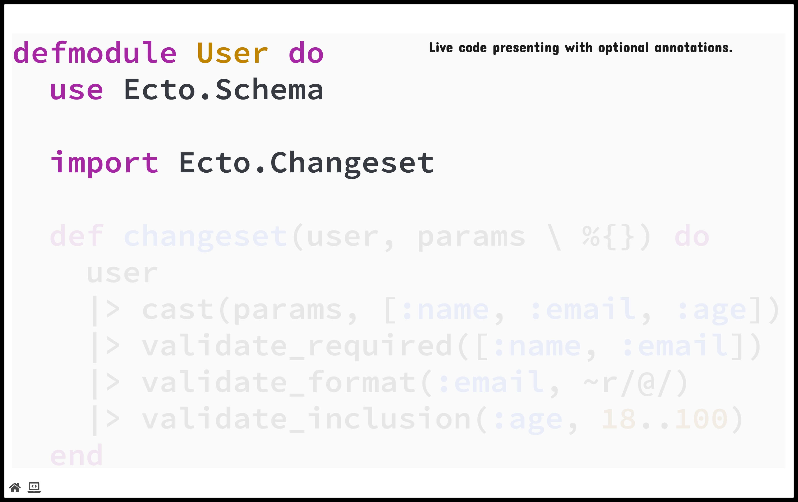
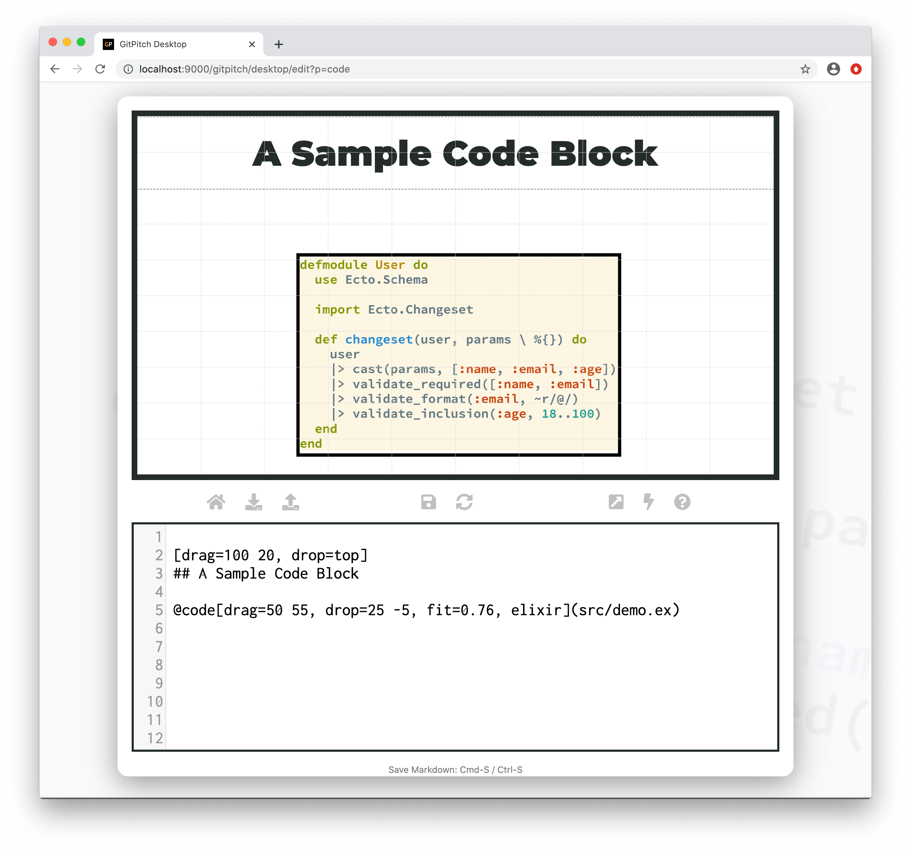
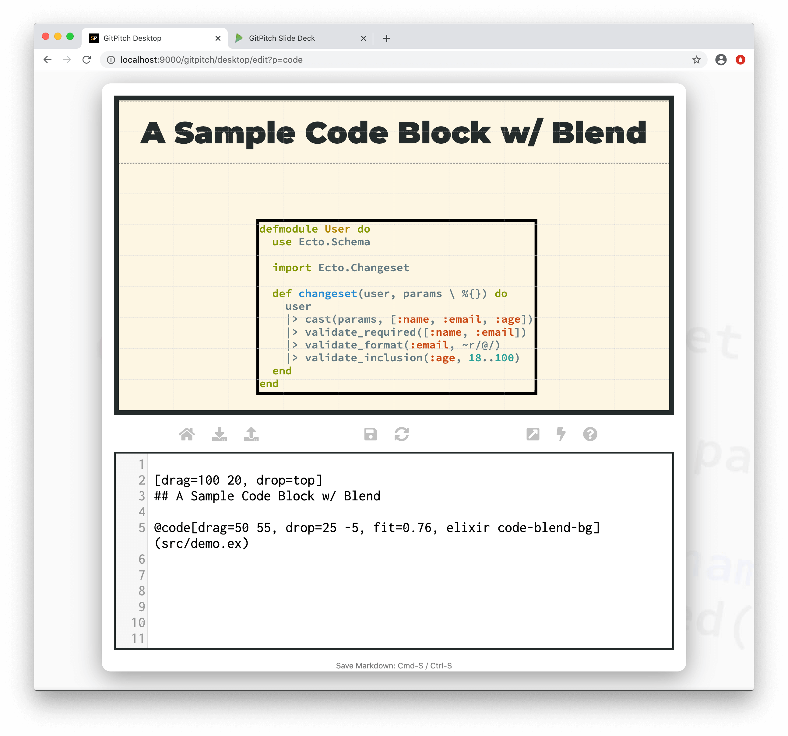
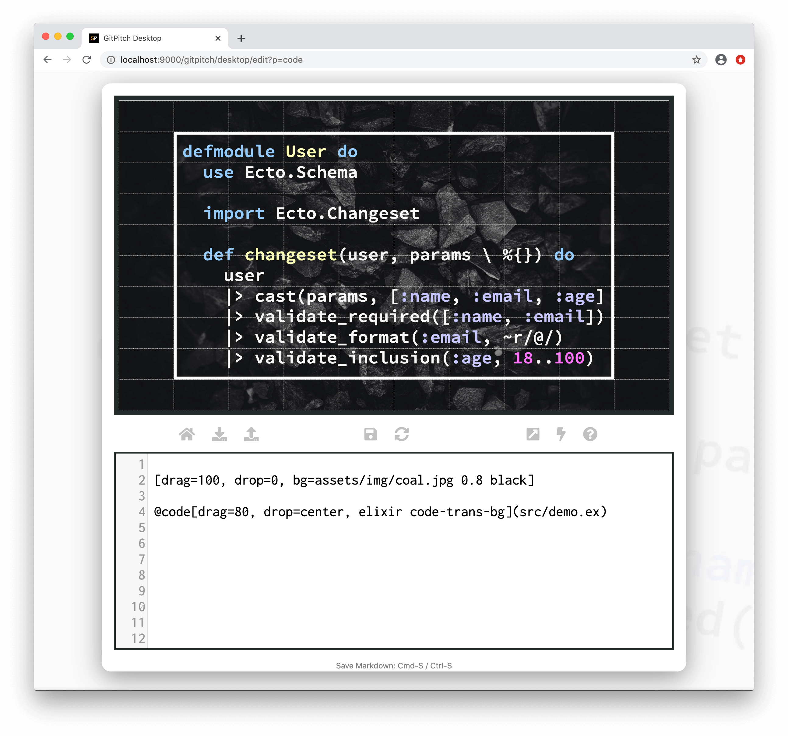

# Code Behaviors

Code behaviors help speakers to present code effectively. By taking control of how and when you reveal your code you can improve focus and engagement with your audience.

### Built-In

The [code widget](/code/widgets.md) supports the following code-specific behaviors:

[Code Widget Behaviors](../_snippets/code-widget-behaviors.md ':include')

### Reveal Fast

The **code-reveal-fast** behavior is used to automatically move a [live code presenting slide](/code/presenting.md) to the first *code-fragment* when the slide is viewed. This behavior is activated as follows:

```markdown
@code[drag=99, drop=center, elixir code-reveal-fast](src/demo.ex)

[drag=50 6, drop=topright]

@[1-4](Live code presenting with optional annotations.)
@[6,12](Filtering, casting, and validation of constraints.)
@[7-8](Taking advantage of Elixir's pipe operator.)
```

This first screenshot shows the default behavior for a code presenting slide. A forward navigation to a default behavior code slide displays the full code in clear focus:



This next screenshot shows reveal fast behavior for a code presenting slide. A forward navigation to a reveal fast slide skips the default code view and causes focus to automatically shift to the first *code-fragment* on the slide as shown here:



?> Reveal fast behavior for code presenting slides gives you more control over the rate at which you reveal code snippets to your audience.

### Reveal Slow


The **code-reveal-slow** behavior is used to inject *breathing space* into your slide deck when you are transitioning from traditional slide content to code content.

A forward navigation to a reveal slow code slide first displays a blank slide. The next forward navigation on a reveal slow slide moves directly from the blank slide to the first [live code presenting](/code/presenting.md) *code-fragment*. This behavior is activated as follows:

```markdown
@code[drag=99, drop=center, elixir code-reveal-slow](src/demo.ex)

[drag=50 6, drop=topright]

@[1-4](Live code presenting with optional annotations.)
@[6,12](Filtering, casting, and validation of constraints.)
@[7-8](Taking advantage of Elixir's pipe operator.)
```

?> Reveal slow behavior for code presenting slides helps to remove distractions from your audience. While giving you time to provide background or context for the upcoming code.

### Code Blend

The **code-blend-bg** behavior can be activated on any [code widget](/code/widgets.md). When activated, the background color for your code block determined by the [code syntax highighting style](/code/highlighting.md) for your slide deck is applied as the background color for the entire slide. This feature is also known as *code blending*.

This behavior is activated as follows:

```markdown
[drag=100 20, drop=top]
## A Sample Code Block w/ Blend

@code[drag=50 55, drop=25 -5, fit=0.76, elixir code-blend-bg](src/demo.ex)
```

This first screenshot shows the default behavior (no blending) for a sample code block:



This next screenshot shows code blend behavior activated for that same sample code block:



?> For code blending related details see the [Code Syntax Highlighting Guide](/code/highlighting.md).

### Code Trans

The **code-trans-bg** behavior can be activated on any [code widget](/code/widgets.md). When activated, the background color for your code block determined by the [code syntax highighting style](/code/highlighting.md) for your slide deck is replaced with a transparent background.

This behavior is activated as follows:

```markdown
[drag=100, drop=0, bg=assets/img/coal.jpg 0.8 black]

@code[drag=80, drop=center, elixir code-trans-bg](src/demo.ex)
```

The following screenshot shows the the effect of a transparent code block overlaid on top of a [slide background image](/images/):



?> This sample slide was created using the `ir-black` [code syntax highlighting style](/code/highlighting.md).


### Line Numbers

The **code-line-numbers** behavior can be activated on any [code widget](/code/widgets.md). When activated, line numbers are automatically displayed alongside the corresponding code on your slide. This behavior is activated as follows:

```markdown
@code[drag=100, fit=1.21, python code-line-numbers](src/demo.py)
```

The resulting sample code block is rendered as follows:


?> The line numbers behavior can be used alongside **code-reveal-fast** or **code-reveal-slow**. When multiple behaviors are activated on a widget use spaces to separate behavior names.

### Diff No Frags

The **diff-nofrags** behavior can be activated on the [@diff code widget](/code/widgets.md) only. By default the `@diff` widget exhibits the following behaviors:

1. The `@diff` widget renders diff output on your slide.
1. And automatically activates *code fragments* that let you step through that diff output.

?> The `@diff` widgets also supports **code-reveal-fast** and **code-reveal-slow** behaviors.


When the **diff-nofrags** behavior is activated the default behavior is overridden as follows:

1. The `@diff` widget renders diff output on your slide.
1. The automatic *code fragments* that let you step through the diff output are disabled.
1. In this case you can still declare custom [code fragments](/code/presenting.md) to step through your diff output.

This behavior is activated as follows:

```markdown
@diff[drag=99, diff-nofrags](onetapbeyond/gen_metrics/3e9f2100269b9f5f2fd98975bd417089183ddcf2)
```

