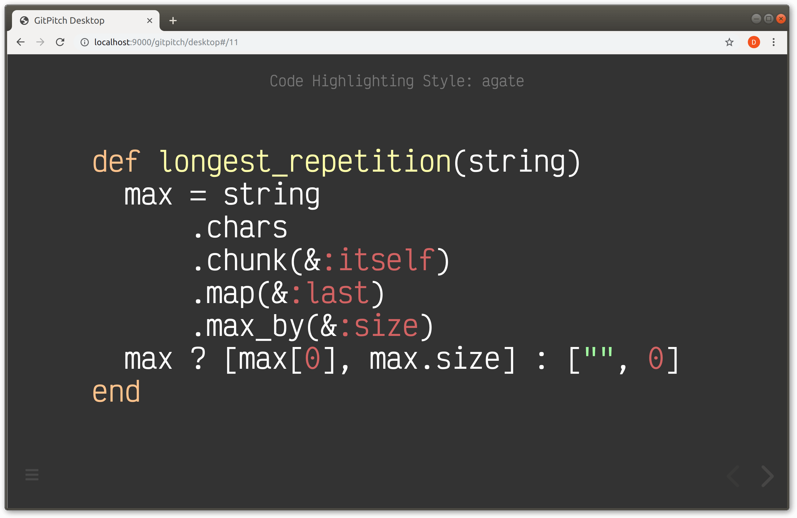
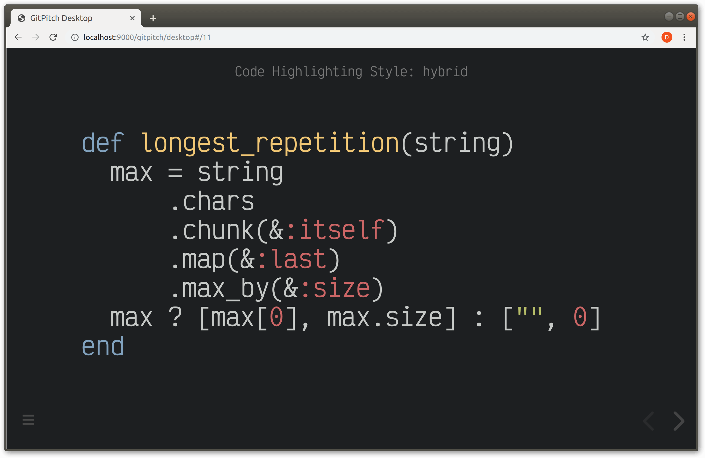
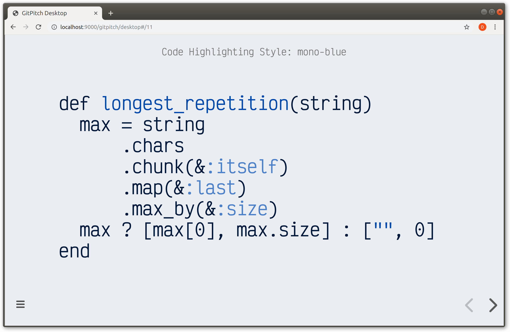
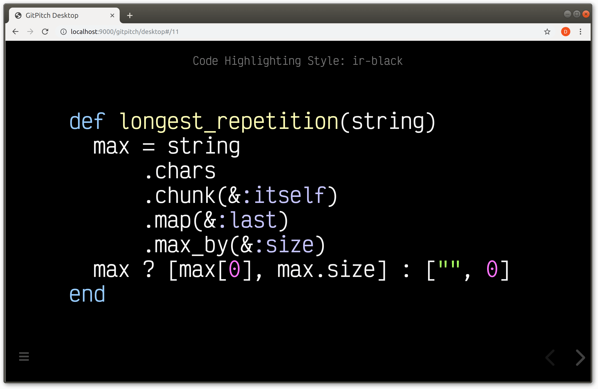
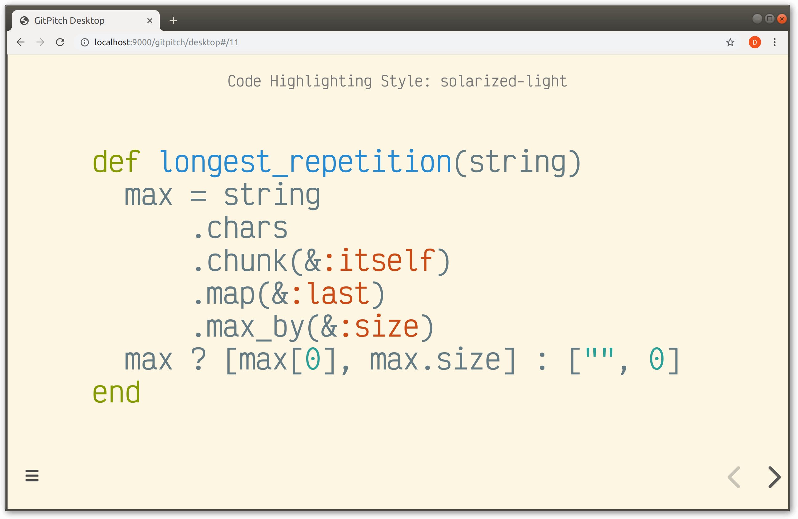
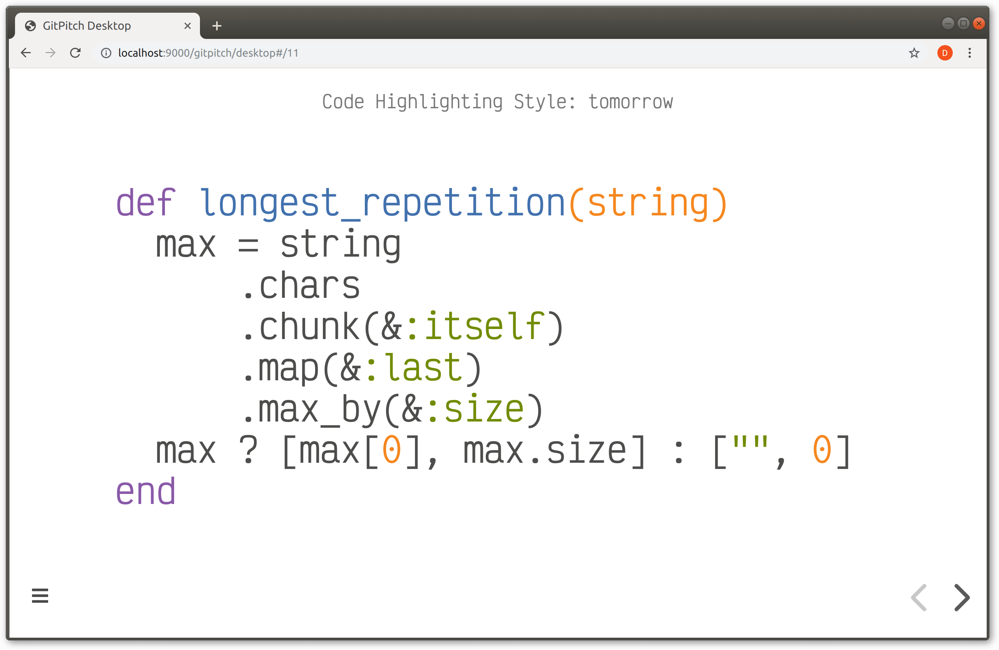

# Code Highlighting

Code syntax highlighting is actived for all code rendered on your slides. GitPitch currently supports 185 distinct programming languages and 89 distinct syntax highlighting styles.

### Highlight Setting

To activate a global code syntax highlighting style for you deck set a style value on the `highlight` setting in your [PITCHME.yaml](/conventions/pitchme-yaml.md):

```yaml
highlight: atom-one-dark
```

?> The default code syntax highlighting style for GitPitch slide decks is `atom-one-light`.

The following list shows some popular *light-themed* code syntax highlighting styles:

- atom-one-light
- github
- solarized-light
- mono-blue
- tomorrow

The following list shows some popular *dark-themed* code syntax highlighting styles:

- atom-one-dark
- hybrid
- agate
- ir-black

?> Code syntax highlighting is powered by [highlight.js](https://highlightjs.org). The complete list of supported code syntax highlighting styles can be found on their website [here](https://highlightjs.org/static/demo/).

### Style Names

The following conventions apply when naming a syntax highlighting style:

1. Style names on the `highlight` setting must be in lower-case only.
1.  Double-barrel style names, such as Mono Blue, must be hyphenated.

For example, the following snippet demonstrates the activation of the Mono Blue highlighting style:

```yaml
highlight : mono-blue
```

### Sample Slides














