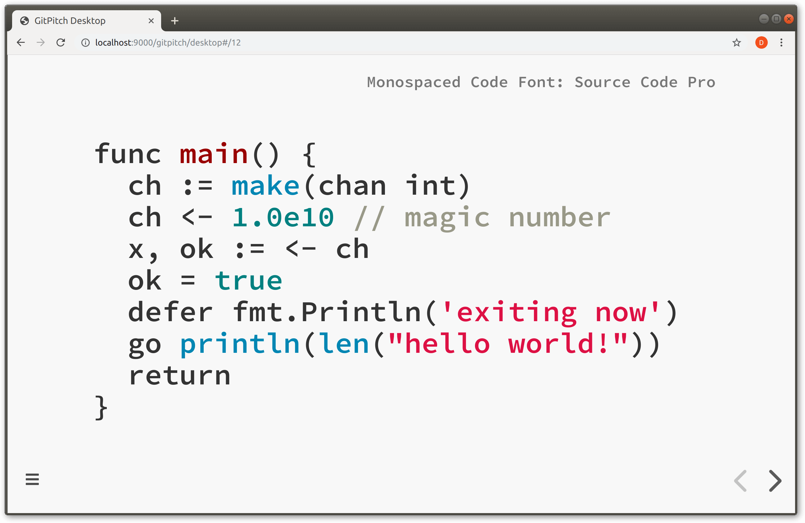
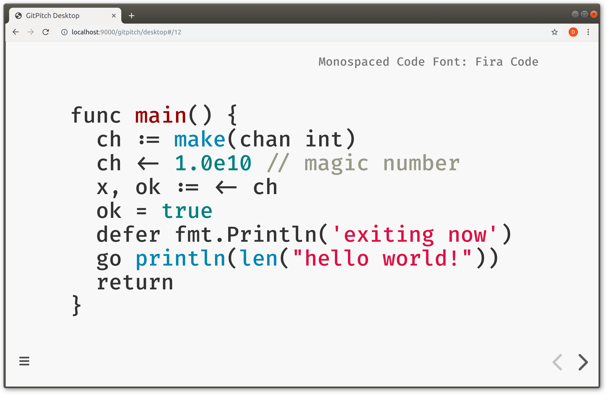
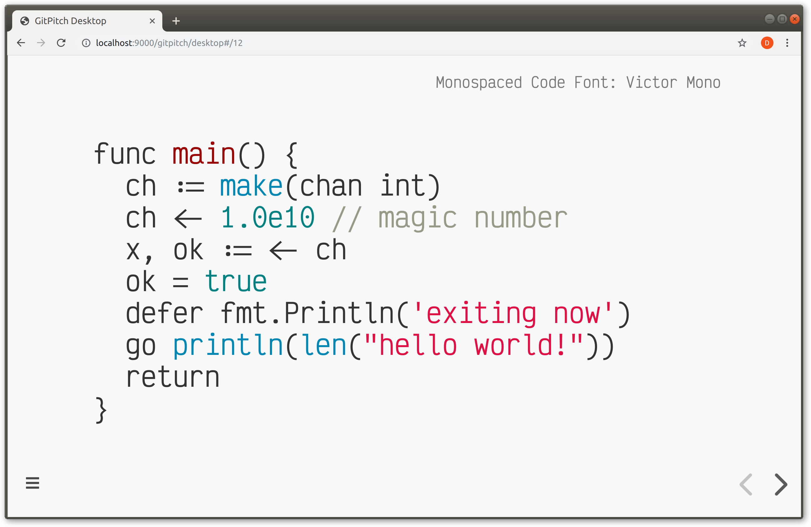
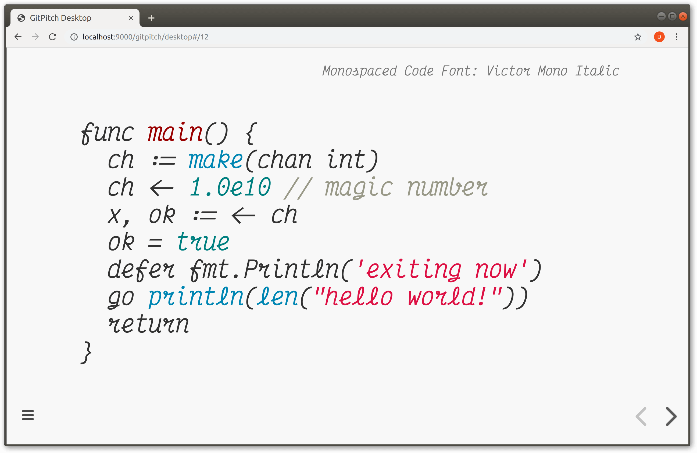
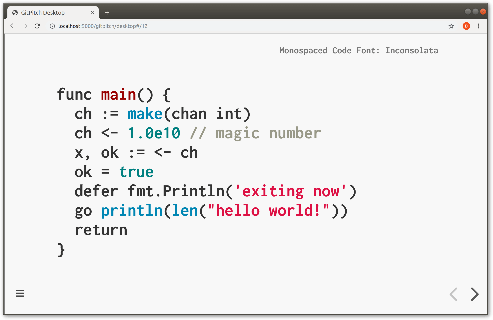

# Monospaced Fonts

Monospaced fonts are designed to render source code beautifully on any slide.


### Code Fonts

The following monospaced fonts are available for use within GitPitch slide decks:

- Source Code Pro
- Inconsolata
- Iosevka
- [Fira Code](https://github.com/tonsky/FiraCode)
- [Victor Mono](https://rubjo.github.io/victor-mono)
- Victor Mono Italic

?> Fira Code and Victor Mono fonts support *symbol ligatures* that are custom designed for rendering source code with a little flair.

### Code Setting

To activate a global monospaced code font for you deck set a font value on the `theme-code` setting in your [PITCHME.yaml](/conventions/pitchme-yaml.md):

```yaml
theme-code: [ "Iosevka" ]
```

The value set on this property must be a case-sensitive match to one of the fonts shown in the list above.

?> The default monospaced code font for GitPitch slide decks is `Source Code Pro`.

### Sample Code











