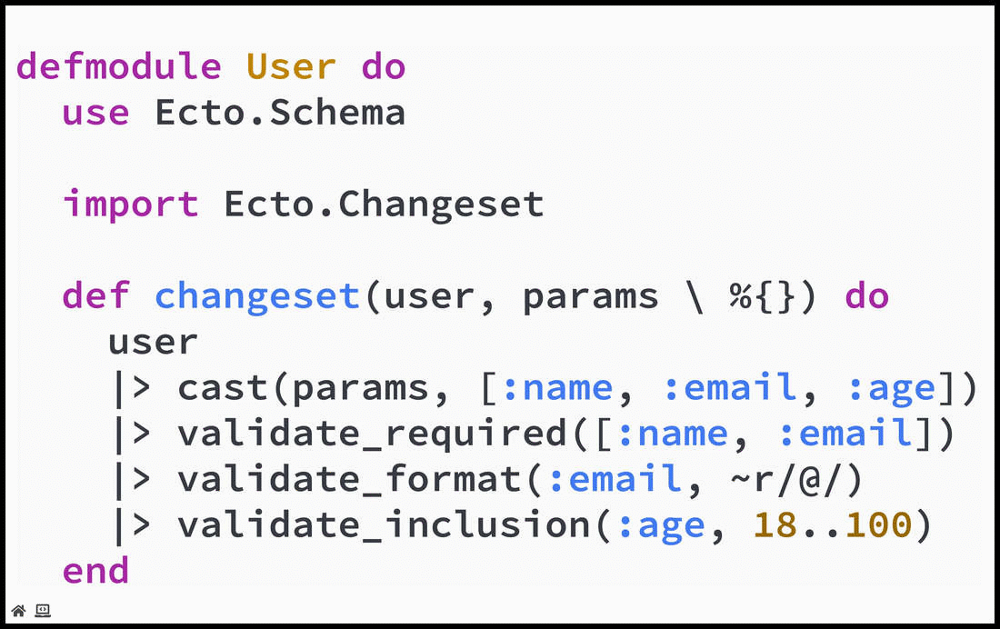

# Code Presenting

Live code presenting lets you *focus-on* and *step-through* code directly on your slides. Perfect for demonstrating code snippets, flow control, initialization, looping, function calls, and more. All without ever having to leave your slide deck.

?> If you are a conference speaker or training instructor *live code presenting* can mean no more switching back-and-forth between your presentation slides and your IDE.

To get a quick sense of what to expect check out this live code presenting screencast:



Live code presenting works seamlessly with grid-native [Code Widgets](/code/widgets.md). Code widgets let you position, size, filter, and present code on any slide. While code presenting lets you step through that code.

### Presenting

Live code presenting is powered by the [@[range]](#fragment-syntax) code-fragment widget. This widget lets you put code fragments into *sharp-focus* on your slide while surrounding code is automatically blurred.

The code-fragment widget works seamlessly with the [code widget](/code/widgets.md) as follows:

1. Use a [code widget](/code/widgets.md) to display source code on your slide.
1. Optionally use a [code filter](/code/filters.md) to filter that code.
1. Then use one or more **code-fragment** widgets to define distinct code presenting steps.
1. At each **code-fragment** step you can also display an [optional code annotation](#annotations).

The following sample markdown snippet demonstrates this approach for a sample slide:

```markdown
@code[drag=99, drop=center, fit=1.49, elixir](src/demo.ex)

[drag=50 6, drop=topright, font=bubblegum]

@[1-4](Live code presenting with optional annotations.)
@[6,12](Filtering, casting, and validation of constraints.)
@[7-8](Taking advantage of Elixir's pipe operator.)
@[7-9]
@[7-10]
@[7-11]
```

?> As shown in this snippet each code-fragment widget can take an [optional code annotation](#annotations).

### Fragment Syntax

The basic code-fragment widget syntax is as follows:

```markdown
@[range]
```

Where *range* identifies a range of one or more line numbers within the code-block that you want in *sharp-focus* on the slide. For example, to identify just the first line in a code-block as a *range* use:

```markdown
@[1]
```

To identify a multi-line *range* covering the second, third, and
fourth lines in a code-block use the following syntax:

```markdown
@[2-4]
```

To identify two or more non-contiguous slices of code within a single *range*, use the following syntax:

```markdown
@[3,5-7,9]
```

### Annotations

An optional annotation can be added to any code-fragment as follows:

```markdown
@[3-6,9](A custom message to display when this fragment is visible.)
```

The annotation text will be displayed on your slide when the corresponding code-fragment is in focus. It is strongly recommended that you use [grid layouts](/grid-layouts/) to position code-fragment annotations on your slides.

