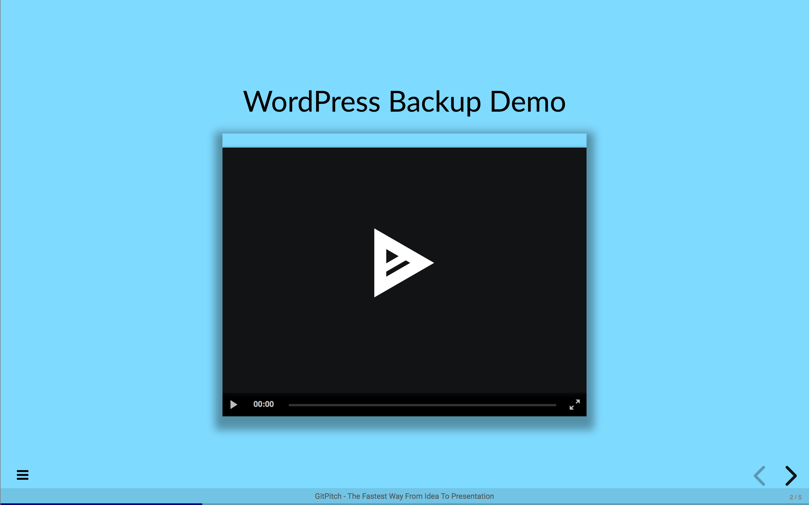
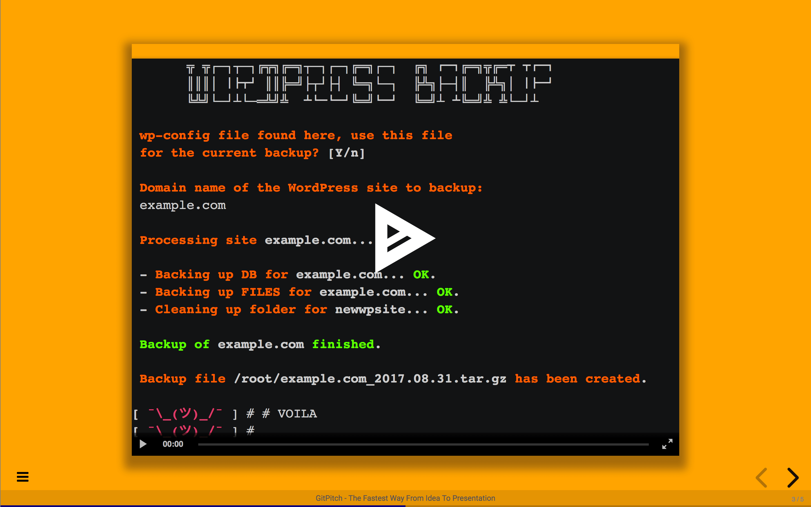
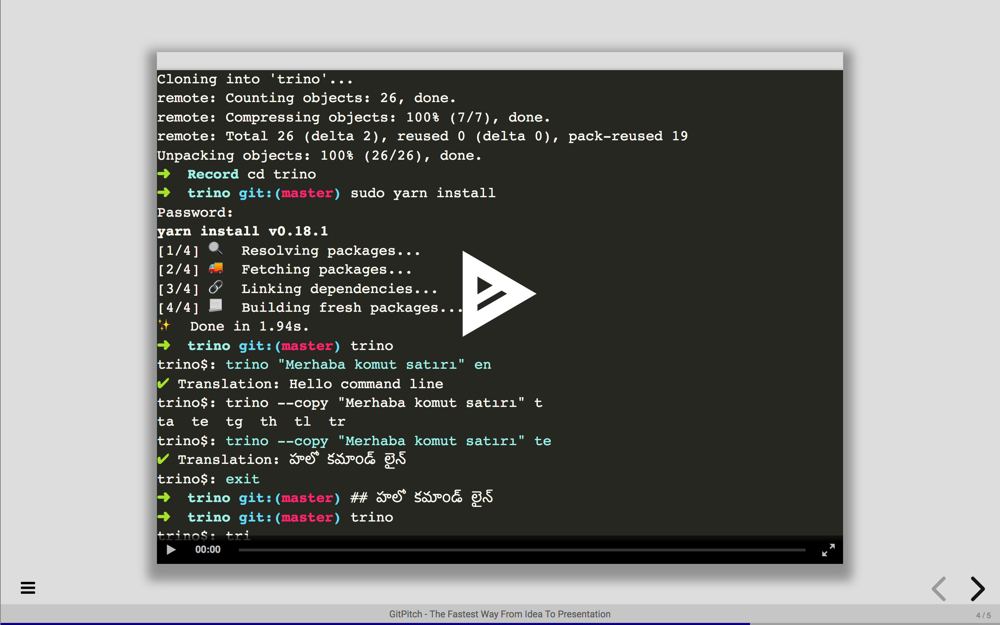

# Terminal Sessions

Embed and playback [Asciinema](https://asciinema.org) *recorded terminal sessions* on any slide.

### Basics

The basic slide delimiter syntax to embed an *terminal session* on a slide is as follows:

```text
---?terminal=path/to/recording/session.json
```

The *terminal delimiter syntax* takes the following options:

- A relative path to a Asciinema terminal session file within your repo and
- A **font** option - an optional *font-size* control for the player
- A **theme** option - an optional *theme* control for the player
- A **poster** option - an optional *preview* control for the player
- An **autoplay** option - an optional *auto-play* control for the player
- A **title** option - an optional title text for the slide
- A **color** option - an optional slide background color override

The **font** parameter can take a value of *small*, *medium*, *large*, or any CSS font-size value (eg. 15px). If unspecified, the default value is *medium*.  This parameter should be used to ensure the *Asciinema Player* fits the *live terminal session* content within the bounds of the slide.

The **theme** parameter can take a value of *asciinema*, *tango*, *solarized-dark*, *solarized-light*, or *monokai*. If unspecified, the default value is *asciinema*.

The **poster** parameter can take any *npt time stamp* (npt:mm:ss) to preview the recording "frame" at the time indicated. For example, the *npt:2:34* stamp would cause the player to preview the "frame" at 2 minutes and 34 seconds into the recording.

The **autoplay** parameter can be activated by setting it's value to true.  When activated, the *Asciinema* player will auto-play on the slide. If unspecified, the default value is false.

The **title** parameter can take any string value. If specified, the string value will be rendered as a title above the *Asciinema* player on the slide.

The **color** parameter can take any valid [CSS Color](https://developer.mozilla.org/en-US/docs/Web/CSS/background-color) value to activate a custom background color for the slide.


### Sample Font

This **PITCHME.md** markdown snippet:

```markdown
---?terminal=sessions/wordpress.json&color=#7FDBFF&font=small&title=WordPress Backup Demo
```

Results in the rendering of the following slide:



### Sample Poster

This **PITCHME.md** markdown snippet:

```markdown
---?terminal=sessions/wordpress.json&poster=npt:1:33&color=orange
```

Results in the rendering of the following slide:



### Sample Theme

This **PITCHME.md** markdown snippet:

```markdown
---?terminal=sessions/trino.json&font=16px&theme=monokai&poster=npt:0:37&color=#DDDDDD
```

Results in the rendering of the following slide:



