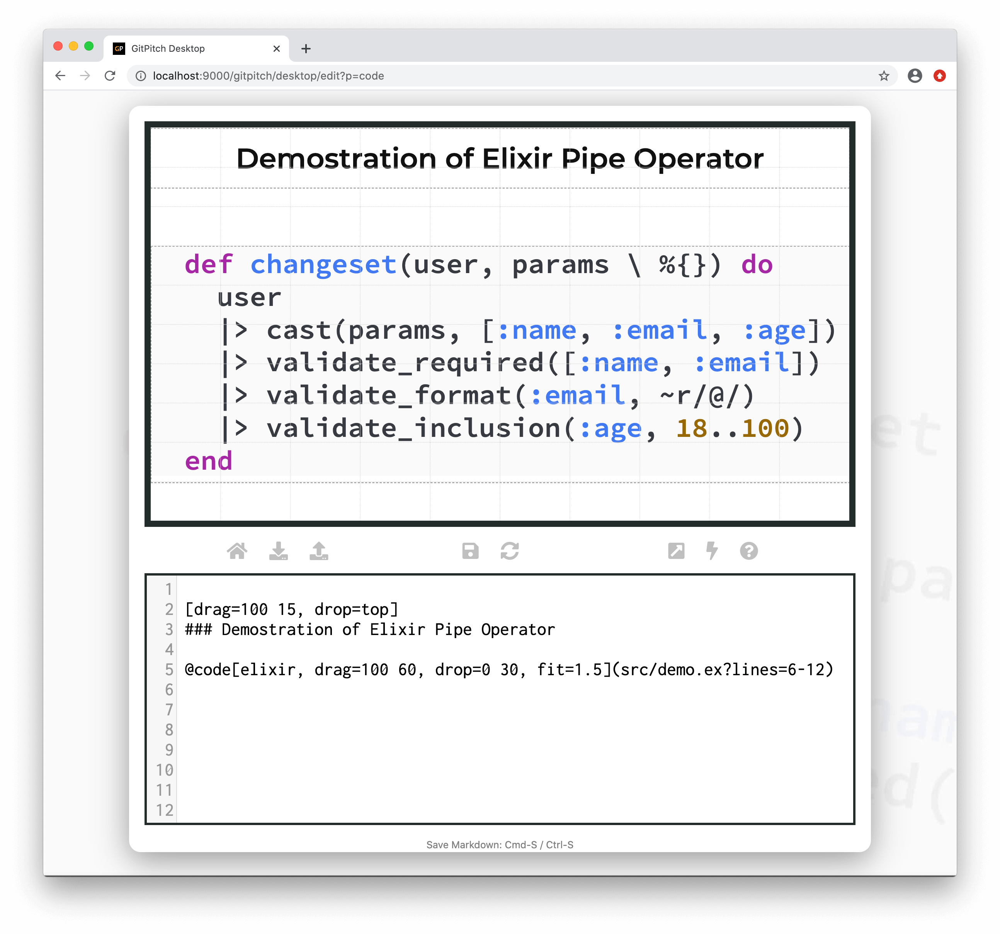

# Code Widgets

?> GitPitch widgets greatly enhance traditional markdown rendering capabilities for slide decks.

Code widgets extend traditional markdown with a concise syntax for positioning, sizing, filtering, and presenting code on any slide. These widgets also help to deliver the many benefits of maintaining modular code dependencies for your slide decks.

### Widget Paths

All paths to source code files specified within [PITCHME.md](conventions/pitchme-md.md) markdown must be relative to the *root directory* of your local working directory or Git repository.


### Widget Syntax

The following markdown snippets demonstrates source code, GIST, and Diff  widget syntax respectively:

<!-- tabs:start -->

#### ** Source Code Widget **

```markdown
# Render contents of a source code file on slide.
@code[lang-hint behaviors..., properties...](path/to/source.ext)
```

```markdown
# Render lines-filtered contents of a source code file on slide.
@code[lang-hint behaviors..., properties...](path/to/source.ext?lines=line-filters]
```

```markdown
# Render tags-filtered contents of a source code file on slide.
@code[lang-hint behaviors..., properties...](path/to/source.ext?tags=tag-filters]
```

#### ** GitHub GIST Widget **


```markdown
# Render contents of a GIST on slide.
@gist[lang-hint behaviors..., properties...](user/gistid)
```

```markdown
# Render contents of a specific GIST file on slide.
@gist[lang-hint behaviors..., properties...](user/gistid?filename=file)
```

```markdown
# Render lines-filtered contents of a GIST on slide.
@gist[lang-hint behaviors..., properties...](user/gistid?lines=line-filters)
```

```markdown
# Render tags-filtered contents of a GIST on slide.
@gist[lang-hint behaviors..., properties...](user/gistid?tags=tag-filters)
```

#### ** GitHub Diff Widget **

```markdown
# Render contents of a Diff on slide.
@diff[behaviors..., properties...](user/repo/commitid)
```

<!-- tabs:end -->


?> The `behaviors...` argument identifies optional [code behaviors](/code/behaviors.md) for your code block. The `properties...` list expects a comma-separated list of [grid property](#grid-native-props) `key=value` pairs.

### Code Lang Hint

The `lang-hint` is a **required** argument for all code widgets, except `@diff` where the hint is implicit. The hint must be specified as the first argument on the widget. To undertand the importance of this argument see [code syntax highlighting hints](/code/?id=language-hints).

### Code Behaviors

The code widget supports the following code-specific behaviors:

[Code Widget Behaviors](../_snippets/code-widget-behaviors.md ':include')

These code behaviors are documented in detail in the [Code Behaviors Guide](code/behaviors.md).

### Grid Native Props

Code widgets are [grid native widgets](/grid-layouts/native-widgets.md) meaning they also directly supports [grid layouts](grid-layouts/) properties:

[Grid Widget Properties](../_snippets/grid-widget-properties.md ':include')

These grid properties are documented in detail in the [Grid Layouts Guide](/grid-layouts/).

# Sample Slide

The following sample slide demonstrates source code rendered using code widget syntax. The sample markdown snippet takes advantage of a number of code widget features:

1. [Code Filter](/code/filters.md) to extract a specific function from the `src/demo.ex` source file.
1. [Grid Drag-and-Drop](/grid-layouts/drag-and-drop.md) to position and size the layout block for the code.
1. [Grid Fit](/grid-layouts/fit-code.md) to magnify the code to best effect within its associated layout block.



