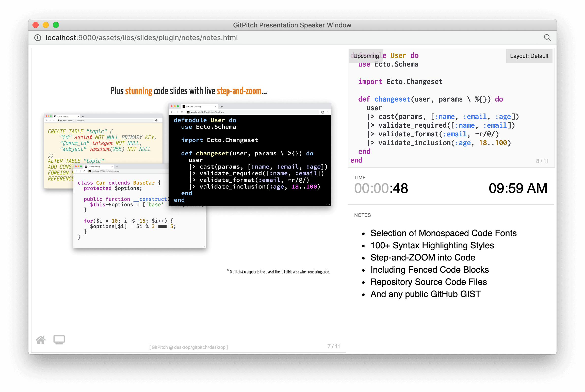

# GitPitch Desktop

?> Interested in taking GitPitch for a test drive? No sign-up. No credit card. And no time limits. Start your [free trial right now](/free-trial.md).

The [Desktop app](desktop/README.md) is a markdown presentation tool delivered using [Docker Desktop](https://www.docker.com/products/docker-desktop) and available on MacOS, Linux, and Windows 10. It supports the following key features:

1. [Offline Slide Deck Development](#offline-development)
1. [Offline Slide Deck Presenting](#offline-presenting)
1. [Offline Publishing PDF, PPTX, HTML](#offline-publishing)
1. [Online Publishing on gitpitch.com](#online-publishing)

### Offline Development

The primary funciton of the desktop app is to let you create beautiful slide decks. Quickly and easily. Using an embedded markdown editor or your favorite IDE.

Slide content is created using standard markdown syntax alongside powerful [widget syntax](#). The app delivers automatic live previews of your slide deck in the browser.

The combination of simple syntax and live previews delivers a great development experience. See the [Quickstart 4.0 Guide](/quickstart.md) for hands on guidance to get you going.

### Offline Presenting

!> To unlock offline presenting features for your slide decks [activate paid service](https://gitpitch.com/pricing).

The secondary function of the desktop app is to help you present your slide decks once they have been developed. To that end the desktop app delivers numerous features tailored specifically for conference speakers and training instructors.

Within the desktop app you can press the **S** key to launch the speaker window when viewing any slide deck. To learn more see the [Speaker Support Guide](/speaker/README.md).

### Offline Publishing

!> To unlock offline publishing features for your slide decks [activate paid service](https://gitpitch.com/pricing).

Beyond slide development and presenting the desktop app makes it very simple to share slide decks with your audience. With just one click the offline publishing manager lets you export any slide deck as a PDF document, as a PPTX slide deck, or as a self-contained HTML bundle.

PDF is a highly portable document format that is great for sharing or printing any slide deck. PPTX slides can be viewed in Microsoft PowerPoint, LibreOffice, Apple Keynote, and Google Slides. While your HTML slides can be published by copying the exported files under your own website or [GitHub Pages](https://pages.github.com/).

For further details see the [Desktop Offline Publishing Guide](/desktop/publishing.md).

?> Exported PPTX slide decks are read-only. Edits should be made using GitPitch Desktop.

### Online Publishing

!> To unlock online publishing features for your slide decks [activate paid service](https://gitpitch.com/pricing).

While offline publishing gives you tools to export and share slide decks as documents the desktop app is itself a seamless companion to the [GitPitch Cloud Service](/cloud/README.md) on **gitpitch.com**.

A slide deck created within the desktop app can be published and shared online with a simple *git-push* to any repository on GitHub, GitLab, or Bitbucket.

To learn more about publishing and sharing public, private, and password-protected slide decks online see the [Cloud Publishing Guide](/cloud/README.md).

