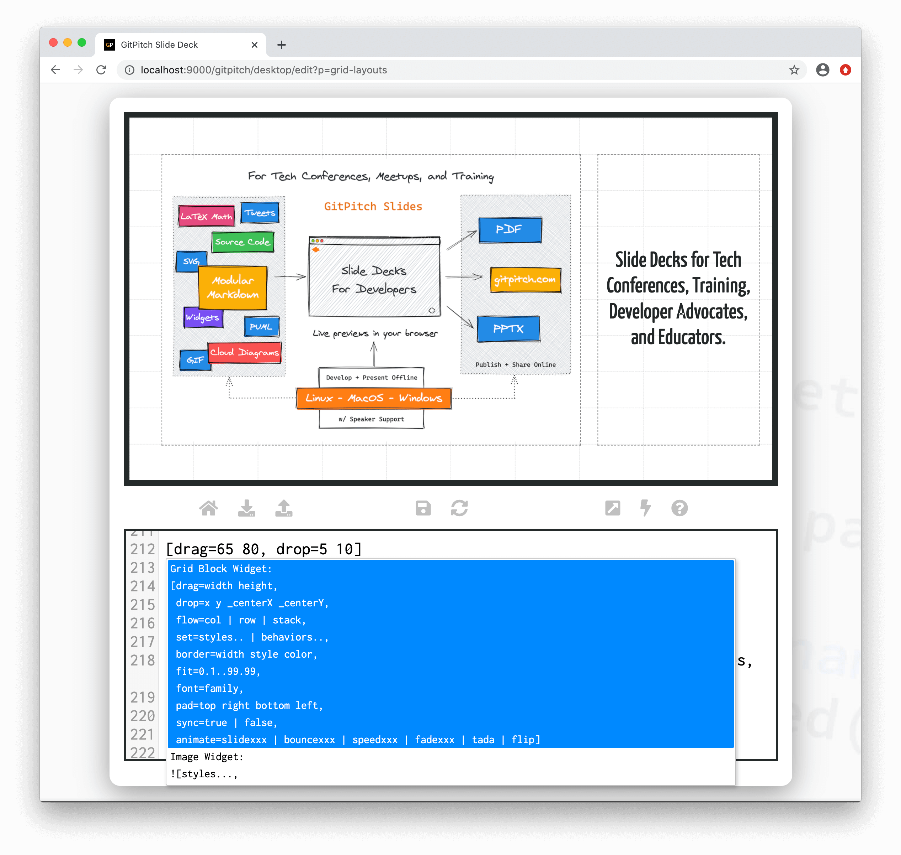
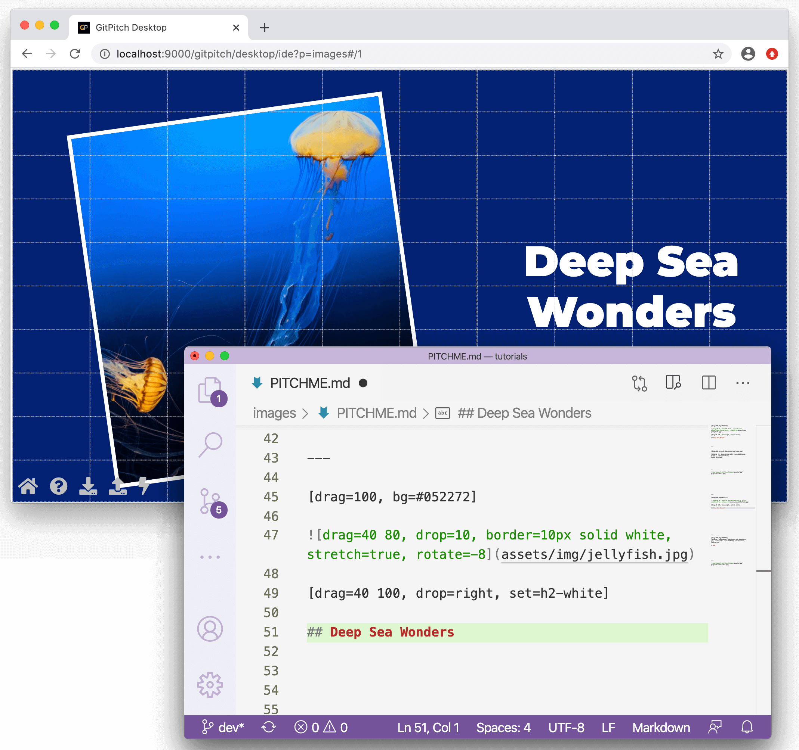

# Desktop Modes

The desktop app supports three distinct modes of operation:

1. [Edit Mode for Development](#edit-mode)
1. [IDE Mode for Development](#ide-mode)
1. [Live Mode for Presenting](#live-mode)

### Edit Mode

Edit mode is the default mode when a slide deck is opened in the desktop app. When this mode is active the interface looks as follows:

In *edit mode* the desktop app exposes the following interface and behaviors:

1. At the top you'll find a dedicated area for live previews of your slide deck.
1. Within the preview area the grid layouts guide-lines are visible as a content positioning aid.
1. In the center a navigation panel provides links to related tools and actions.
1. At the bottom an embedded markdown editor is available for developing slide content.
1. Any changes saved in the embedded editor are automatically reflected in the preview window.

The center navigation panel in edit mode supports the following links and actions:

- :fas fa-home fa-fw: Return to the Deck Manager
- :fas fa-download fa-fw: Open the [Offline Publishing Manager](/desktop/publishing.md)
- :fas fa-upload fa-fw: Open the Online Publishing Manager
- :fas fa-save fa-fw: Save the latest Markdown
- :fas fa-sync-alt fa-fw: Reload the current Slide Deck
- :fas fa-external-link-square-alt fa-fw: Switch to [Desktop IDE Mode](#ide-mode)
- :fas fa-bolt fa-fw: Switch to [Desktop Live Mode](#live-mode)
- :fas fa-question-circle fa-fw: Open the GitPitch Documentation

When working within the embedded markdown editor the following keyboard shortcuts are available:

- **Cmd-S** or **Ctrl-S**: Save the latest Markdown
- **Cmd-Space** or **Ctrl-Space**: Open Widget Syntax Help

When you save markdown within the editor the slide deck preview automatically refreshes. The Widget Syntax Help feature is context sensitive. Simply type the opening syntax for any widget then type **Cmd-Space** or **Ctrl-Space**. The syntax and associated properties for the corresponding widget will be displayed directly within the editor.

> The above screenshow shows Widget Syntax Help within the embedded editor in action.

### IDE Mode

!> In IDE mode use **vim**, **emacs**, **sublime**, **vscode**, **intellij** etc. to create your slide deck content.

If you prefer using your favorite IDE or editor to create, edit, and manage your presentation files while enjoying a live preview of your slide deck in a dedicated browser window, then *IDE mode* is for you:

In *IDE mode* the desktop app exposes the following interface and behaviors:

1. IDE mode uses a dedicated browser window for live previews of your slide deck.
1. Within the preview window the grid layouts guide-lines are visible as a content positioning aid.
1. In the bottom-left of the browser window you'll find navigation links to other tools and actions.
1. Any changes saved in your IDE or editor are automatically reflected in the preview window.

The bottom-left navigations in ide mode supports the following links and actions:
- :fas fa-home fa-fw: Return to the Deck Manager
- :fas fa-question-circle fa-fw: Show the Keyboard Shortcuts Help
- :fas fa-download fa-fw: Open the [Offline Publishing Manager](/desktop/publishing.md)
- :fas fa-upload fa-fw: Open the Online Publishing Manager
- :fas fa-bolt fa-fw: Switch to [Desktop Live Mode](#live-mode)

### Live Mode

Live mode is used when you are ready to engage your audience and present your slide deck. This mode disables all features that are specific to development including live refresh and the display of grid layouts grid-lines.

In *live mode* the desktop app exposes the following interface and behaviors:

1. Live mode uses a dedicated browser window for live presentation of your slide deck.
1. Within the live window the grid layouts guide-lines are hidden.
1. The live window does not detect changes or refresh if your slide deck content changes.
1. In the bottom-left of the browser window you'll find navigation links to other tools and actions.

The bottom-left navigations in ide mode supports the following links and actions:
- :fas fa-home fa-fw: Return to the Deck Manager
- :fas fa-laptop-code fa-fw: Switch to [Desktop Edit Mode](#edit-mode)

When live mode is activated press the **S** key on your keyboard to launch the [Speaker Window](/speaker/window.md).

