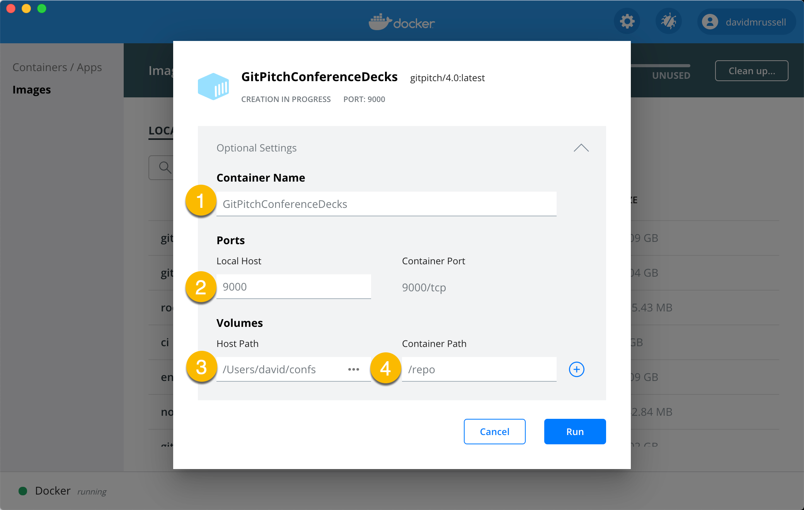

# GitPitch Desktop Launch

!> [Docker Desktop](https://www.docker.com/products/docker-desktop) must already be installed locally in order to launch GitPitch Desktop.

This guide assumes that you have successfully [downloaded the desktop app](/desktop/download.md). The following desktop app launch options are available:

- [Use the Docker Dashboard](#use-the-docker-dashboard)
- [Use a Bash Alias](#use-a-bash-alias)
- [Use Docker Run](#use-docker-run)
- [Use Docker Compose](#use-docker-compose)
- [Windows Launch Tips](#windows-launch-tips)

### Use the Docker Dashboard

?> To use the Docker Dashboard you must install or update to Docker Desktop 2.2 or later. You can download the latest release of Docker Desktop [here](https://www.docker.com/products/docker-desktop).

The Docker Dashboard provides an intuitive UI that you can use to manage and launch GitPitch Desktop. This is the recommended approach to launch GitPitch Desktop. If you are prefer to work with a CLI rather than a UI see the other launch options details in this guide.

The following short video introduces Docker Dashboard and demonstrates how it can be used to quickly launch GitPitch Desktop:

<iframe id="youtube" width="900" height="600" src="https://www.youtube.com/embed/Lt1xySQnEpk" frameborder="0" allow="accelerometer; autoplay; encrypted-media; gyroscope; picture-in-picture" allowfullscreen></iframe>

The video details and demonstrates the steps to launch GitPitch Desktop. The following screenshot is also provided as a quick reference for the main settings described in the video:



These settings are summarized again here for your convenience:

1. The **Container Name** describes the purpose of a collection of slide decks in a specific directory.
1. The **Local Host**  must always be set to **9000**.
1. The **Host Path** points to a local file system directory that contains your presentation files.
1. The **Container Path**  must always be set to **/repo**.
1. After specifying custom values for these settings, click **Run**.

As noted in the video you can define and name multiple container instances for GitPitch Desktop. You can then switch between these instances to launch GitPitch Desktop for different collections of slide decks on your file system.

### Use a Bash Alias

The simplest way to launch the desktop app using the command line is to create a simple *bash alias* or equivalent for your preferred shell.

<!-- tabs:start -->

#### ** Trial **

```bash
# Add GitPitch launch alias to your ~/.bashrc
alias gpd='docker run -it -v $PWD:/repo -p 9000:9000 gitpitch/trial'
```

#### ** Paid **

```bash
# Add GitPitch launch alias to your ~/.bashrc
alias gpd='docker run -it -v $PWD:/repo -p 9000:9000 gitpitch/4.0'
```

<!-- tabs:end -->

Once this alias is activated in your local shell environment, for example `(source ~/.bashrc)`, you can launch the desktop app in two simple steps:

1. Change directory into a local working directory
1. Then execute your custom alias to launch the deskstop app, for example:

```
$ cd {LOCALWORKINGDIRECTORY}
$ gpd

[info] GitPitch Desktop 4.0 Pro Edition started.
[info] BUILD Thu Sep 6 19:00:24 UTC 2020
[info] EVENT directory watcher detected 212 files in 709 ms.
[info] MARKDOWN ( GFM - Widgets ) service enabled.
[info] LAYOUT ( Grid - Auto ) service enabled.
[info] DIAGRAMS ( Mermaid - PlantUML - Cloud ) service enabled.
[info] WHITEBOARD ( Excalidraw ) service enabled.
[info] COMPRESSION ( JPG - PNG - GIF ) service enabled.
[info] SPEAKER ( Window - Notes - Remote ) service enabled.
[info] PUBLISHING ( Offline - PDF - PPTX ) service enabled.
[info] PUBLISHING ( Online - Public - Private - Password ) service enabled.
[info] Application started (Prod)
[info] Listening for HTTP on /0.0.0.0:9000
```

Note, *{LOCALWORKINGDIR}* is a placeholder. You must replace it with a path to a working directory on your local file system. The directory must exist. It can be empty. Or it can contain existing presentation files and assets.

?> The {LOCALWORKINGDIR} is often the root directory of a local Git repository. But the directory does not have to be a Git repository. Any regular directory on your local file system can be used.

Upon successful launch you can access the desktop app in your browser at the following URL:

```http
http://localhost:9000/gitpitch
```

To open your browser at this default desktop URL right now, click [http://localhost:9000](http://localhost:9000/gitpitch).

### Use Docker Run

You can launch the desktop app from any directory using the following `docker run` command directly:

<!-- tabs:start -->

#### ** Trial **

```shell
docker run -it -v {LOCALWORKINGDIR}:/repo -p 9000:9000 gitpitch/trial
```

#### ** Paid **

```shell
docker run -it -v {LOCALWORKINGDIR}:/repo -p 9000:9000 gitpitch/4.0
```

<!-- tabs:end -->

Note, *{LOCALWORKINGDIR}* is a placeholder. You must replace it with an *absolute path* to a working directory on your local file system. The directory must exist. It can be empty. Or it can contain existing presentation files and assets.

?> The {LOCALWORKINGDIR} is often the root directory of a local Git repository. But the directory does not have to be a Git repository. Any regular directory on your local file system can be used.

Upon successful launch you can access the desktop app in your browser at the following URL:

```http
http://localhost:9000/gitpitch
```

To open your browser at this default desktop URL right now, click [http://localhost:9000](http://localhost:9000/gitpitch).

### Use Docker Compose

You can use the *docker-compose* command as a convenient alternative to [docker run](#use-docker-run). To use Compose you first need to copy and save the following service description into a file on your local disk:

<!-- tabs:start -->

#### ** Trial **

```yaml
version: '3'
services:
  gitpitch:
    image: gitpitch/trial
    volumes:
      - .:/repo
    ports:
      - "9000:9000"
    environment:
      - PORT=9000
      - SWEEP=false
```

#### ** Paid **

```yaml
version: '3'
services:
  gitpitch:
    image: gitpitch/4.0
    volumes:
      - .:/repo
    ports:
      - "9000:9000"
    environment:
      - PORT=9000
      - SWEEP=false
```

<!-- tabs:end -->

Following Docker conventions, we recommend saving this service description into a file called *docker-compose.yaml*.

Now to launch the desktop app copy this file into a local working directory. The directory must exist. It can be empty. Or it can contain existing presentation files and assets. Then within that same directory, use the following launch command:

```shell
docker-compose up
```

Upon successful launch you can access the desktop app in your browser at the following URL:

```http
http://localhost:9000/gitpitch
```

To open your browser at this default desktop URL right now, click [http://localhost:9000](http://localhost:9000/gitpitch).

### Windows Launch Tips

If your version of Docker Desktop for Windows is using the new [WSL 2 Backend](https://docs.docker.com/docker-for-windows/wsl/) the launch details provided above should have you up and running without problems.

However, if your version of Docker Desktop for Windows is using the older *Hyper-V Backend* you need to update your Docker Desktop file sharing settings to allow local directories on Windows to be shared with the GitPitch Desktop Linux container. It's easy to set this up. You can find details describing directory sharing under the *File Sharing* section in the following [Docker for Windows Guide](https://docs.docker.com/docker-for-windows/).

