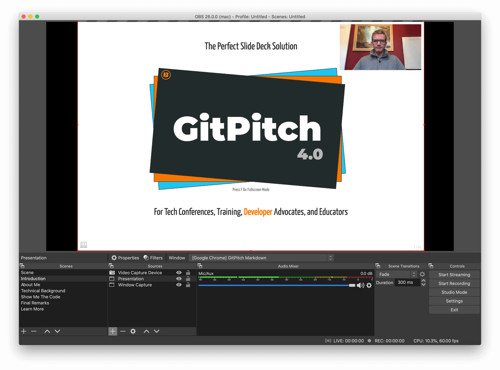

# Desktop OBS Studio

GitPitch Desktop integrates with [OBS Studio](https://obsproject.com/) to deliver a seamless GitPitch/OBS presentation experience whether you are live streaming or video recording.

1. Present a new slide or slide fragment.
1. And have GitPitch Desktop automatically activate a new OBS scene for your audience.



Whether you are giving a virtual conference talk, hosting a Twitch stream, or recording a technical training course you can use GitPitch with OBS to deliver a seamless presentation experience.


### OBS Plugin

To integrate the desktop app with OBS Studio you must first activate the [OBS Websocket Plugin](https://obsproject.com/forum/resources/obs-websocket-remote-control-obs-studio-from-websockets.466/) within your local installation of OBS Studio. See the **Usage instructions** on the linked page for installation details.

### OBS Setting

To enable OBS support for your slide deck you must activate the `obs` property in the [PITCHME.yaml](/conventions/pitchme-yaml) settings for your slide deck:

```yaml
obs : "localhost:4444"
```

The value on this setting must match the host and port configuration used when you activated the [OBS Websocket Plugin](#obs-plugin) above. The example values shown above are the *default* host and port values used by the websocket plugin.

### OBS Widget

To automatically activate a named OBS scene when a slide is displayed use the **@obs** markdown widget. This widget can be declared directly following any slide delimiter in your deck. For example:

```markdown
---
@obs[Intro Scene]

Slide markdown content goes here...

```

The value on the widget must match a valid OBS scene name exactly. And exact match includes case, spacing etc in the scene name. For example, `Intro Scene` as shown above. OBS scene names appear in the **Scenes** box in the bottom-left corner of OBS Studio.

### OBS Fragments

You can associate a named OBS scene with a specific [grid layouts block](/grid-layouts/drag-and-drop) using the `obs=` property on the block, for example:

```markdown

[drag=width height, drop=x y, obs=Speaker Focus]

Block markdown content goes here...

```

This example demonstrates the activation of an OBS scene named `Speaker Focus` when this layout block is displayed. This `obs=` property has two important effects:

1. It automatically turns the grid layouts block into a [slide fragment](/grid-layouts/fragments).
1. And when that fragment is visible, it will automatically activate the named OBS scene.

You can imagine a `Speaker Focus` OBS scene might be used to temporarily maximize your webcam while minimizing slide content within your overall display. But of course the full sophistication of OBS scene management is at your fingertips.

