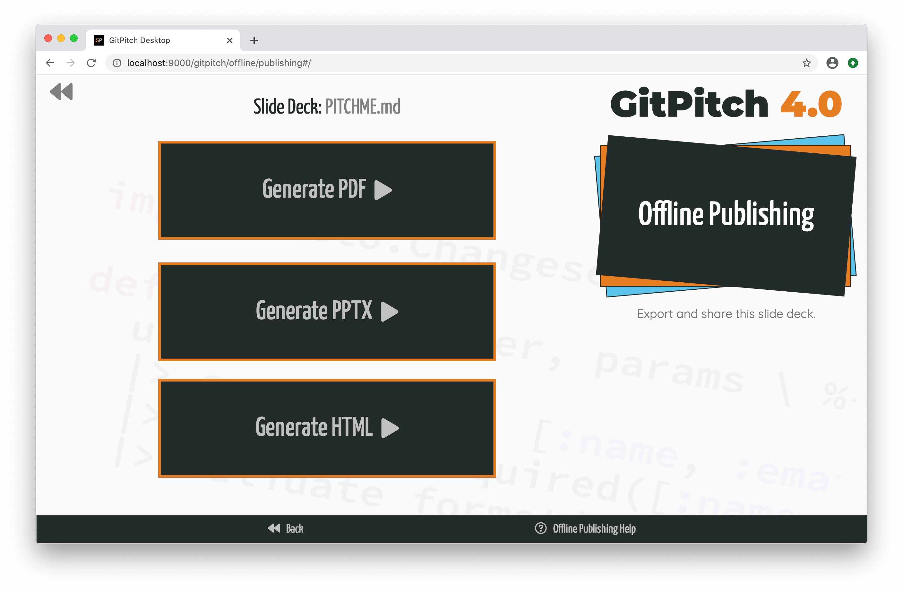

# Desktop Offline Publishing

!> To unlock offline publishing features for your slide decks [activate paid service](https://gitpitch.com/pricing).

Using the desktop app you can export any slide deck with just one click:

- As a PDF document
- As a PPTX slide deck or
- As a self-contained HTML bundle



PDF is a highly portable document format that is great for sharing or printing any slide deck. PPTX slides can be viewed in Microsoft PowerPoint, LibreOffice, Apple Keynote, and Google Slides. While your HTML slides can be published by copying the exported files under your own website or [GitHub Pages](https://pages.github.com/).

### Preview HTML

If you want to preview your HTML slide deck locally before [deploying](#deploy-html) to your own server or GitHub Pages you can take the following steps:

1. Generate a HTML slide deck using GitPitch Dekstop
1. Create a new directory on your local file system, for example, `/home/david/tecktalk`
1. Move the generated `PITCHME.zip` file into your new local directory
1. Unzip the generated `PITCHME.zip` file in your new local diretory
1. You will now see an `index.html` file plus some additional file dependencies.
1. Delete the generated `PITCHME.zip` file from your new local directory

After you have completed these steps you need to start a local web server within your new local directory so you can open and preview your slide deck. The following tabs demonstrate some simple ways to launch a local web server:

<!-- tabs:start -->

#### ** Python 2 **

```bash
# Assuming Python 2 is installed locally, run this command
# in the new local directory where your HTML slides are found. 

python -m SimpleHTTPServer

# What version of Python are you running locally?
python -V
```

#### ** Python 3 **

```bash
# Assuming Python 3 is installed locally, run this command
# in the new local directory where your HTML slides are found.

python -m http.server

# What version of Python are you running locally?
python -V
```

#### ** Node.js **

```bash
# Assuming http-server is installed globally, run this command
# in the new local directory where your HTML slides are found.

http-server

# How do I install the http-server package globally?
npm install --global http-server
```


<!-- tabs:end -->

### Deploy HTML

When exporting a slide deck as HTML a file called `PITCHME.zip` is generated by GitPitch Desktop. The desktop app provides a one-click download of this file directly in your browser. To deploy the slide deck contained within that ` PITCHME.zip` file under your own website or GitHub Pages you need to take the following steps:

1. Generate a HTML slide deck using GitPitch Dekstop
1. Copy the generated `PITCHME.zip` file onto your server
1. Create a new directory under your web server, for example, `/www/tecktalk`
1. Move the generated `PITCHME.zip` file into your new web server directory
1. Unzip the generated `PITCHME.zip` file in your new web server diretory
1. You will now see an `index.html` file plus some additional file dependencies.
1. Delete the generated `PITCHME.zip` file from your new web server directory

Your HTML slide deck should then be available at `https://yorserver.com/techtalk`.

### Settings

The set of `print` settings let you customize PDF and PPTX output when exporting GitPitch slide decks.
These settings should be enabled or disabled as required in the [PITCHME.yaml](/conventions/pitchme-yaml.md) for your slide deck.

### Defaults

```yaml
print-fragments : true
print-notes     : false
print-footer    : false
print-hires     : true
```

### Details

By default, the following document export controls are activated:

1. Each [markdown fragment](/grid-layouts/fragments.md) and [code fragment](/code/presenting.md) is printed on an individual page.
1. Speaker [notes](/speaker/notes.md) are not printed.
1. Slide [footnotes](/settings/footnote.md) are not printed.
1. PPTX screens are captured in hi-resolution.

When all *print* settings are enabled the following document export controls are activated:

1. Each [markdown fragment](/grid-layouts/fragments.md) and [code fragment](/code/presenting.md) is printed on an individual page.
1. Slide-specific speaker [notes](/speaker/notes.md) are printed on an individual page.
1. Slide [footnotes](/settings/footnote.md) are printed on each page.
1. PPTX screens are captured in hi-resolution.

### Customize

You can override any of the `print` setting values for custom behavior by enabling or disabling any of these settings in the [PITCHME.yaml](/conventions/pitchme-yaml.md) for your slide deck. For example:

```yaml
print-fragments : false
print-notes     : false
print-footer    : false
print-hires     : false
```

