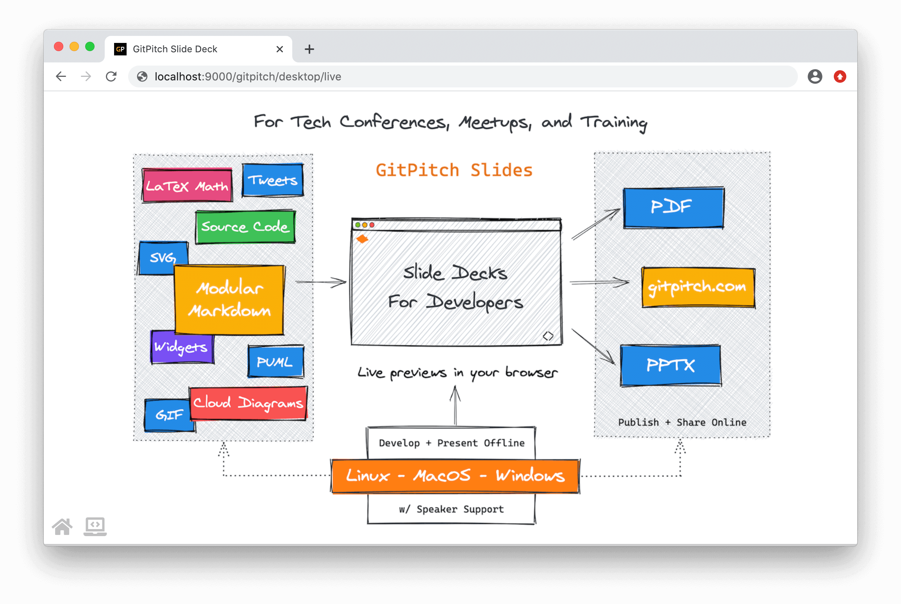
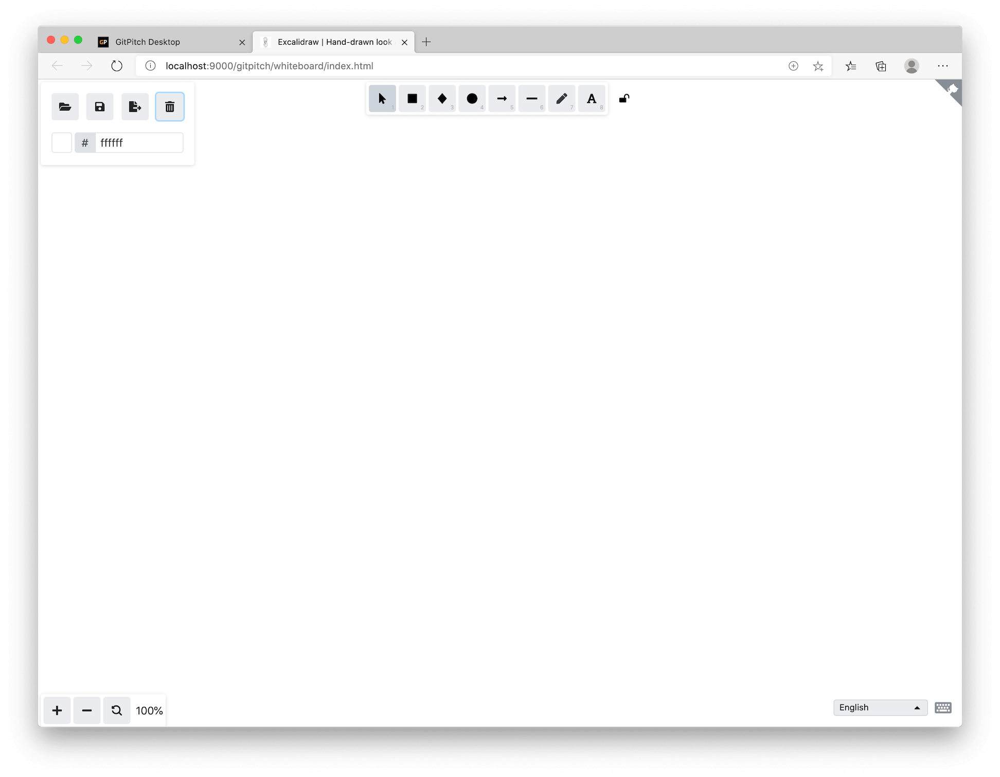
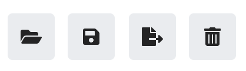
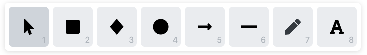
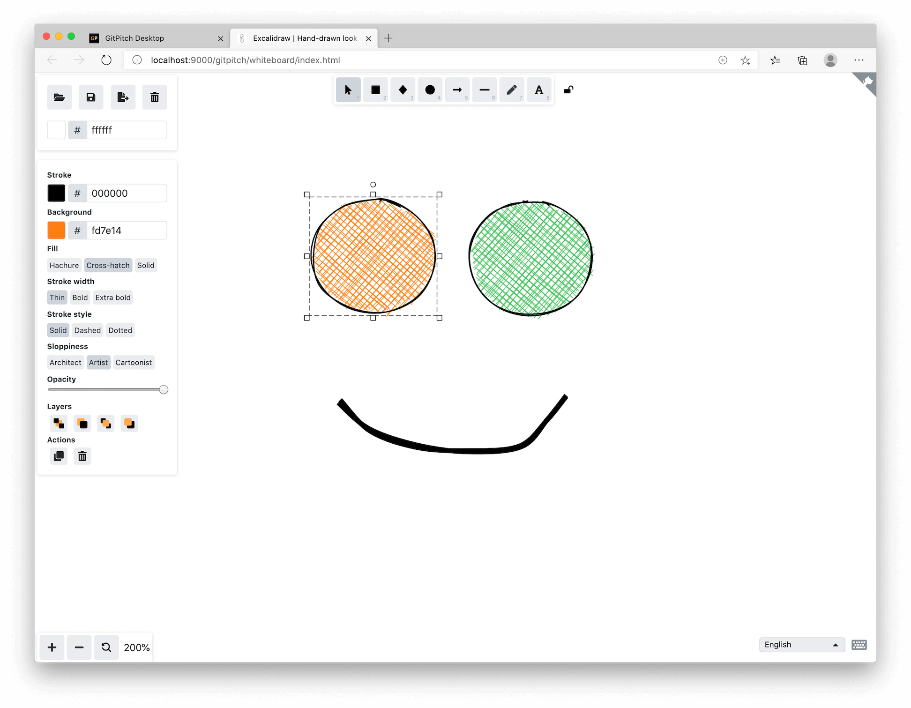
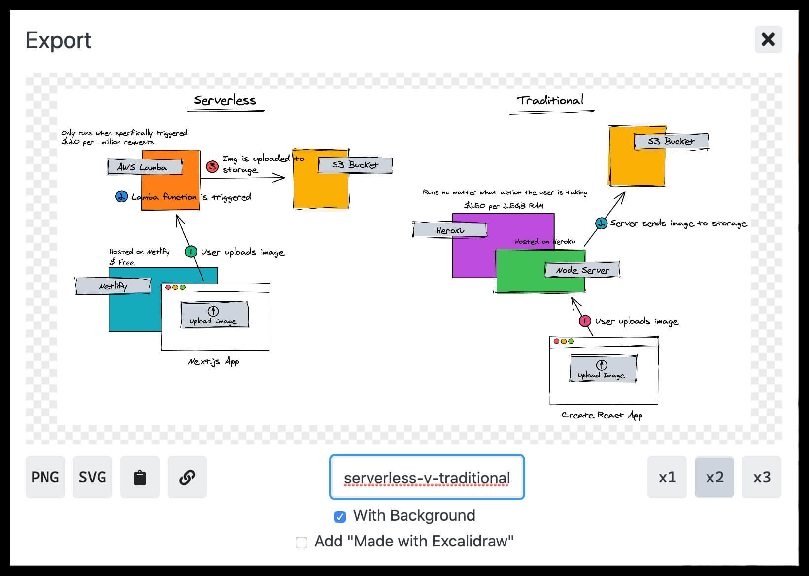
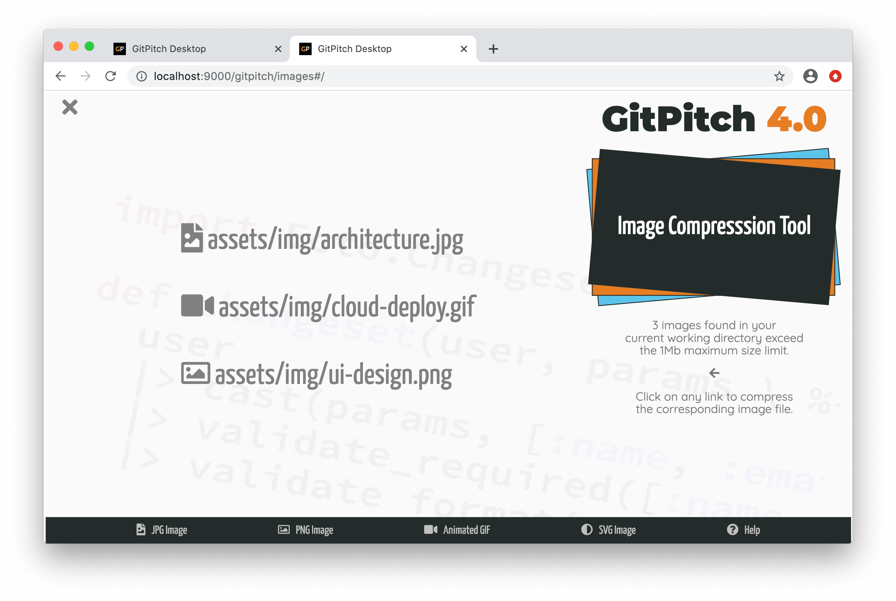

# Desktop Tools

The desktop app has a number of built-in tools to support your work as a presentation author including:

- [Whiteboard Sketch Tool](#whiteboard-tool)
- [Image Compression Tool](#compression-tool)


### Whiteboard Tool

The whiteboard tool lets you quickly sketch any diagram  with a hand-drawn feel.  Ideal for sharing mockups, wireframes, system diagrams, UI workflows, casual brainstorming, concepts, and more.  You can save your sketches as images for rendering on any slide. Just like this sample slide:



The whiteboard is powered by the amazing [Excalidraw Sketch Tool](https://github.com/excalidraw/excalidraw) and integrated seamlessly for working offline within the desktop app. When first launched the whiteboard may be empty:



The button controls in the top-left corner of the whiteboard support the following features:



1. Load an existing sketch (sketch files have an [.excalidraw](https://github.com/excalidraw/excalidraw) file extension)
1. Save the current sketch as an [.excalidraw](https://github.com/excalidraw/excalidraw) file
1. Export the current sketch as an SVG or PNG image file
1. Clear the whiteboard by wiping the currenty displayed sketch

When drawing on the whiteboard the following shape and text tools are available:



Simply click on a drawing tool and then use it to draw on the whiteboard. Excalidraw is a highly intuitive sketching tool where the basic shapes (when in focus) expose rendering properties that can be quickly customized to suit your needs.



#### Saving Whiteboard Sketches as SVG or PNG

Using the export button in the top-left of the whiteboard you will be presented with a panel to save your sketch to SVG or PNG. A number of export options are presented on this panel as shown in the following screenshot:



Clicking on the **PNG** or **SVG** button will cause your sketch to be downloaded as an image file in your browser. Before downloading you can name the image file.

#### Using Whiteboard Sketches within your Slide Decks

Once you have [saved your sketch](#saving-whiteboard-sketches-as-svg-or-png) as an SVG or PNG file you can immediately render that image on any slide as detailed in the [Image Content Guide](/images/).


### Compression Tool

GitPitch enforces [size limits](/images/size-limits-policy.md) on image files used within your slide decks. These limits exist to ensure slide decks viewed online can be efficiently loaded and rendered in the browser. The compression tool detects oversized images. And with one-click can compress the size of any image.

!> There is a **1Mb** file size limit for each individual **JPG**, **PNG**, and **GIF** image.

Any image file found in your local working directory that exceeds image size limits is automatically displayed within the image compression tool:



One-click on any file listed by the tool generates a compressed version of the image file that will automatically download to local disk. After downloading a compressed image file you can view it in a local image viewer or copy it into the local working directory and view it directly on your slide.

#### How to Disable Image Size Limits

By default, GitPitch enforces [image size limits](/images/size-limits-policy.md) for all slide decks. But there may be times when your target audience is not online. For example, when:

- Using the Desktop to present a slide deck live at a [tech conference or meetup](/speaker/).
- Using the Desktop to present hi-resoluiton image content that exceed size limits.
- Using the Desktop to export and share a slide deck as [PDF or PowerPoint PPTX](/desktop/).

When needed, you can disable size limit restrictions by disabling the `image-size-limits` setting in the [PITCHME.yaml](/conventions/pitchme-yaml.md) for any slide deck, as follows:

```yaml
image-size-limits : false
```

!> This setting disables image size limits in the Desktop only. If you publish your slide deck to the cloud this setting is ignored. The default image size limits are always enforced on **gitpitch.com**.

To ensure consistent rendering everywhere, we strongly recommend that you always size-optimize image files used by your slide decks.
