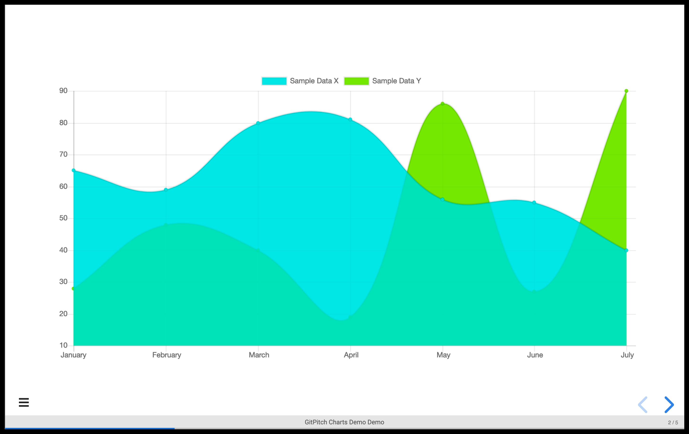
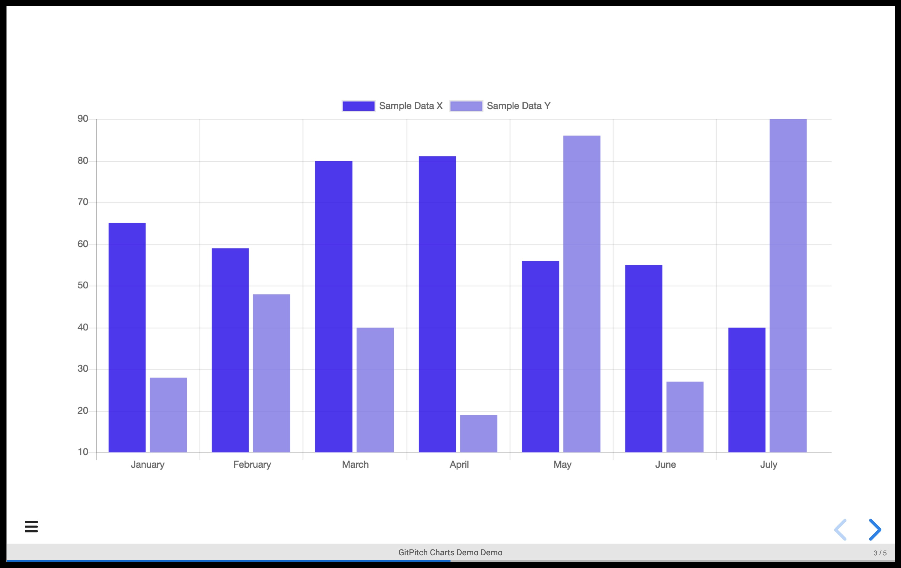
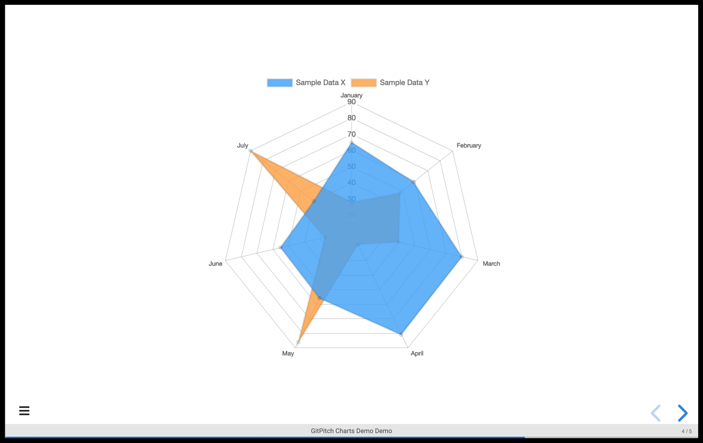

# Line, Bar, Radar Charts

Charts support is disabled by default. When enabled you can render line, bar, pie, radar, and radial charts on any slide.

### Activation

To enable the charts plugin for your slide deck activate the `charts` setting in your [PITCHME.yaml](/conventions/pitchme-yaml.md):

```yaml
charts: true
```

Once this setting is enabled, a chart can be included on any slide by adding a canvas element with the _data-chart_ attribute set to the desired chart type. The chart can be configured within the canvas body by a JSON string embedded into an HTML comment.

?> For additional details see the documentation for the [reveal.js plugin for Chart.js](https://github.com/rajgoel/reveal.js-plugins/tree/master/chart).


### Line Chart

To render a line chart you must declare a **canvas** element on your slide. This required element takes a **data-chart** property. And that property value determines the style of chart rendered for your custom data. For a line chart, this property value must be set to **line**. For example:

```text
<canvas data-chart="line">
<!--
{
 "data": {
  "labels": ["January"," February"," March"," April"," May"," June"," July"],
  "datasets": [
   {
    "data":[65,59,80,81,56,55,40],
    "label":"Sample Data X",
    "backgroundColor":"rgba(20,220,220,.8)"
   },
   {
    "data":[28,48,40,19,86,27,90],
    "label":"Sample Data Y",
    "backgroundColor":"rgba(120,220,0,.8)"
   }
  ]
 },
 "options": { "responsive": "true" }
}
-->
</canvas>
```

Please note the following:

- Your chart properties must be defined as a JSON string within HTML comment syntax
- You can add as many data elements as needed inside the **datasets** array.
- The number of elements within the top-level **labels** property value should match the size of the **data** arrays specified within **datasets**.
- Each element within **datasets** must provide a **data** property, plus optional but recommended properties including **label**, and **backgroundColor**.

This sample markup snippet is rendered as follows:



### Bar Chart

To render a bar chart you must declare a **canvas** element on your slide. This required element takes a **data-chart** property. And that property value determines the style of chart rendered for your custom data. For a bar chart, this property value must be set to **bar**. For example:

```text
<canvas data-chart="bar">
<!--
{
 "data": {
  "labels": ["January"," February"," March"," April"," May"," June"," July"],
  "datasets": [
   {
    "data":[65,59,80,81,56,55,40],
    "label":"Sample Data X",
    "backgroundColor":"rgba(20,20,220,.8)"
   },
   {
    "data":[28,48,40,19,86,27,90],
    "label":"Sample Data Y",
    "backgroundColor":"rgba(120,120,220,.8)"
   }
  ]
 },
 "options": { "responsive": "true" }
}
-->
</canvas>
```

Please note the following:

- Your chart properties must be defined as a JSON string within HTML comment syntax
- You can add as many data elements as needed inside the **datasets**
- You can add as many data elements as needed inside the **datasets** array.
- The number of elements within the top-level **labels** property value should match the size of the **data** arrays specified within **datasets**.
- Each element within **datasets** must provide a **data** property, plus optional but recommended properties including **label**, and **backgroundColor**.

This sample markup snippet is rendered as follows:



### Radar Chart

To render a radar chart you must declare a **canvas** element on your slide. This required element takes a **data-chart** property. And that property value determines the style of chart rendered for your custom data. For a radar chart, this property value must be set to **radar**. For example:

```text
<canvas data-chart="radar">
<!--
{
 "data": {
  "labels": ["January"," February"," March"," April"," May"," June"," July"],
  "datasets": [
   {
    "data":[65,59,80,81,56,55,40],
    "label":"Sample Data X",
    "backgroundColor":"rgba(80,160,240,.8)"
   },
   {
    "data":[28,48,40,19,86,27,90],
    "label":"Sample Data Y",
    "backgroundColor":"rgba(240,160,80,.8)"
   }
  ]
 },
 "options": { "responsive": "true" }
}
-->
</canvas>
```

Please note the following:

- Your chart properties must be defined as a JSON string within HTML comment syntax
- You can add as many data elements as needed inside the **datasets**
- You can add as many data elements as needed inside the **datasets** array.
- The number of elements within the top-level **labels** property value should match the size of the **data** arrays specified within **datasets**.
- Each element within **datasets** must provide a **data** property, plus optional but recommended properties including **label**, and **backgroundColor**.

This sample markup snippet is rendered as follows:



### External Data

If your chart is driven by an external _csv_ data file you must specify an absolute URL to that file. If your _csv_ data file lives in your GitHub repo then you will need to use the absolute URL to the raw file. Relative paths to data files *are not supported*.

