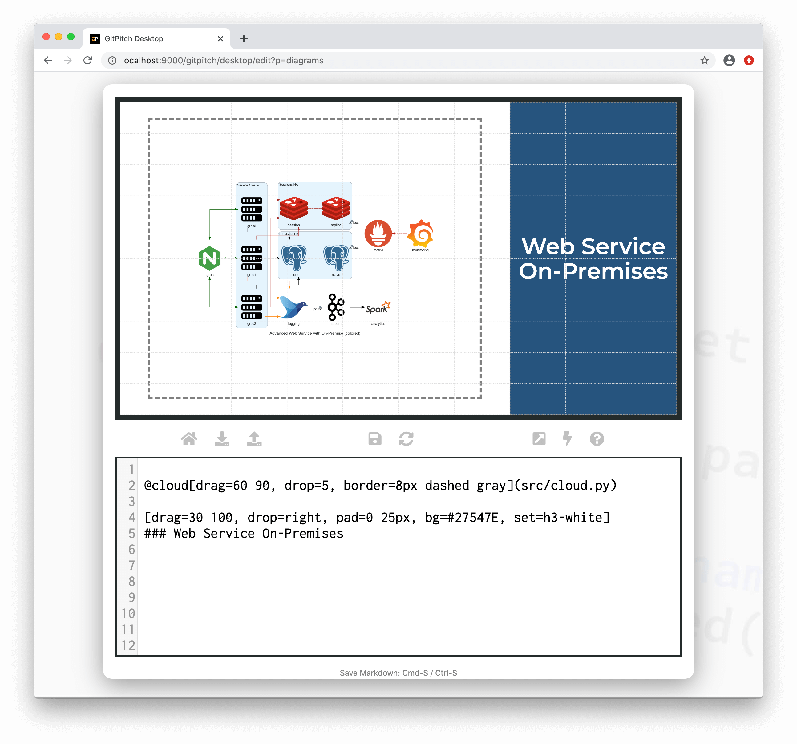

# Cloud Architecture Diagrams

?> GitPitch widgets greatly enhance traditional markdown rendering capabilities for slide decks.

The cloud widget is a special markdown syntax that can be used to render sophisticated cloud system architecture diagrams powered by [Diagrams-as-Code](https://diagrams.mingrammer.com/).

### Widget Paths

All paths to cloud description files specified within [PITCHME.md](/conventions/pitchme-md.md) markdown must be relative to the *root directory* of your local working directory or Git repository.

### Widget Syntax

The following markdown snippet demonstrates cloud widget syntax:

```markdown
@cloud[properties...](path/to/cloud.py)
```

?> The `properties...` list expects a comma-separated list of property `key=value` pairs.

Each cloud system archtecture diagram is defined using simple Python syntax within a dedicated source code file. The exact syntax is defined by the [Diagrams As Code](https://diagrams.mingrammer.com) project. The following conventions are enforced:

1. Diagram descriptions **must** be defined in a file within your local repository.
1. Diagram description files must have a **.py** extension.
1. The contents of your diagram description files must adhere to valid [Diagrams As Code](https://diagrams.mingrammer.com/docs/guides/diagram) syntax.

[Cloud Properties](../_snippets/diagrams-cloud-properties.md ':include')

### Sample Slide

The following slide demonstrates a sample cloud architecture diagram rendered using cloud widget syntax. The markdown snippet used to create this slide takes advantage of *grid native properties* to position, size, and transform the diagram on the slide:



