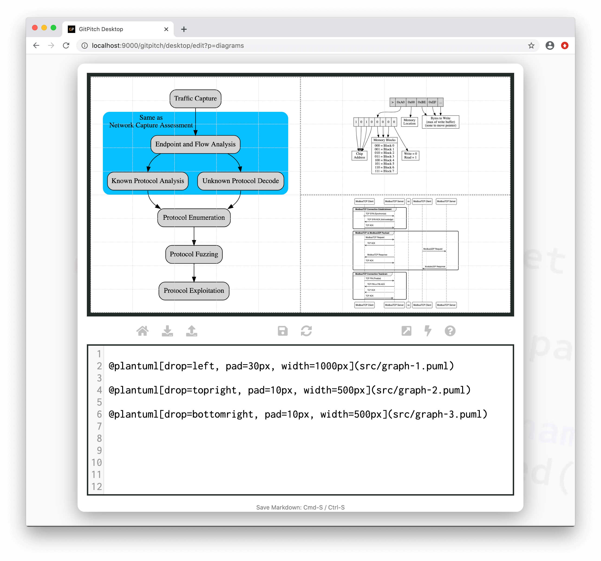
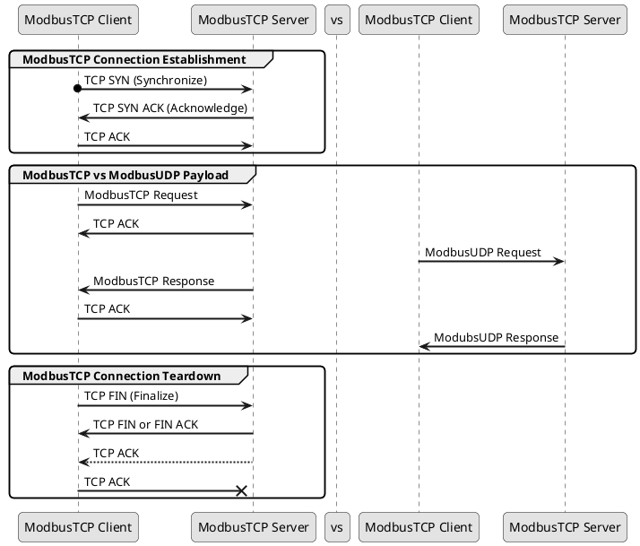

# Graphviz/DOT Diagrams

?> GitPitch widgets greatly enhance traditional markdown rendering capabilities for slide decks.

The [PlantUML Widget](/diagrams/plantuml.md) makes use of [Graphviz/DOT Visualization Software](http://www.graphviz.org) for rendering under the hood. This guide describes how you can leverage Graphviz/Dot
support directly to generate sophisticated graphs on any slide.

### Widget Paths

All paths to graphviz description files specified within [PITCHME.md](/conventions/pitchme-md.md) markdown must be relative to the *root directory* of your local working directory or Git repository.

### Widget Syntax

The following markdown snippet demonstrates graphviz widget syntax:

```markdown
@plantuml[properties...](path/to/file.puml)
```

?> The `properties...` list expects a comma-separated list of property `key=value` pairs.

Each diagram is defined using a simple text-based syntax within a dedicated description file. The exact syntax is defined by the [PlantUML Dot Project](https://plantuml.com/dot). The following conventions are enforced:

1. *PlantUML Dot* diagram descriptions **must** be defined in a file within your local repository.
1. These *PlantUML Dot* diagram description files must have a **.puml** extension.
1. The contents of your diagram description files must adhere to valid [PlantUML Dot](https://plantuml.com/dot) syntax. 

[PlantUML Properties](../_snippets/diagrams-plantuml-properties.md ':include')

### Sample Slide

The following slide demonstrates a sample sequence diagram rendered using plantuml widget syntax. The markdown snippet used to create this slide takes advantage *grid native properties* to position, size, and transform the diagram on the slide:



### Sample Dot Sytnax

The *dot syntax* used to create the sample diagrams shown above was kindly provided by a member of the GitPitch community (thanks Justin!) and is provided here for reference:


<!-- tabs:start -->

#### ** Left Diagram **

```puml
@startuml
digraph G {
  node [shape=record, fillcolor=lightgrey, style="filled,rounded"]
  capture [label="Traffic Capture"]
  capture -> analyze

  subgraph cluster0 {
    label = "Same as\nNetwork Capture Assessment"
    labeljust = left
    style = "filled,rounded"
    color = deepskyblue
    analyze [label="Endpoint and Flow Analysis"]
    analyze:0 -> known:n
    analyze:1 -> unknown:n
    known [label="Known Protocol Analysis"]
    unknown [label="Unknown Protocol Decode"]
  }

  known:s -> enum:0
  unknown:s -> enum:1
  enum [label="Protocol Enumeration"]
  enum -> fuzz
  fuzz [label="Protocol Fuzzing"]
  fuzz -> exploit
  exploit [label="Protocol Exploitation"]
}
@enduml
```

#### ** Top-Right Diagram **

```puml
@startuml
digraph structs {
  node [shape=record];
  write [label="\> | <0>0xA0 | <1>0x00 | <2>0xBE | <3>0xEF | <4>...", fillcolor=lightgrey, style=filled];

  write:0 -> command:4;
    command [label="<0>1|<1>0|<2>1|<3>0|<4>0|<5>0|<6>0|<7>0", fillcolor=whitesmoke, style=filled];
    command:0 -> chip:0;
    command:1 -> chip:1;
    command:2 -> chip:2;
    command:3 -> chip:3;
      chip [label="Chip\nAddress"];
    command:4 -> memblock:0;
    command:5 -> memblock:1;
    command:6 -> memblock:2;
      memblock [label="{Memory Blocks | 000 = Block 0\n001 = Block 1\n010 = Block 2\n011 = Block 3\n100 = Block 4\n101 = Block 5\n110 = Block 6\n111 = Block 7}"];
    command:7 -> rw;
      rw [label="Write = 0\nRead = 1"];

  write:1 -> address;
    address [label="Memory\nLocation"];

  write:2 -> data:0;
  write:3 -> data:1;
  write:4 -> data:2;
    data [label="Bytes to Write\n(max of write buffer)\n(none to move pointer)"];

}
@enduml
```

#### ** Bottom-Left Diagram **



<!-- tabs:end -->

