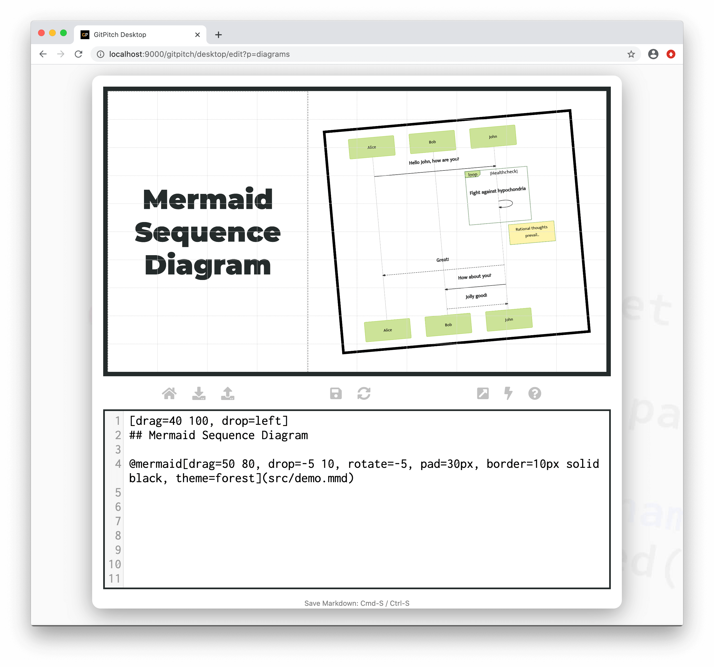
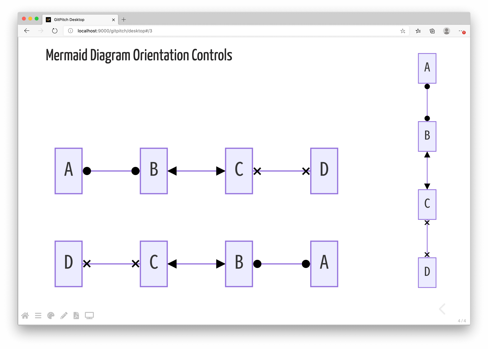

# Mermaid Diagrams

?> GitPitch widgets greatly enhance traditional markdown rendering capabilities for slide decks.

The mermaid widget is a special markdown syntax that can be used to render [Mermaid Diagrams and Flowcharts](https://mermaid-js.github.io/mermaid) on any slide.


### Widget Paths

All paths to mermaid description files specified within [PITCHME.md](/conventions/pitchme-md.md) markdown must be relative to the *root directory* of your local working directory or Git repository.

### Widget Syntax

The following markdown snippet demonstrates mermaid widget syntax:

```markdown
@mermaid[properties...](path/to/file.mmd)
```

?> The `properties...` list expects a comma-separated list of property `key=value` pairs.

Each diagram is defined using a simple text-based syntax within a dedicated description file. The exact syntax is defined by the [Mermaid Project](https://mermaid-js.github.io/mermaid). The following conventions are enforced:

1. *Mermaid* diagram descriptions **must** be defined in a file within your local repository.
1. These *Mermaid* diagram description files must have a **.mmd** extension.
1. The contents of your diagram description files must adhere to valid [Mermaid](https://mermaid-js.github.io/mermaid) syntax.

[Mermaid Properties](../_snippets/diagrams-mermaid-properties.md ':include')

### Sample Slide

The following slide demonstrates a sample sequence diagram rendered using mermaid widget syntax. The markdown snippet used to create this slide takes advantage of both *mermaid-specific* and *grid native properties* to position, size, and transform the diagram on the slide:



### Layout Orientation

You can control the layout orientation of any Mermaid diagram by specifying one of the following orientation flags on the opening **graph** declaration in your diagram description file.

- **TB** - top to bottom
- **BT** - bottom to top
- **LR** - left to right
- **RL** - right to left
- **TD** - same as TB

For example, the following snippet demonstrates a Mermaid graph with a *top-to-bottom* orientation:

```text
graph TB
    Start --> Stop
```

The following screenshot demonstrates a Mermaid graph being rendered using different layout orientations on a sample GitPitch slide:



Given the default aspect ratio of GitPitch slides is **16:9** there are times when activating an **LR** or **RL** layout for your diagrams makes sense.  Doing so lets you to take advantage of the full width of your slides.


