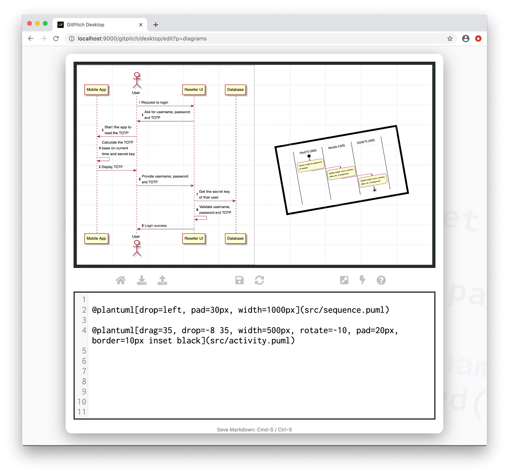

# PlantUML Diagrams

?> GitPitch widgets greatly enhance traditional markdown rendering capabilities for slide decks.

The plantuml widget is a special markdown syntax that can be used to render [PlantUML Diagrams](https://plantuml.com/). That includes usecase, class, activity, and state diagrams among others.

### Widget Paths

All paths to plantuml description files specified within [PITCHME.md](/conventions/pitchme-md.md) markdown must be relative to the *root directory* of your local working directory or Git repository.

### Widget Syntax

The following markdown snippet demonstrates plantuml widget syntax:

```markdown
@plantuml[properties...](path/to/file.puml)
```

?> The `properties...` list expects a comma-separated list of property `key=value` pairs.

Each diagram is defined using a simple text-based syntax within a dedicated description file. The exact syntax is defined by the [PlantUML Project](https://plantuml.com/). The following conventions are enforced:

1. *PlantUML* diagram descriptions **must** be defined in a file within your local repository.
1. These *PlantUML* diagram description files must have a **.puml** extension.
1. The contents of your diagram description files must adhere to valid [PlantUML](https://plantuml.com/) syntax.

[PlantUML Properties](../_snippets/diagrams-plantuml-properties.md ':include')

### Sample Slide

The following slide demonstrates a sample sequence diagram rendered using plantuml widget syntax. The markdown snippet used to create this slide takes advantage *grid native properties* to position, size, and transform the diagram on the slide:



### Layout Orientation

By default, *PlantUML* diagram entities are rendered in a *top-to-bottom* layout. You can control the layout orientation of any PlantUML diagram by specifying a custom **direction** within your diagram description file. For example:

```uml
@startuml
left to right direction
.
.
.
@enduml
```

Given the aspect ratio of GitPitch slides is **16:9** there are times when activating an *left-to-right* layout for your diagrams makes sense.  Doing so lets you to take advantage of the full width of your slides.

