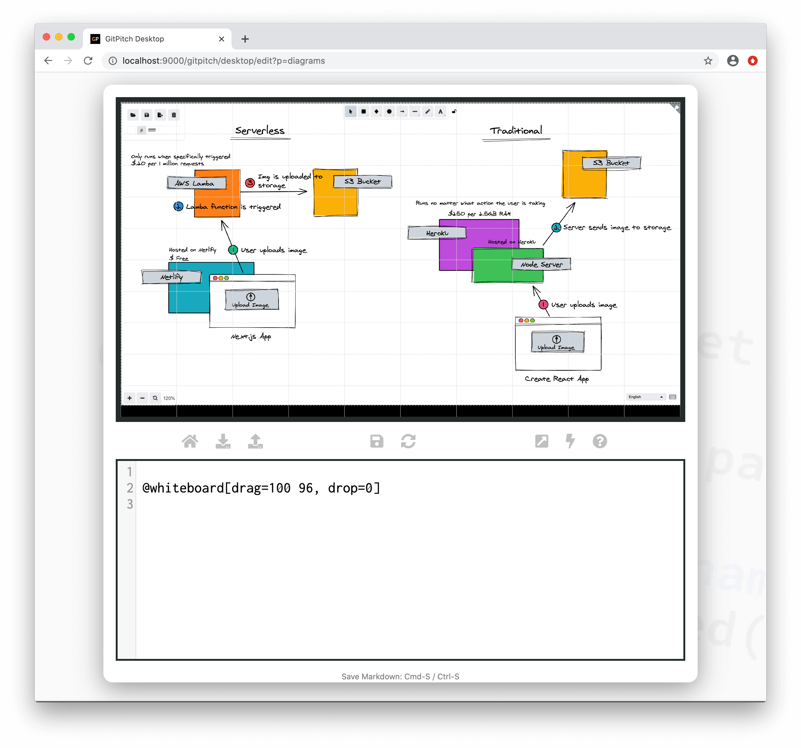

# Whiteboard Sketches

### Whiteboard Tool

The whiteboard tool lets you quickly sketch any diagram  with a hand-drawn feel.  Ideal for sharing mockups, wireframes, system diagrams, UI workflows, casual brainstorming, concepts, and more.  You can save your sketches as images for rendering on any slide. Just like this sample slide:


The [Desktop Tools Guide](/desktop/tools.md) details the use of the whiteboard as an offline sketching tool. As described next, the whiteboard widget lets you embed the whiteboard directly on any slide.

### Whiteboard Widget

As a speaker or training instructor you may find yourself turning away from your slide deck to another tool when you need to explore or expand upon concepts, designs, etc. Frequently we turn to whiteboards.

The `@whiteboard` widget lets you embed a whiteboard directly on any slide within your slide deck. Offering a more seamless, integrated whiteboard experience for you and your audience.

### Widget Syntax

The `@whiteboard` widget lets you embed a whiteboard directly on any slide. The following markdown snippet demonstrates its use:

```markdown
@whiteboard[drag=100 96, drop=0]
```

This markdown snippet is rendered as follows:



?> It is strongly recommended that the size of your `@whiteboard` widget **does not cover** 100% of your slide. The unused slide area presents a click target that you can use to return focus to your deck. Once focus is returned to your deck you can continue to navigate between your slides.

### Grid Native Props

The whiteboard widget is a [grid native widget](/grid-layouts/native-widgets.md) meaning it also directly supports [grid layouts](/grid-layouts/) properties:

[Grid Widget Properties](../_snippets/grid-widget-properties.md ':include')

These grid properties are documented in detail in the [Grid Layouts Guide](/grid-layouts/).


