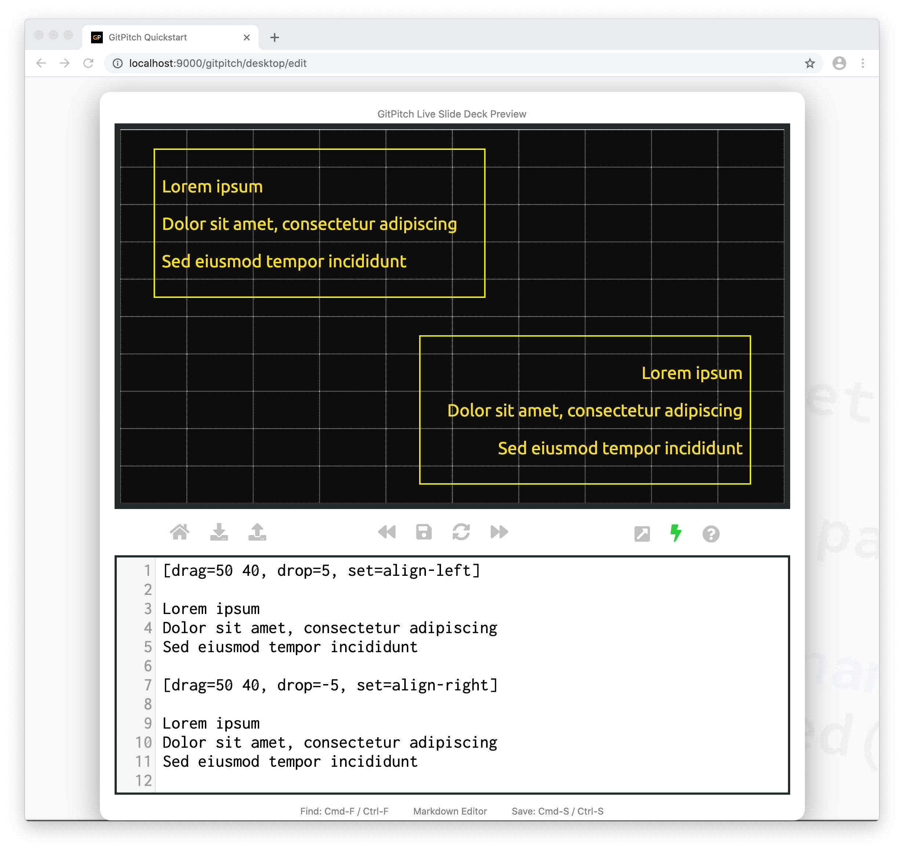

# Grid Alignment

The grid *set* property is used to activate custom styles and behaviors for a [layout block](/grid-layouts/drag-and-drop.md). The [Grid Set Guide](grid-layouts/set.md) focuses on styles. This guide focuses on the following behaviors:

- **align-left**
- **align-right**
- **align-top**
- **align-bottom**

Alignment behavior is used to override the default `center` alignment for content within your [layout blocks](/grid-layouts/drag-and-drop.md).

### Activate Alignment

The following basic syntax is used to activate a custom **align-xxx** behavior on a layout block:

```
[drag=width height, drop=x y, set=align-xxx]
```

Where **xxx** can take a value of `left`, `right`, `top`, or `bottom`.

The `left` or `right` alignment behavior is used when [column flow](/grid-layouts/flow.md) is activated on a layout block. While `top` or `bottom` alignment behavior is used when [row flow](/grid-layouts/flow.md) is activated on a layout block.



This sample slide demonstrating alignment behavior was created using the following markdown snippet:

```markdown
[drag=50 40, drop=5, set=align-left]

Lorem ipsum
Dolor sit amet, consectetur adipiscing
Sed eiusmod tempor incididunt

[drag=50 40, drop=-5, set=align-right]

Lorem ipsum
Dolor sit amet, consectetur adipiscing
Sed eiusmod tempor incididunt
```

