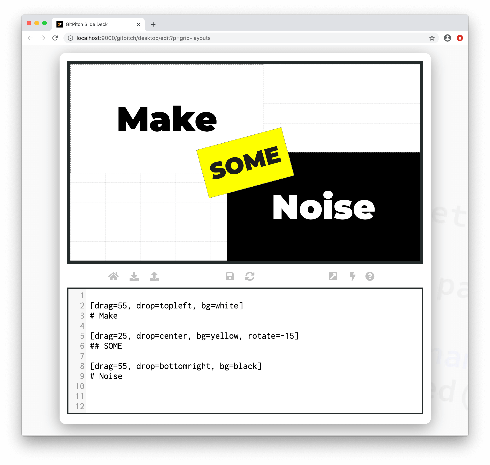
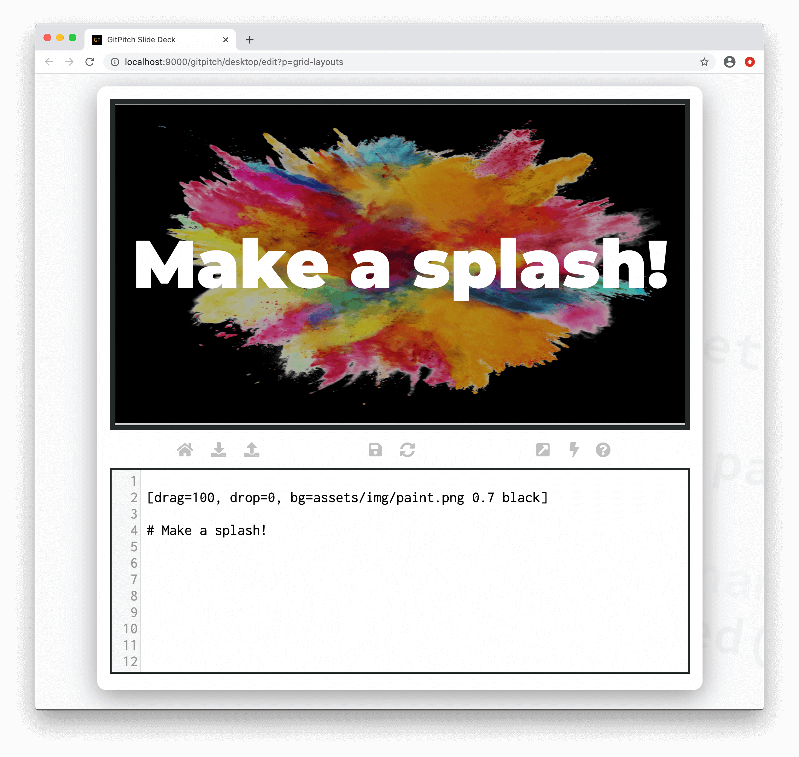

# Grid Backgrounds

The grid *bg* property is used to activate a custom background for a [layout block](grid-layouts/drag-and-drop.md). A custom background can be a [custom color](#bg-color-syntax) or a [custom image](#bg-image-syntax). Block items added to the layout block are rendered on top of the custom background.

?> When discussing grid layouts *content-within-blocks* are referred to as *block items*.

### Bg Color Syntax

The following basic syntax is used to activate a custom *color* background for a layout block:

```
[drag=width height, drop=x y, bg=color]
```

Where the *color* option on the `bg=` property takes any valid [CSS Color Value](https://developer.mozilla.org/en-US/docs/Web/CSS/color_value). The following sample slide screenshot demonstrates *color* backgrounds for layout blocks:



### Bg Image Syntax

The following basic syntax is used to activate a custom *image* background for a layout block:

```
[drag=width height, drop=x y, bg=path/to/image.ext opacity color]
```

Where the *path* option identifying an image file is required. While the *opacity* and *color* options are optional. The following sample slide screenshot demonstrates an *image* background for a layout block:



As you can see background images on layout blocks can be used to *visually enhance* text and other callouts on your slides. Note any image used as a background is automatically [stretched](grid-layouts/stretch-image.md) to cover the entire area of the layout block.

### Deck Backgrounds

If you want to activate a default background image automatically activated for every slide in your slide deck see the [Background Settings Guide](/settings/background.md).

