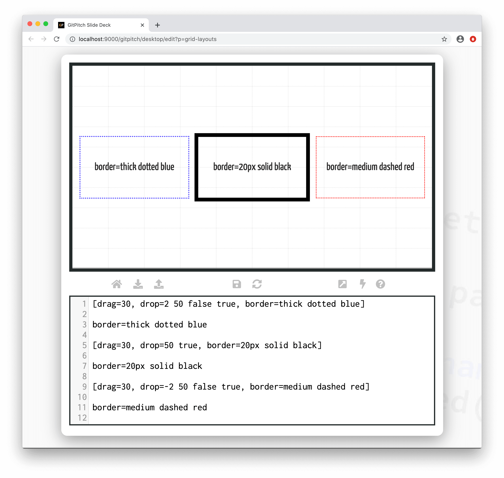
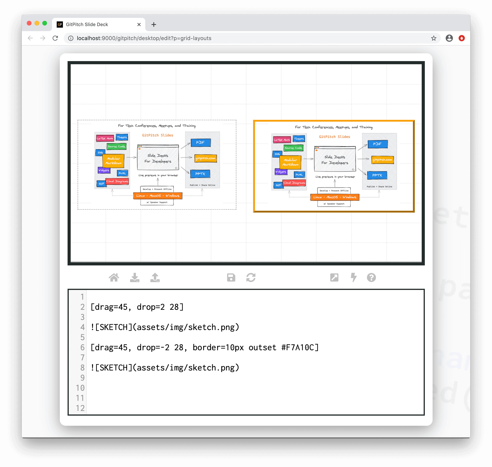

# Grid Borders

The grid *border* property is used to activate a custom border for a [layout block](grid-layouts/drag-and-drop.md). Custom borders can help to highlight or differentiate block items on your slides.

?> When discussing grid layouts *content-within-blocks* are referred to as *block items*.

### Basic Syntax

The following basic syntax is used to activate a custom *border* for a layout block:

```
[drag=width height, drop=x y, border=width style color]
```

Where the `width` option on the `border=` property takes values of *thin*, *medium*, *thick* or a pixel value such as `10px`. The `style` option takes values of *dotted*, *solid*, *dashed*, *inset*, or *outset*. And the `color` option takes any valid [CSS Color Value](https://developer.mozilla.org/en-US/docs/Web/CSS/color_value).

The following sample slide screenshot demonstrates *borders* for layout blocks:



One common use case for *borders* is to enhance the look of media content such as images on a slide. The following sample slide screenshot demonstrates *borders* used as a visual enhancement when displaying an image:



