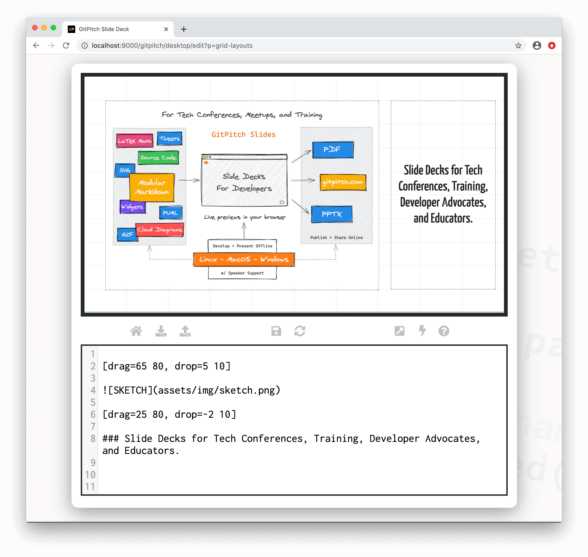
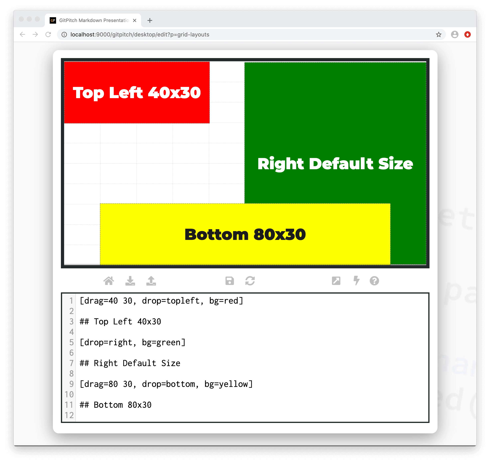
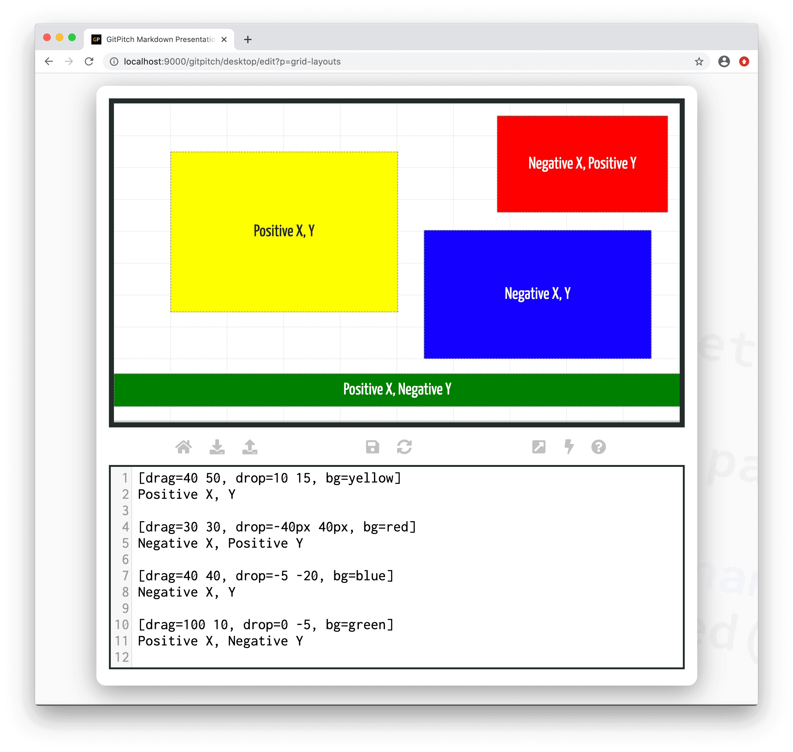
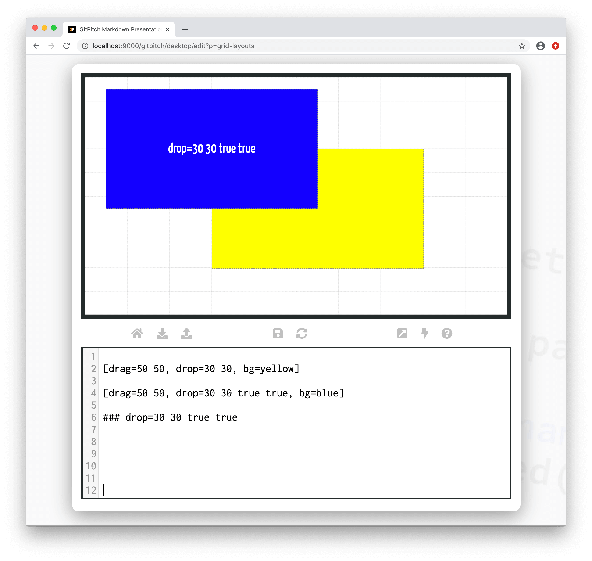

# Grid Layouts Drag-and-Drop

Grid layouts *drag-and-drop* is used to size and position content on your slides. It mirrors the layout semantics found in traditional drag-and-drop solutions. This is achieved using a simple concept supported by GitPitch markdown called a grid layouts **block**.

A grid layouts block has the following characteristics:

1. A block defines a fixed sized area on a slide.
2. A block has a fixed position on a slide.
3. A block may contain zero, one, or more block items.

?> When discussing grid layouts *content-within-blocks* are referred to as *block items*.

### Basic Syntax

The following basic syntax is used to *drag-and-drop* a block on a GitPitch slide:

```
[drag=width height, drop=x y]
```

The *width* and *height* values on the `drag=` property for a block define the fixed sized area on the slide. These values can be specified as a *%* of slide width and height or as pixel sizes. The *x* and *y* values on the `drop=` property for a block define a fixed position on the slide. Again these values can be specified as a *%* of slide width and height or as pixel sizes.

?> By default *width*, *height*, *x*, and *y* define a *%* value. Append *px* to your values for pixel sizes.

The following sample slide screenshot helps to clarify these concepts:



### Position by Name

Some common grid positions have been *named* for your convenience. Named positions can be used in place of *x* and *y* coordinates on the `drop=` property for any block. The following named positions are currently defined:

- center
- top
- bottom
- left
- right
- topleft
- topright
- bottomleft
- bottomright

The following sample slide screenshot helps to clarify these concepts:



Note the `drop=right` block in the sample slide above. It demonstrates that *named* block positions inherit intelligent default block sizes. You can override these defaults by specifying a custom *width* and *height* on the `drag=` property for your block.

### Position Coordinates

Both positive and negative values can be set for *x* and *y* on the `drop=` property. The meaning of positive and negative values in each case is summarized as follows:

1. A positive *x* value indicates a position relative to the *left* edge of the slide.
1. A negative *x* value indicates a position relative to the *right* edge of the slide.
1. A positive *y* value indicates a position relative to the *top* edge of the slide.
1. A negative *y* value indicates a position relative to the *bottom* edge of the slide.

The following sample slide screenshot helps to clarify these concepts:



### Position Centering

The following syntax can be used to center a grid layouts block around the `drop=x y` position as follows:


```
[drag=width height, drop=x y _centerX _centerY]
```

Where *_centerX* and *_centerY* can take a boolean value of *true* or *false*. The following sample slide screenshot helps to clarify these concepts:



