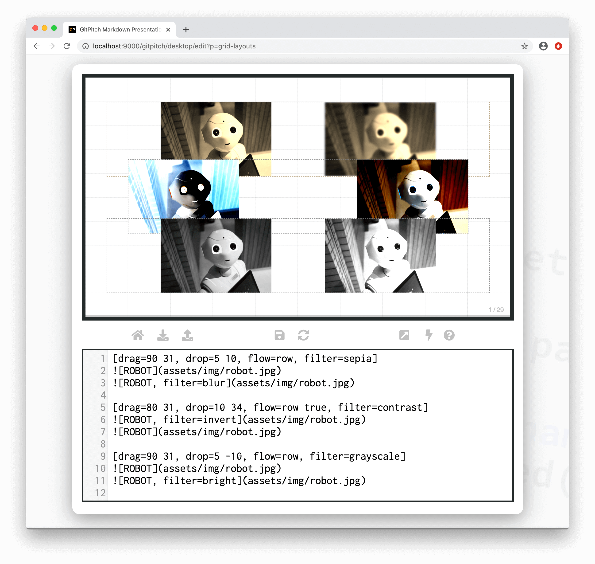

# Grid Filters

The grid *filter* property is used to activate filter effects on a [layout block](/grid-layouts/drag-and-drop.md). Filter effects on a block also affect all associated block items.

?> When discussing grid layouts *content-within-blocks* are referred to as *block items*.

### Filter Activation

The following basic syntax is used to activate a *filter* on a layout block:

```
[drag=width height, drop=x y, filter=effect]
```

Where the `effect` option on the `filter=` property can take one of the following filter types:

- blur
- bright
- contrast
- grayscale
- hue
- invert
- saturate
- sepia

The following sample slide screenshot demonstrates *filter* effects on sample blocks:



Note this sample slide demonstrates different filter effects on each layout block and also filters activated directly on some of the individual images using [Image Widget Syntax](/images/inline.md).

