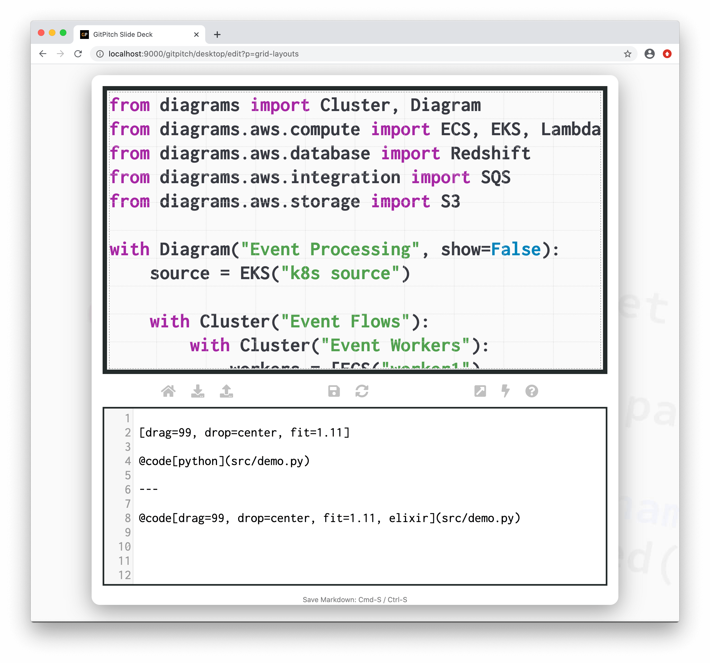
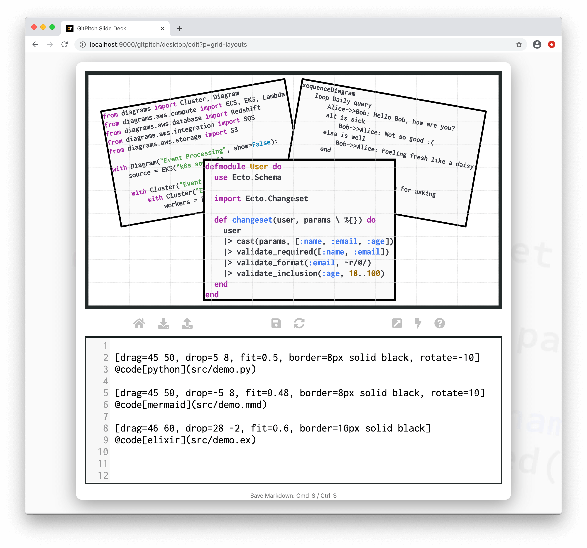

# Grid Fit for Code

The grid *fit* property is used to scale and size code within [layout blocks](/grid-layouts/drag-and-drop.md).

?> Fit takes a scaling value. Any value greater than 1 magnifies content. Any value less than 1 shrinks content. A value equal to 1 renders the content at it’s original size. Original size is determined by the [theme settings](/theme/template.md) for your slide deck.

### Basic Syntax

The following basic syntax is used to activate a custom *fit* for code content within a layout block:

<!-- tabs:start -->

#### ** Code Widget **

```markdown
@code[scala code-blend-bg, drag=99, fit=scale](path/to/demo.scala)
```

#### ** GIST Widget **

```markdown
@gist[elixir code-line-numbers, drag=100, fit=scale](user/gistid)
```

#### ** Diff Widget **

```markdown
@diff[diff-nofrags, drag=80 100, drop=right, fit=scale](user/repo/commitid)
```

<!-- tabs:end -->

?> For code widget syntax details see the [Code Widget Guide](/code/widgets.md).

Where *scale* can take any value between *0.01* and *99.99*. If the `fit=` property is not specified for a block then the block automatically inherits the default *scale* of 1.0. A fit value greater than *1.0* magnifies code content. While a fit value less than *1.0* shrinks code content.

The best `fit=scale` value for your content depends on:

1. The code content itself
2. The font active for that code content and
3. The dimensions of the target block.

Simply experiment with *scale* values to find the best fit for your code content within the block.

### Fit Code to Slide

The following sample slide screenshot demonstrates `fit=` on [code content](/code/). The grid layouts block in this example covers 99% of the slide area. See how the code is perfectly fitted within that block:



### Fit Code to Block

The following sample slide screenshot demonstrates `fit=` on [code content](/code/). In this example each grid layouts block only partially covers the slide area. See how the corresponding code for each block is perfectly fitted for that block:


