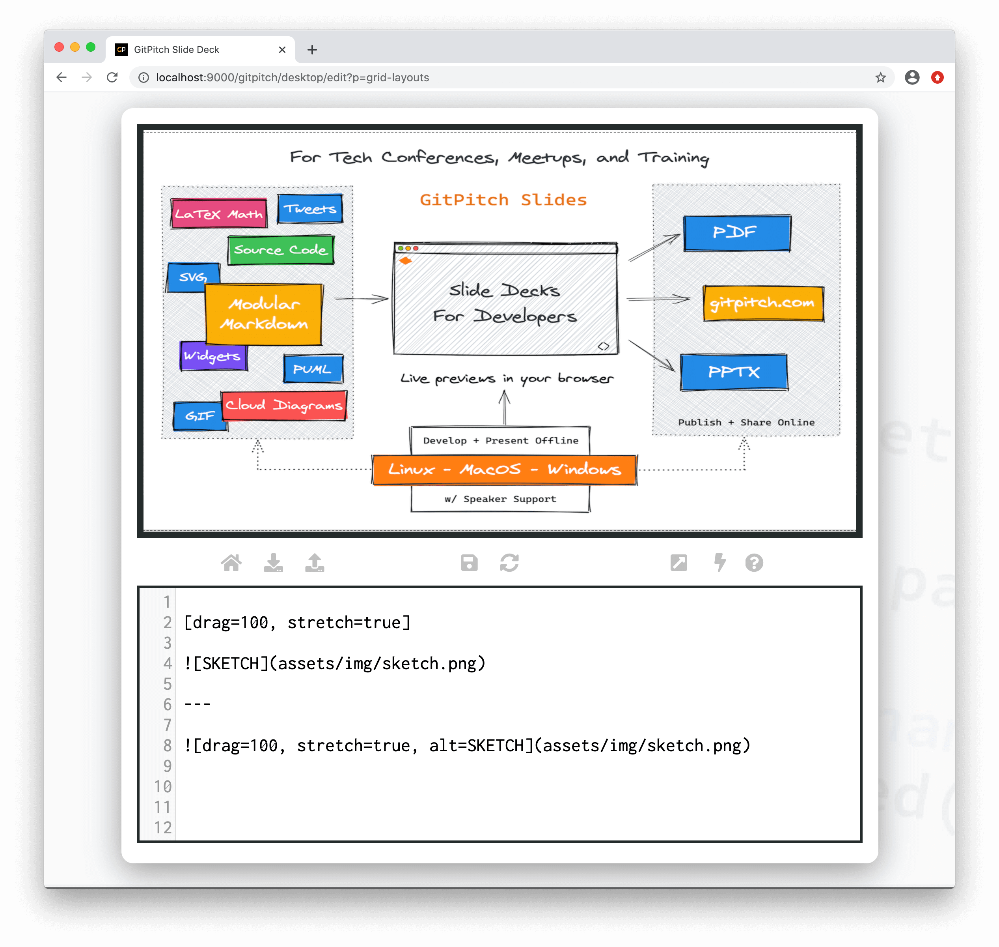
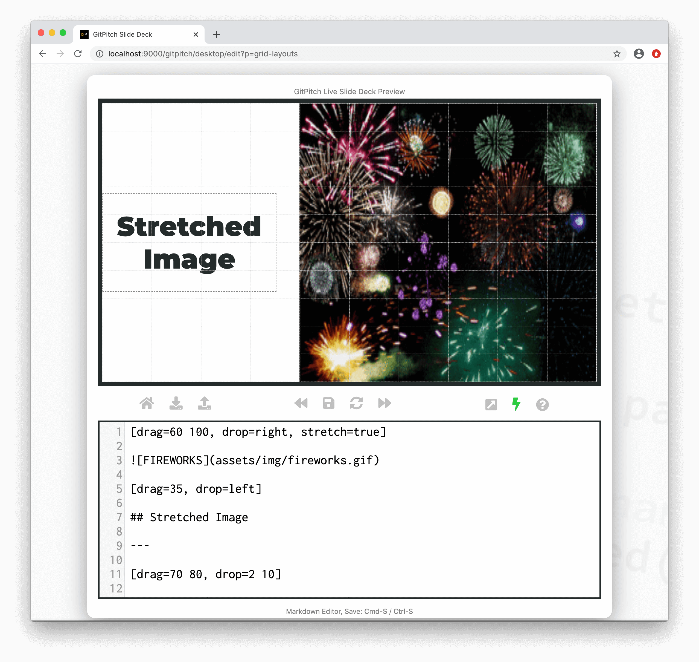
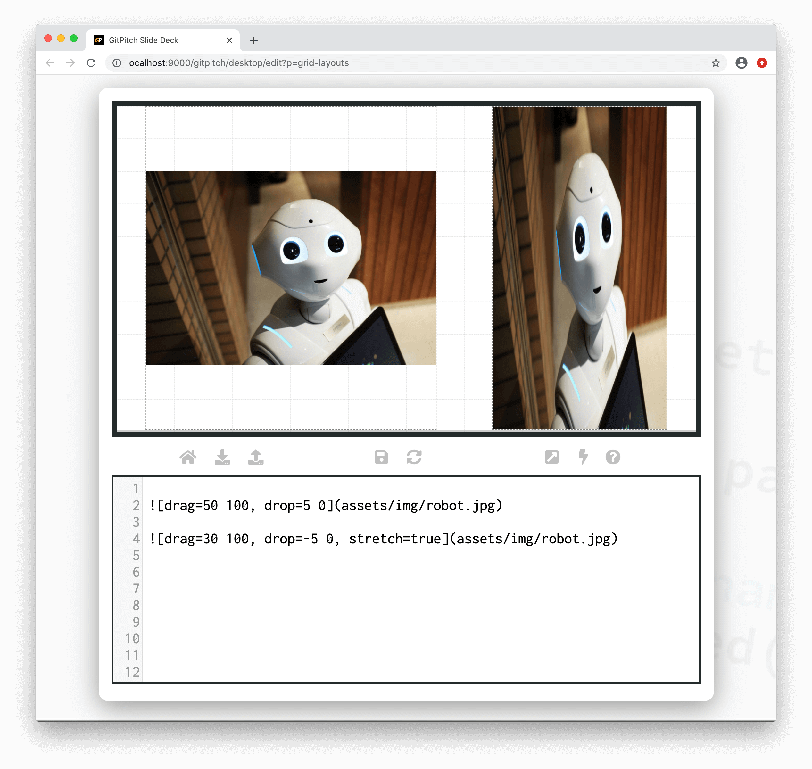

# Grid Fit for Images

The grid *stretch* property is used to scale and size an image to the exact dimensions of a [layout block](/grid-layouts/drag-and-drop.md). Stretch overrides the default aspect ratio of the target image.

?> By default the original *aspect ratio* of images rendered within grid layout blocks is preserved. Grid stretch is used to override this default behavior.

### Basic Syntax

The following basic syntax is used to activate *stretch* for an image within a layout block:

```markdown

```

?> For image widget syntax details see the [Image Widget Guide](/images/widget.md).

### Stretch Image to Slide

The following sample slide screenshot demonstrates `stretch=true` for an image. The grid layouts block in this example covers 100% of the slide area:



### Stretch Image to Block

The following sample slide screenshot demonstrates `stretch=true` for an image. The grid layouts block only partially covers the slide area:



### Stretch Caveat Emptor

Buyer beware! As previously noted, *stretch* overrides the default aspect ratio of the target image. In some cases this override behavior may be desirable. In other cases, it may not. For example, in some cases *stretch* may result in a visually skewed image.

The following sample slide screenshot demonstrates an image showing the original aspect ratio on the left and a stretched (and skewed) version of that same image on the right:



### Stretch for Grid Stacks

Grid *stretch* is typically used to *size a single image* to the exact dimensions of a layout block. However due to the unique rendering behaviors of [Grid Stacks](/grid-layouts/stacks.md) the stretch property can be activated on a stack as follows:

```markdown
[drag=width height, drop=x y, flow=stack, stretch=true]
```

When activated in this way the *stretch* behavior is applied to all images within the stack.
