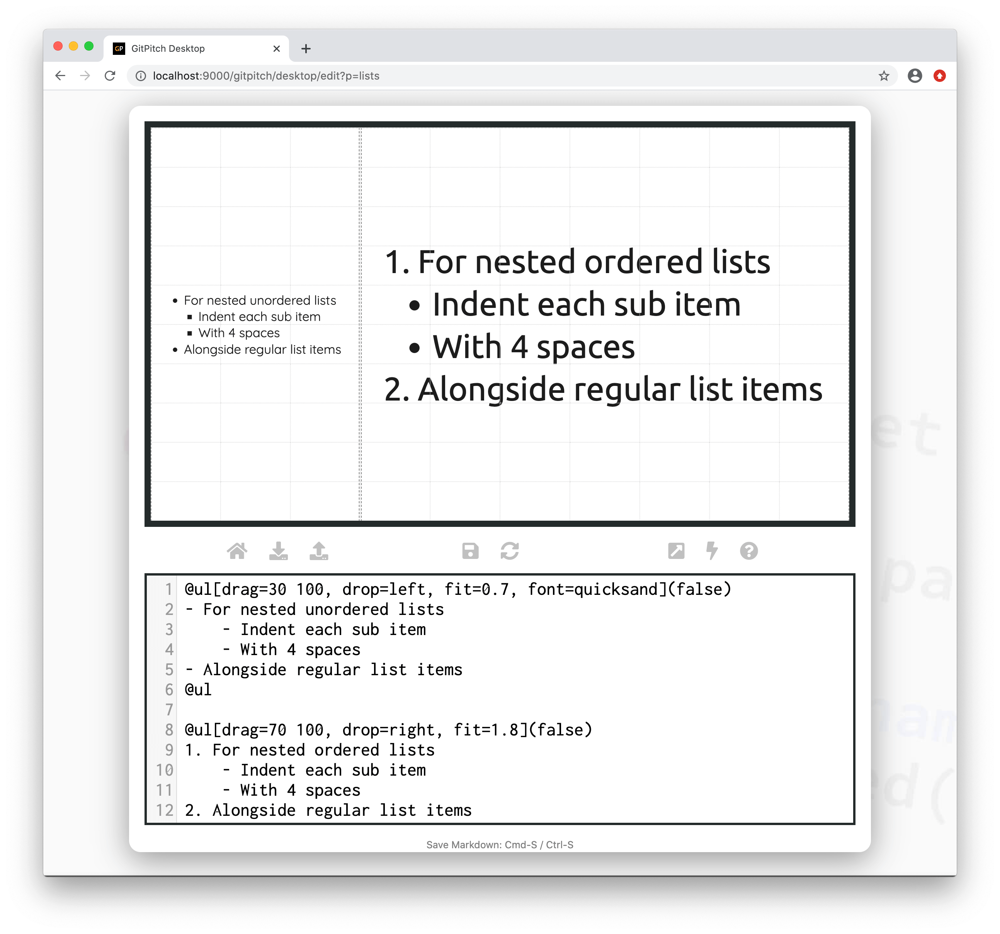

# Grid Fit for Lists

The grid *fit* property is used to scale and size list content within [layout blocks](/grid-layouts/drag-and-drop.md).

?> Fit takes a scaling value. Any value greater than 1 magnifies content. Any value less than 1 shrinks content. A value equal to 1 renders the content at it’s original size. Original size is determined by the [theme settings](/theme/template.md) for your slide deck.

### Basic Syntax

The following basic syntax is used to activate a custom *fit* for lists within a layout block:

<!-- tabs:start -->

#### ** Unordered List **

```markdown
@ul[drag=width height, drop=x y, fit=scale]
- Item One
- Item Two
- etc
@ul
```

#### ** Ordered List **

```markdown
@ol[drag=width height, drop=x y, fit=scale]
1. Item One
1. Item Two
1. etc
@ol
```
<!-- tabs:end -->

?> For list widget syntax details see the [List Widget Guide](/lists/widgets.md).

Where *scale* can take any value between *0.01* and *99.99*. If the `fit=` property is not specified for a block then the block automatically inherits the default *scale* of 1.0. A fit value greater than *1.0* magnifies content. While a fit value less than *1.0* shrinks content.

The best `fit=scale` value for your list content depends on:

1. The list content itself
2. The font active for that list content and
3. The dimensions of the target block.

Simply experiment with *scale* values to find the best fit for your content within the block.

### Fit to Magnify

The following sample slide screenshot demonstrates `fit=` on list content. In this example the grid layouts block only partially covers the slide area while the list content is magnified to fill the block:


### Fit to Shrink

The following sample slide screenshot demonstrates `fit=` on list content. Note the differences between the sample fit values used on this slide. A fit value less than `1.0` is used to shrink the sample list content on the left side of the slide:


