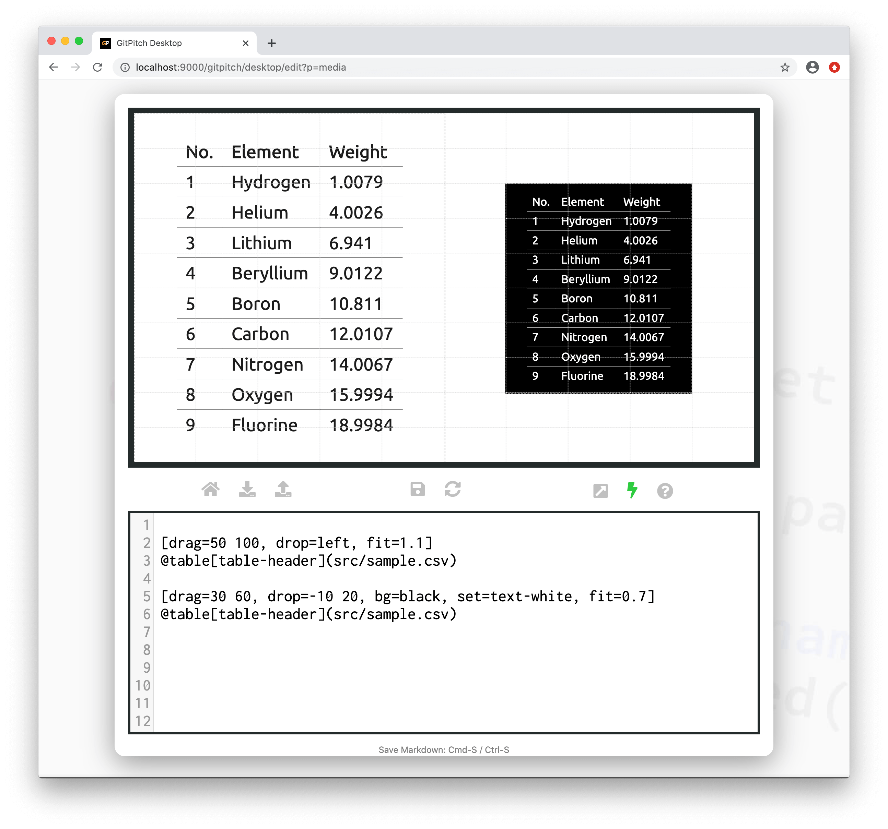

# Grid Fit for Tables

The grid *fit* property is used to scale and size table content within [layout blocks](/grid-layouts/drag-and-drop.md).

?> Fit takes a scaling value. Any value greater than 1 magnifies content. Any value less than 1 shrinks content. A value equal to 1 renders the content at it’s original size. Original size is determined by the [theme settings](/theme/template.md) for your slide deck.

### Basic Syntax

The following basic syntax is used to activate a custom *fit* for table data within a layout block:

```markdown
[drag=width height, drop=x y]
@table[table-header](src/sample.csv)
```

?> For table widget syntax details see the [Table Widget Guide](/media/table-data.md).

Where *scale* can take any value between *0.01* and *99.99*. If the `fit=` property is not specified for a block then the block automatically inherits the default *scale* of 1.0. A fit value greater than *1.0* magnifies content. While a fit value less than *1.0* shrinks content.

The best `fit=scale` value for your list content depends on:

1. The table data content itself
2. The font active for that table content and
3. The dimensions of the target block.

Simply experiment with *scale* values to find the best fit for your content within the block.

### Fit to Block

The following sample slide screenshot demonstrates `fit=` on table content. In this example the table data is magnified on the left and shrunk on the right to fit within the corresponding layout blocks:



