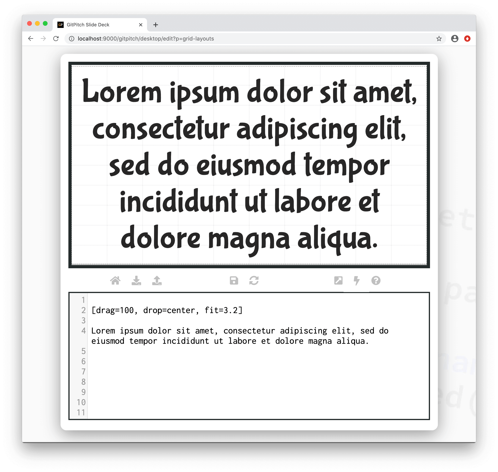
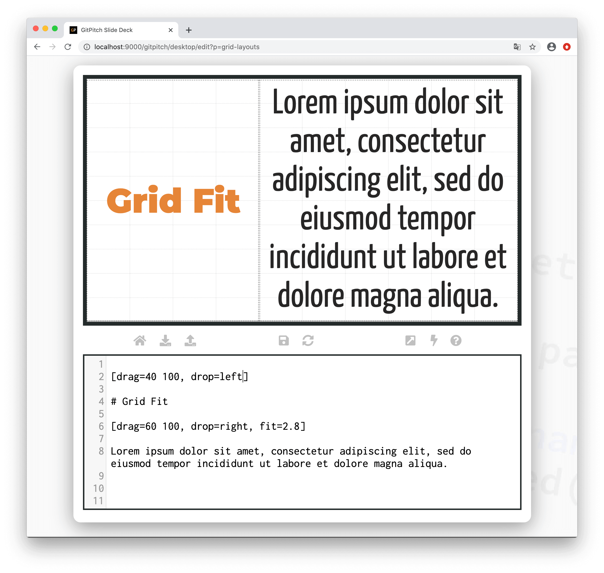

# Grid Fit for Text

The grid *fit* property is used to scale and size text within [layout blocks](/grid-layouts/drag-and-drop.md). Fit can scale both headline content and plain text content.

?> Fit takes a scaling value. Any value greater than 1 magnifies content. Any value less than 1 shrinks content. A value equal to 1 renders the content at it’s original size. Original size is determined by the [theme settings](/theme/template.md) for your slide deck.

### Basic Syntax

The following basic syntax is used to activate a custom *fit* for text within a layout block:

```
[drag=width height, drop=x y, fit=scale]

Your text goes here.
```

Where *scale* can take any value between *0.01* and *99.99*. If the `fit=` property is not specified for a block then the block automatically inherits the default *scale* of 1.0. A fit value greater than *1.0* magnifies content. While a fit value less than *1.0* shrinks content.

The best `fit=scale` value for your content depends on:

1. The text itself
2. The font active for that text and
3. The dimensions of the target block.

Simply experiment with *scale* values to find the best fit for your content within the block.

### Fit Headline to Slide

The following sample slide screenshot demonstrates `fit=` on headline content. The grid layouts block in this example covers 100% of the slide area:


### Fit Text to Slide

The following sample slide screenshot demonstrates `fit=` on plain text content. The grid layouts block in this example covers 100% of the slide area:



### Fit Text to Block

The following sample slide screenshot demonstrates `fit=` on plain text content. In this example the grid layouts block only partially covers the slide area:



