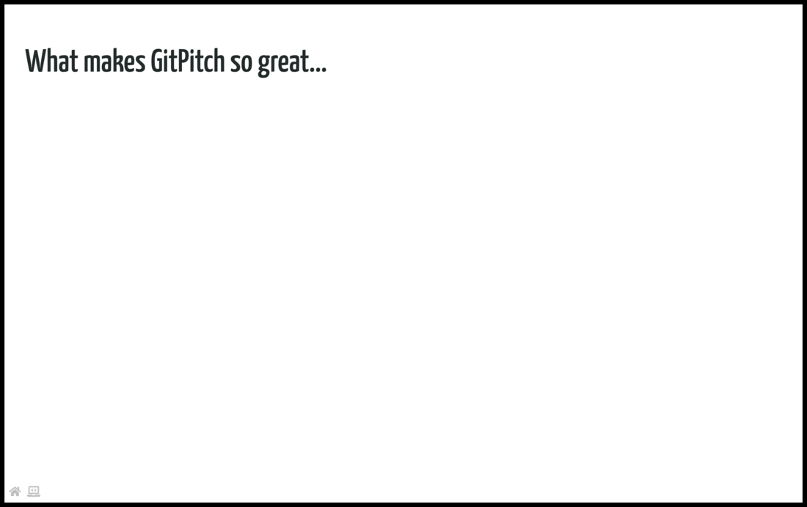

# Grid Fragments

The grid *set* property is used to activate custom styles and behaviors for a [layout block](/grid-layouts/drag-and-drop.md). The [Grid Set Guide](grid-layouts/set.md) focuses on styles. This guide focuses on the *fragment* behavior.

Fragment behavior is used to reveal elements incrementally on a slide. As distinct to revealing all elements on the slide at once.

?> Slide fragments can help you to focus an audience's attention on key concepts.

### Fragment Activation

The following basic syntax is used to activate the *fragment* behavior on a layout block:

```
[drag=width height, drop=x y, set=fragment]
```

A slide can have an unlimited number of layout blocks. And any number of those blocks can be *fragment* blocks. The following sample slide screencast demonstrates the activation of *fragment* behavior on layout blocks:



This sample slide demonstrating fragment behavior was created using the following markdown snippet:

```markdown
[drag=45 15, drop=topleft, flow=row true, pad=50px]
### What makes GitPitch so great...

[drag=31, drop=1 50 false true, rotate=-6, bg=green, set=h3-white fragment]
### It could be Markdown.

[drag=31, drop=50 50 true true, rotate=6, bg=orange, set=h3-white fragment]
### It could be Git.

[drag=31, drop=-1 50 false true, rotate=-6, bg=red, set=h3-white fragment]
### Or it could be<br>the Secret Sauce!
```

