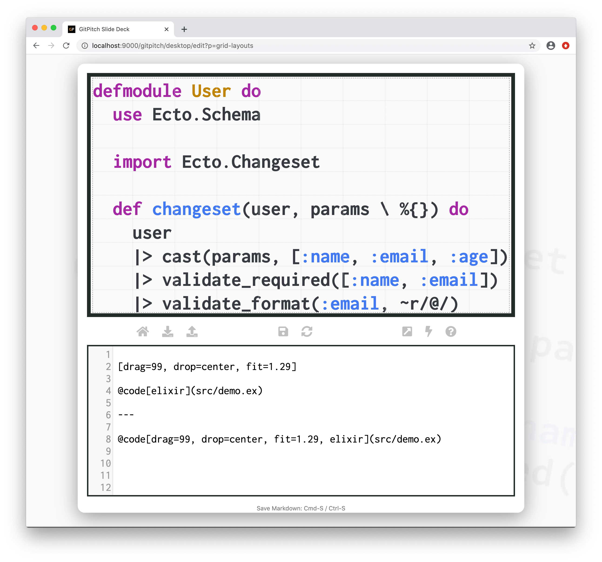
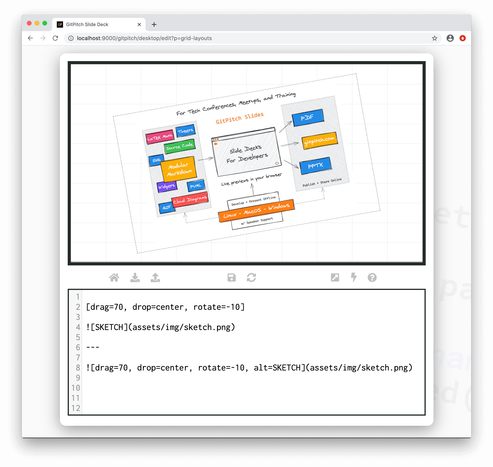

# Grid Native Widgets

?> GitPitch widgets greatly enhance traditional markdown rendering capabilities for slide decks.

The common approach demonstrated throughout these grid layouts guides is as follows:

1. First [drag-and-drop](/grid-layouts/drag-and-drop.md) a block on your slide.
1. Second activate a [custom flow](/grid-layouts/flow.md) for the block.
1. And finally add one or more block items to your block.

?> When discussing grid layouts content-within-blocks are referred to as block items.

This approach makes sense when you are adding multiple block items to a given block. However when you need to size and position just *one single block item* then grid native markdown widget syntax can be used to simplify the steps.

### Sample Native Code Widget

<!-- tabs:start -->

#### ** Grid Layouts + Code Widget Syntax **

```markdown
[drag=99, drop=center, fit=1.29]

@code[elixir](src/demo.ex)

```

#### ** Grid Native Code Widget Syntax **

```markdown
@code[drag=99, drop=center, fit=1.29, elixir](src/demo.ex)
```

<!-- tabs:end -->

Both of these sample markdown snippets render identically. But the native widget syntax is more concise. The following sample slide screenshot helps to clarify this concept:



### Sample Native Image Widget

<!-- tabs:start -->

#### ** Grid Layouts + Image Widget Syntax **

```markdown
[drag=70, drop=center, rotate=-10]


```

#### ** Grid Native Image Widget Syntax **

```markdown

```

<!-- tabs:end -->

Both of these sample markdown snippets render identically. But the native widget syntax is more concise. The following sample slide screenshot helps to clarify this concept:



### Native Widgets List

Currently the following markdown widgets support grid native syntax:

- [Image Widget](/images/widget.md)
- [List Widget](/lists/widget.md)
- [Code Widget](/code/widgets.md)
- [GIST Widget](/code/widgets.md)
- [Diff Widget](/code/widgets.md)
- [Mermaid Widget](/diagrams/mermaid.md)
- [Cloud Widget](/diagrams/cloud-architecture.md)
- [PlantUML Widget](/diagrams/plantuml.md)
- [GraphViz Widget](/diagrams/graphviz.md)
- [MathJax Widget](/maths/math-formulas.md)
- [LaTex Widget](/diagrams/latex-asciimath.md)
- [Video Widget](/videos/inline.md)
- [Whiteboard Widget](/diagrams/whiteboard-sketches.md)

Each of the corresponding grid native widget guides provide detailed widget syntax documentation including details of all supported grid native widget properties.
