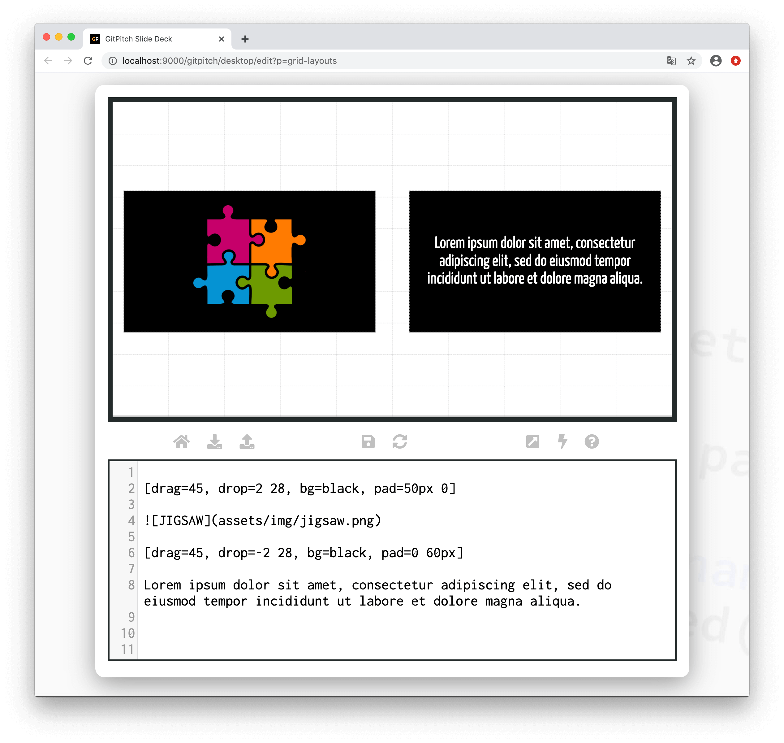

# Grid Padding

The grid *pad* property is used to activate custom padding for a [layout block](/grid-layouts/drag-and-drop.md). Custom padding can help to enhance the overall appearance of content by controlling the space around block items.

?> Padding introduced by this property does not increase the size of the block itself. Rather it reduces the size of the area available to render items within the block.

### Basic Syntax

The following basic syntax is used to activate a custom *padding* for a layout block:

```
[drag=width height, drop=x y, pad=top right bottom left]
```

Where the `top`, `right`, `bottom`, and `left` options on the `pad=` property all take pixel size values. Following standard [CSS Padding Rules](https://developer.mozilla.org/en-US/docs/Web/CSS/padding) these four options can also be specified with just two values or even a single value, for example:

```
[drag=width height, drop=x y, pad=10px 15px]
```

This sample layout block above would display with `10px` padding top and bottom and `15px` padding left and right. The following sample slide screenshot demonstrates *padding* for layout blocks:



The layout block containing the image uses `50px` padding top and bottom to inject space above and below the image within the block. While the layout block containing the text uses `60px` padding left and right to inject space between the text and the edges of the block. In both examples padding has been used to enhance the overall appearance of the content on the slide.
