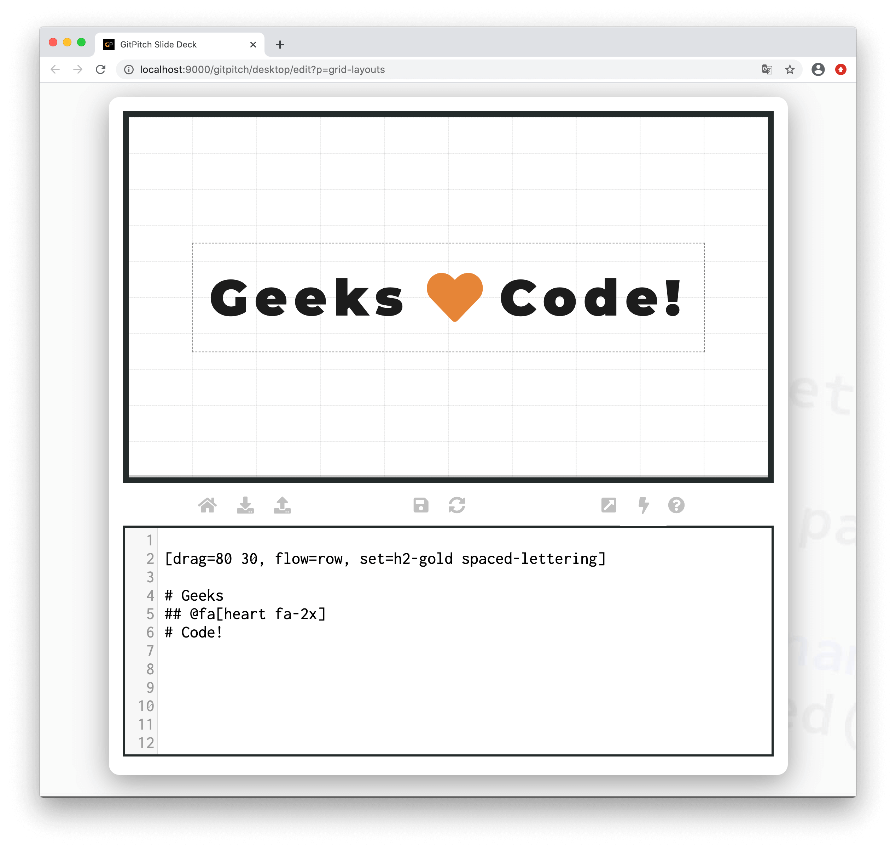

# Grid Set

The grid *set* property is used to activate custom styles and behaviors for a [layout block](/grid-layouts/drag-and-drop.md). 

?> When discussing grid layouts *content-within-blocks* are referred to as *block items*.

### Set Style Syntax

The following basic syntax is used to activate custom *styles* for a layout block:

```
[drag=width height, drop=x y, set=style...]
```

Where the `style...` option on the `set=` property takes a space-separated list of CSS style names. These style names can be [custom styles](/theme/custom-css.md) or [build-in styles](/theme/utility-styles.md). The following sample slide screenshot demonstrates the activation of *styles* for a layout block:



In this example two styles were activated for content within the layout block. The `h2-gold` style is a [built-in style](/theme/utility-styles.md). It targets `h2` content within the block. The `spaced-lettering` is an example of a [custom style](/theme/custom-css.md). It was specified to target `h1` content within the block as follows:

```css
.spaced-lettering h1 { letter-spacing: 20px; }
```

?> You can define any number of custom style rules to target individual content or collective content on your GitPitch slides.

### Set Behavior Syntax

Activating behaviors for layout blocks is covered by the [Grid Fragments](/grid-layouts/fragments.md) and [Grid Synchronization](/grid-layouts/synchronization.md) guides.
