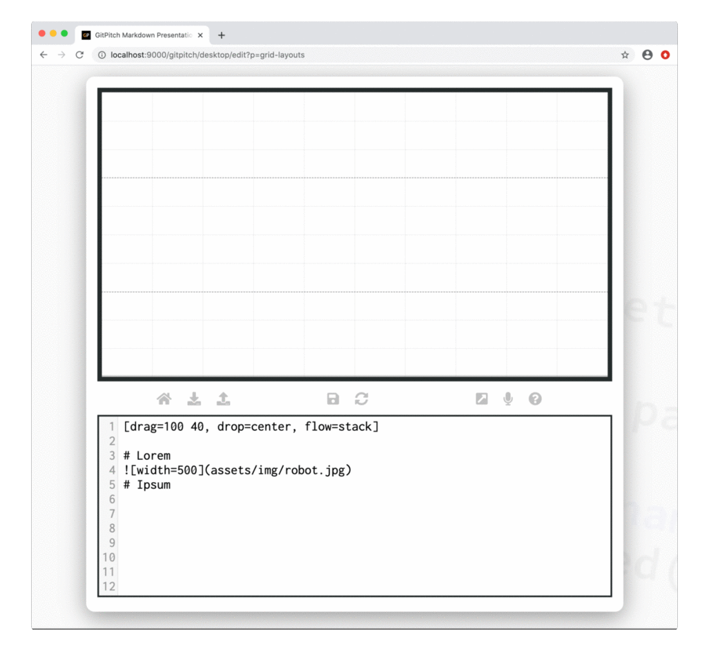

# Grid Stacks

Grid layouts [drag-and-drop](/grid-layouts/drag-and-drop.md) both sizes and positions content within blocks. Grid layouts [flow](grid-layouts/flow.md) controls the layout of content within those blocks. Using `flow=stack` is a special type of flow that activates *layout-and-behavior* for block items.

?> When discussing grid layouts *content-within-blocks* are referred to as *block items*.

When `flow=stack` is activated for a block [fragments behavior](markdown/fragments.md) is automatically activated for all block items within the block. This behavior ensures only one block item is visible within the block at any one time.

Initially all block items within the stack are hidden. Block items are then revealed one at a time. The following sample slide screencast helps to clarify these concepts:



See the [Stack Block Items](#stack-block-items) section below to learn about the different types of slide content that can be used within a grid stack.

!> Stack flow is activated for a block with zero changes to the markdown of the block items.

### Basic Syntax

The following basic syntax is used to activate *grid stack* layout-and-behavior for any block:

```
[drag=width height, drop=x y, flow=stack]
```

### Stack Block Items

The following slide content types can be added as grid stack block items:

- [Plain Text](/text/basics.md)
- [Heading Content](/text/basics.md)
- [Image Widget](/images/widget.md)
- [Code Widget](/code/widgets.md)
- [GIST Widget](/code/widgets.md)
- [Diff Widget](/code/widgets.md)
- [Mermaid Widget](/diagrams/mermaid.md)
- [Cloud Widget](/diagrams/cloud.md)
- [PlantUML Widget](/diagrams/plantuml.md)
- [GraphViz Widget](/diagrams/graphviz.md)
- [MathJax Widget](/maths/math-formulas.md)
- [Video Widget](/videos/inline.md)

!> Any content type not listed here can not currently be used within a grid stack.

### Stack Synchronization

Grid stack behavior reveals block items one at a time. [List widgets](/lists/) are also capable of revealing items one at a time. Synchronization is a powerful presentation feature that allows items across two or more lists and/or stacks to be revealed on a slide in a synchronized fashion.

For full details including a discussion of **stack ghosts** see the [Grid Synchronization Guide](/grid-layouts/synchronization.md).

