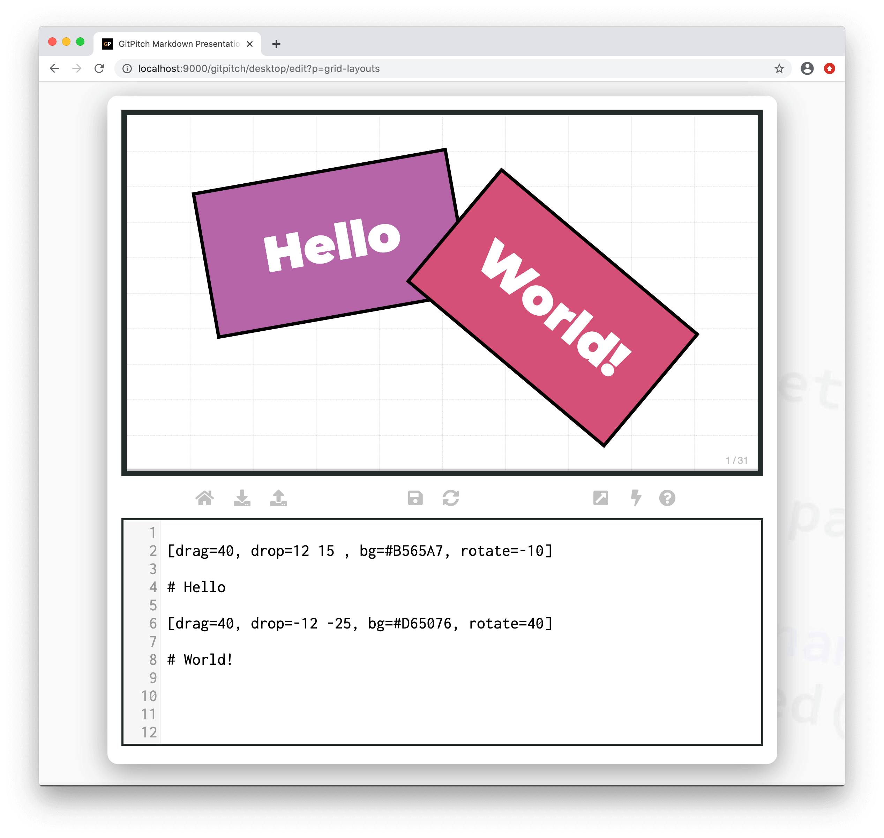
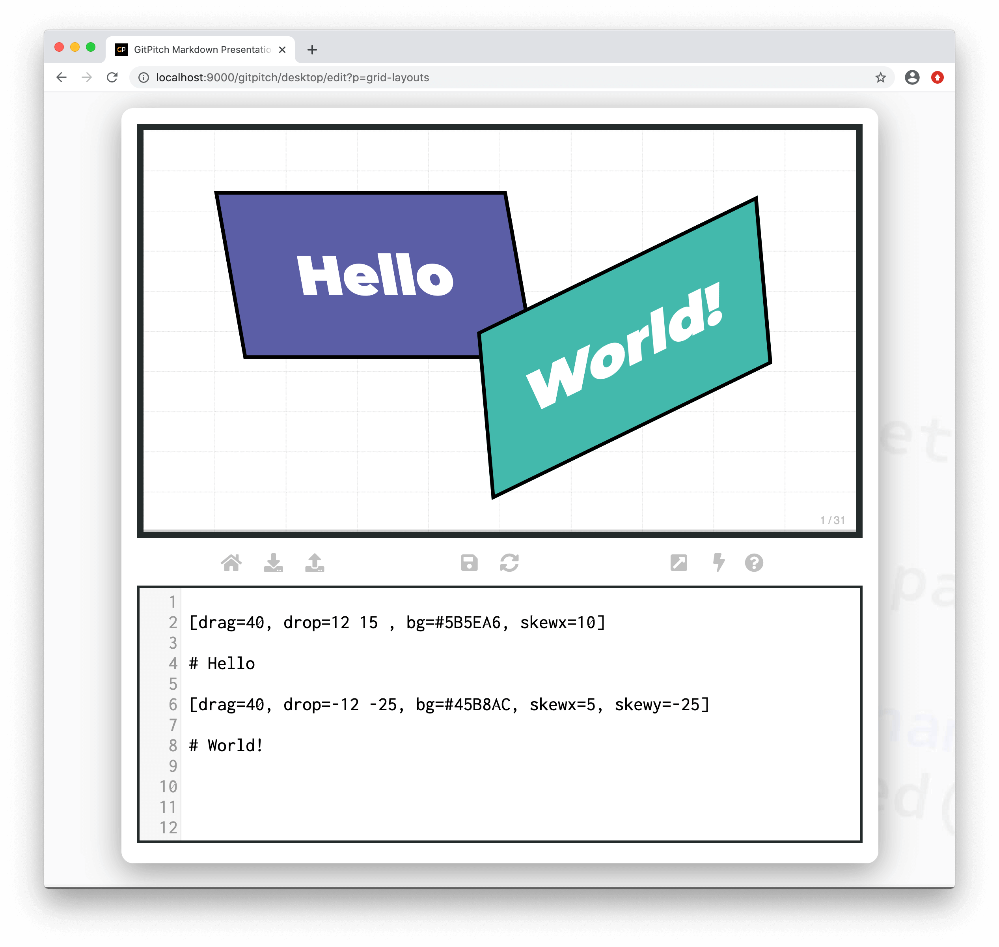

# Grid Transformations

The grid *rotate* property is used to control the 2D rotation of a [layout block](/grid-layouts/drag-and-drop.md). While the *skewx* and *skewy* properties are used to control the 3D rotation of a layout block. Transformations on a block also affect all associated block items.

?> When discussing grid layouts *content-within-blocks* are referred to as *block items*.

### 2D Transformations

The following basic syntax is used to activate a *2D transformation* on a layout block:

```
[drag=width height, drop=x y, rotate=deg]
```

Where the `deg` option on the `rotate=` property is a postive or negative value indicates a degree of rotation from `0` to `360` degrees.

The following sample slide screenshot demonstrates *2D transformations* of sample blocks:



Note this sample slide demonstrates different filter effects on each layout block and also filters activated directly on some of the individual images using [Image Widget Syntax](/images/inline.md).

### 3D Transformations

The following basic syntax is used to activate a *3D transformation* on a layout block:

```
[drag=width height, drop=x y, skewx=deg]
```

Where the `deg` option on the `skewx=` property is a postive or negative value indicates a degree of rotation on the x-axis from `0` to `360` degrees. Using the `skewy=` property applies the rotation to the y-axis.

The following sample slide screenshot demonstrates *3D transformations* on sample blocks:



