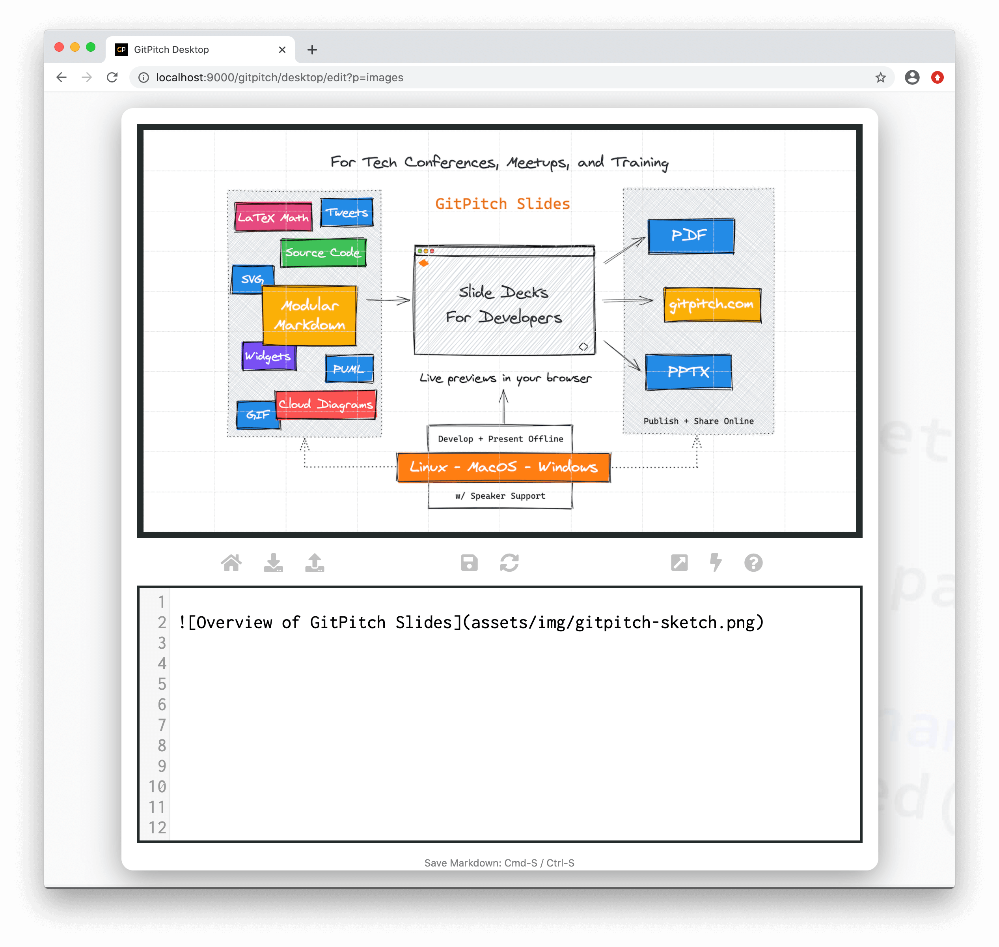
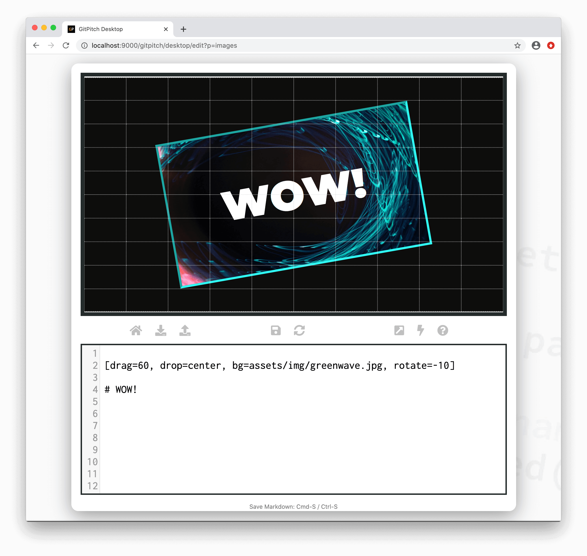

# Image Content

PNG, JPG, and GIF images can be displayed on any slide. The following image rendering techniques are available:

- [Inline Images](#inline)
- [Inline Background Images](#inline-background)
- [Slide Background Images](#slide-background)

?> Additional image effects including positioning, sizing, transformations, and filters can be achieved using the [Grid Native Image Widget](/images/widget.md).

### Image Paths

All paths to image files specified within [PITCHME.md](/conventions/pitchme-md.md) markdown must be relative to the *root directory* of your local working directory or Git repository.

### Inline

Inline images are displayed using [standard markdown](https://guides.github.com/features/mastering-markdown/) image syntax. For example:

?> See the [Image Alt Text](#image-alt-text) note on the important benefits of making your content web accessibile.

### Inline Background

Inline background images take advantage of [Grid Backgrounds](/grid-layouts/backgrounds.md) syntax. One of the big advantages of inline background images is that you can easily overlay additional slide content on top of the image. This technique can be used to create eye-catching visuals on any slide. For example:

?> Inline background images are automatically *stretched* to the full size of the background block.

### Slide Background

Slide background images take advantage of [Grid Backgrounds](/grid-layouts/backgrounds.md) syntax. A slide background image is simply an [inline background](#inline-background) image using a `drag=100` value indicating the image will cover the entire slide.

?> Slide background images are automatically *stretched* to the full size of the background block.

### Image Alt Text

Descriptive text used within standard markdown image syntax `` is automatically set as *alt text* for the image on your slide. The benefits of using alt text on your images are as follows:

1. Alt text is first and foremost a principle of web accessibility. Visually impaired users using screen readers can read alt text to better understand an on-slide image.
1. Alt text is displayed in place of an image if an image file cannot be loaded.
1. Alt text provides better image context to search engines helping them with indexing.

Note the [Image Widget](/images/widget.md) supports an `alt=text` property that can also be used to activate alt text for image on your slides.

