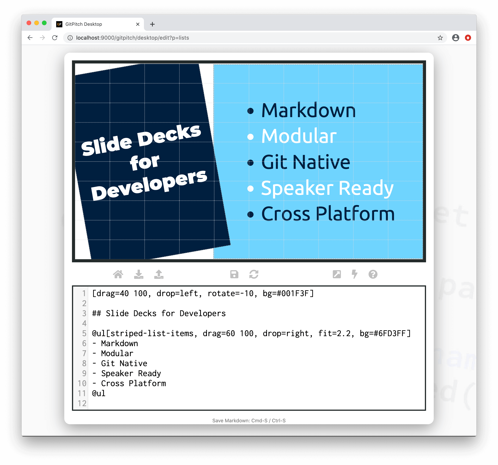

# List Styles

### Built-In

The [list widget](/lists/widget.md) supports the following list-specific styles:

[List Widget Styles](../_snippets/list-widget-styles.md ':include')

### Spacing

The following built-in list spacing styles are available for use on the list widget:

- **list-spaced-xs-bullets**
- **list-spaced-sm-bullets**
- **list-spaced-bullets**
- **list-spaced-lg-bullets**
- **list-spaced-xl-bullets**

By activating one of these styles on your list widget you can control the vertical spacing between items in the list. The **xs** style adds the least amount of space. The **xl** style adds the most amount of space.

### Bullets

The following built-in list bullet styles are available for use on the list widget:

- **list-disc-bullets**
- **list-circle-bullets**
- **list-square-bullets**
- **list-alpha-bullets**
- **list-roman-bullets**
- **list-boxed-bullets**
- **list-no-bullets**

By activating one of these styles on your list widget you can control the item marker used for list items. The default style for unordered lists is the **disc** style.

### Custom

For fine-grained control the over the appearance of list content you can define and then activate [custom style rules](/theme/custom-css.md) on your list widgets. For example, the following CSS snippet declares a custom style rule that activates a striped-effect using alternating colors on list items:

```css
ul.striped-list-items {
  color: #001F3F;
}

ul.striped-list-items > li:nth-child(even){
  color: white;
}
```

One or more custom style rules can be activated directly on the list widget. For example:



?> Note the activation of the custom **striped-list-items** style on the sample list widget above.

