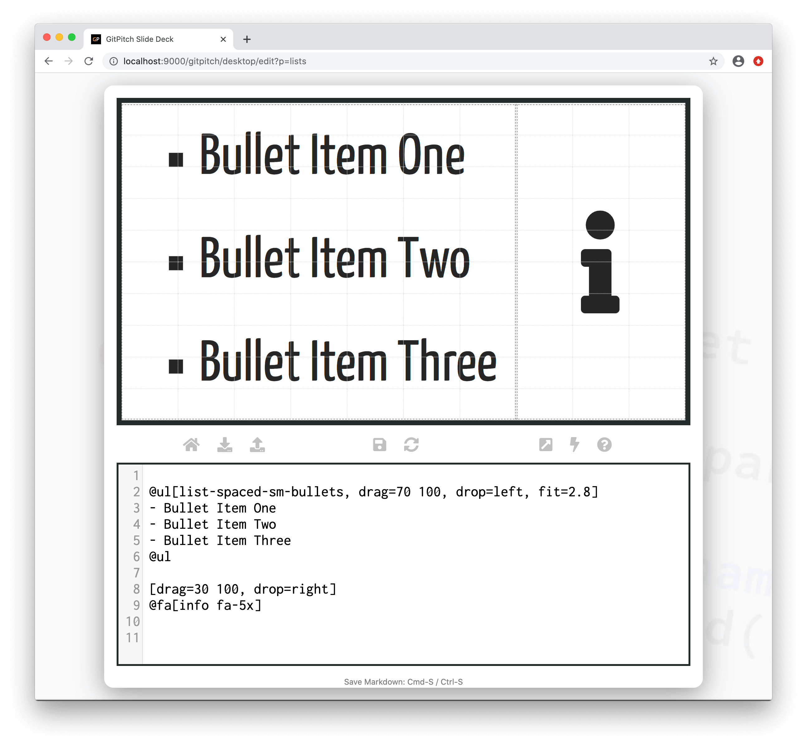

# List Widget

?> GitPitch widgets greatly enhance traditional markdown rendering capabilities for slide decks.

The list widget extends traditional markdown list syntax with support for built-in styles, custom styles, plus unqiue presenting behaviors.

### Widget Syntax

The following markdown snippet demonstrates list widget syntax:

<!-- tabs:start -->

#### ** Unordered List Widget **

```markdown
@ul[styles..., properties...]
- Item One
- Item Two
- etc
@ul
```

#### ** Ordered List Widget **

```markdown
@ol[styles..., properties...]
1. Item One
1. Item Two
1. etc
@ol
```
<!-- tabs:end -->


?> The `styles` list expects a space-separated list of list style names or behaviors. The `properties...` list expects a comma-separated list of grid property `key=value` pairs.

[List Widget Styles](../_snippets/list-properties.md ':include')

### Sample Slide

The following slide demonstrates a list rendered using list widget syntax. The markdown snippet used to create this slide takes advantage of built-in styles plus *grid native properties* to position and size the list content on the slide:



The following guides provide detailed descriptions of styles and behaviors unique to lists:

- [Built-in List Styles](/lists/styles.md)
- [Custom List Styles](/lists/styles.md)
- [Built-in List Behaviors](/lists/behaviors.md) 

